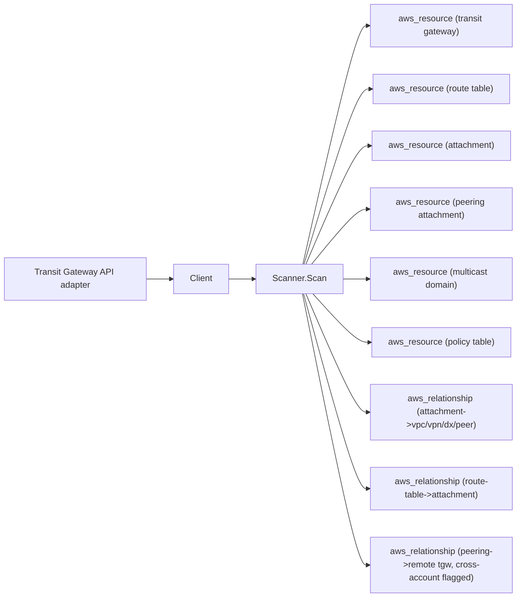

# AWS Transit Gateway Scanner

## Purpose

`internal/collector/awscloud/services/transitgateway` owns the Transit Gateway
scanner contract for the AWS cloud collector. It converts transit gateways,
transit gateway route tables, transit gateway attachments (VPC, VPN, Direct
Connect gateway, peering, and Connect), peering attachments, multicast domains,
and policy tables into reported AWS facts and relationship evidence.

The scanner pairs with `services/vpc`. The VPC scanner already emits
`vpc_route_targets_transit_gateway` and `vpc_vpn_connection_uses_transit_gateway`
edges that point at the transit gateway node by AWS-reported identifier; this
scanner makes that node real and adds the hub-side topology around it.

## Ownership boundary

This package owns scanner-level Transit Gateway fact selection and identity
mapping. It does not own AWS SDK pagination, credential acquisition, workflow
claims, fact persistence, graph writes, reducer admission, or query behavior.

It does not emit `aws_vpc_route_table`, `aws_vpc_vpn_connection`, or any
EC2-owned resource. Those identities belong to the VPC and EC2 scanners; this
scanner cross-references them by identifier on relationship edges.

## Exported surface

See `doc.go` for the godoc contract.

- `Client` - the metadata read surface consumed by `Scanner`. The interface
  exposes only `List*` methods; `scanner_test.go::TestClientInterfaceIsReadOnly`
  asserts no method name matches a mutation verb.
- `Scanner` - emits transit gateway metadata and direct relationship facts for
  one boundary.
- `TransitGateway`, `RouteTable`, `Attachment`, `PeeringAttachment`,
  `MulticastDomain`, `PolicyTable` - scanner-owned metadata records, plus the
  `TransitGatewayOptions`, `MulticastDomainOptions`, and
  `PeeringTransitGatewayInfo` option/info sub-records.

## Dependencies

- `internal/collector/awscloud` for boundaries, resource constants,
  relationship constants, and envelope builders.
- `internal/facts` for emitted fact envelope kinds.

The package depends on a small `Client` interface rather than the AWS SDK for
Go v2 so tests can use fake clients and the `awssdk` adapter can own SDK
behavior.

## Telemetry

This scanner emits no spans or logs directly. `awsruntime.ClaimedSource`
records scan duration and emitted resource counts after `Scanner.Scan` returns.
The `awssdk` adapter records Transit Gateway API call counts, throttles, and
pagination spans. The required resource signal is
`eshu_dp_aws_resources_emitted_total{service="transitgateway"}` with the
existing bounded AWS collector labels.

## Gotchas / invariants

- The scanner is metadata-only. It must never call any mutation API:
  Create/Delete/Modify TransitGateway, TransitGatewayAttachment,
  TransitGatewayRouteTable, or TransitGatewayMulticastDomain;
  AssociateTransitGatewayRouteTable; or
  EnableTransitGatewayRouteTablePropagation. The `awssdk` adapter's reflection
  test pins the same contract on its narrow `apiClient` interface.
- It must never read transit gateway routes, multicast group memberships, or
  policy table rules. The scanner-owned `PolicyTable` type has no rules field;
  the adapter never calls `SearchTransitGatewayRoutes` or
  `GetTransitGatewayPolicyTableEntries`.
- Cross-account peering attachments are surfaced as-is. The accepter side of a
  peering attachment is frequently a transit gateway in a different account; the
  scanner emits the remote transit gateway identity exactly as AWS reports it,
  flags the edge `cross_account` and records the reported `owner_id` and
  `region` for downstream org-context joins, and never resolves the remote
  account's identity itself.
- An attachment whose AWS-reported resource type has no typed target (for
  example a Connect attachment) still emits the attachment resource and the
  attachment-to-transit-gateway edge, but no fabricated resource edge.
- Resource types are disjoint from the VPC scanner.
  `scanner_test.go::TestResourceTypesDisjointFromVPC` pins the boundary.
- Preserve stable transit gateway, route table, attachment, multicast domain,
  and policy table identities across repeated observations in the same AWS
  generation.
- Keep IDs, ARNs, tags, and CIDR-like strings out of metric labels.

## Evidence

Collector Performance Evidence: `go test ./internal/collector/awscloud/services/transitgateway/...`
covers the bounded Transit Gateway metadata path: paginated
DescribeTransitGateways, DescribeTransitGatewayRouteTables,
DescribeTransitGatewayAttachments, DescribeTransitGatewayPeeringAttachments,
DescribeTransitGatewayMulticastDomains, and DescribeTransitGatewayPolicyTables
with `MaxResults=1000`, and no route, multicast-membership, or policy-rule reads.

No-Regression Evidence: `go test ./cmd/collector-aws-cloud ./internal/collector/awscloud/...`
covers transit gateway resource and relationship fact emission, the
cross-account peer surfacing without remote-account resolution, omission of
policy rule entries, runtime registration, command configuration, and the SDK
adapter's safe metadata mapping. The scanner adds no Cypher, graph write, queue,
worker, lease, batching, or runtime-stage code; it reuses the bounded AWS
collector claim path already measured for the VPC and KMS scanners on the same
input shape.

Collector Observability Evidence: Transit Gateway uses the existing AWS
collector `aws.service.pagination.page` span plus `eshu_dp_aws_api_calls_total`,
`eshu_dp_aws_throttle_total`, `eshu_dp_aws_resources_emitted_total`,
`eshu_dp_aws_relationships_emitted_total`, and `aws_scan_status` rows.

No-Observability-Change: the existing AWS collector telemetry contract already
diagnoses Transit Gateway scans through the bounded shared instruments; this
scanner adds no new metric, span, or log.

Collector Deployment Evidence: Transit Gateway runs inside the existing hosted
`collector-aws-cloud` runtime, so `/healthz`, `/readyz`, `/metrics`, and
`/admin/status` stay covered by the command wiring and Helm collector runtime.

## Related docs

- `../vpc/README.md`
- `docs/public/services/collector-aws-cloud.md`
- `docs/public/services/collector-aws-cloud-scanners.md`
- `docs/public/guides/collector-authoring.md`
