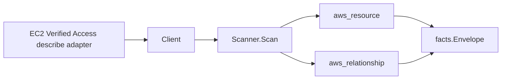

# Amazon Verified Access Scanner

## Purpose

`internal/collector/awscloud/services/verifiedaccess` owns the Amazon Verified
Access scanner contract for the AWS cloud collector. It converts Verified Access
instance, group, endpoint, and trust-provider metadata into `aws_resource` facts
and emits relationship evidence for group-in-instance and endpoint-in-group
membership, instance-to-trust-provider attachment, and endpoint dependencies on
EC2 subnets, EC2 security groups, and ACM certificates.

Although Verified Access ships under the EC2 SDK, it is its own `service_kind`
(`verifiedaccess`) with its own `ResourceType*` constants, distinct from the core
`ec2` scanner.

## Ownership boundary

This package owns scanner-level Verified Access fact selection and identity
mapping. It does not own AWS SDK pagination, STS credentials, workflow claims,
fact persistence, graph writes, reducer admission, or query behavior.

## Exported surface

See `doc.go` for the godoc contract.

- `Client` - minimal Verified Access metadata read surface consumed by `Scanner`.
- `Scanner` - emits instance, group, endpoint, and trust-provider resources plus
  their relationships for one boundary.
- `Snapshot`, `Instance`, `Group`, `Endpoint`, `TrustProvider` - scanner-owned
  views with policy-document and secret fields intentionally absent.

## Dependencies

- `internal/collector/awscloud` for boundaries, resource constants, relationship
  constants, partition helpers, and envelope builders.
- `internal/facts` for emitted fact envelope kinds.

The package depends on a small `Client` interface rather than the AWS SDK for Go
v2 so tests can use fake clients and the runtime adapter can own SDK behavior.

## Telemetry

This scanner emits no spans or logs directly. `awsruntime.ClaimedSource` records
scan duration and emitted resource counts after `Scanner.Scan` returns. The
`awssdk` adapter records Verified Access API call counts, throttles, and
pagination spans.

## Gotchas / invariants

- Verified Access facts are metadata only. The scanner must never read or persist
  trust-provider client secrets, OIDC client identifiers, group/endpoint policy
  documents, or any data-plane payload, and must never call a mutation API.
- Verified Access instances, endpoints, and trust providers carry no ARN in the
  EC2 describe responses, so the scanner synthesizes the partition-aware ARN
  (`arn:<partition>:ec2:<region>:<account>:<kind>/<id>`) via
  `awscloud.PartitionForBoundary` and never hardcodes `arn:aws:`; GovCloud and
  China resolve to the real node identity. Groups carry an API ARN and use it
  directly.
- The group-in-instance edge keys the instance by the resource_id the instance
  node publishes (its synthesized ARN). The endpoint-in-group edge keys the group
  by the resource_id the group node publishes (its API ARN).
- The endpoint-to-subnet edge targets `aws_ec2_subnet` by the bare `subnet-...`
  id and the endpoint-to-security-group edge targets `aws_ec2_security_group` by
  the bare `sg-...` id, matching how the EC2 scanner publishes those node ids.
  `target_arn` stays empty for those bare-id edges.
- The endpoint-to-ACM-certificate edge targets `aws_acm_certificate` by the
  reported certificate ARN, matching the ACM scanner's published resource_id, and
  is emitted only when AWS reports an ARN-shaped value.
- IAM Identity Center usage is recorded as the `uses_iam_identity_center`
  attribute (and `user_trust_provider_type`), not a graph edge: AWS exposes no
  IAM Identity Center instance ARN on the trust provider, so an edge would
  dangle.
- Emit reported evidence only. Do not infer deployment, workload, repository
  ownership, environment, or deployable-unit truth from instance, group,
  endpoint, or trust-provider names, or AWS tags.

## Evidence

Collector Performance Evidence:
`go test ./internal/collector/awscloud/services/verifiedaccess/...` covers the
bounded Verified Access metadata path: one paginated
DescribeVerifiedAccessInstances stream, one DescribeVerifiedAccessTrustProviders
stream, one DescribeVerifiedAccessGroups stream, and one
DescribeVerifiedAccessEndpoints stream, no policy reads, no mutations, and no
graph writes in the collector.

No-Regression Evidence: metadata-only control-plane scanner; new read path, no
change to existing hot paths. `go test ./internal/collector/awscloud/services/verifiedaccess/...` green.

No-Observability-Change: reuses shared AWS pagination span + API-call/throttle counters; no telemetry contract change.

Collector Deployment Evidence: Verified Access runs inside the existing hosted
`collector-aws-cloud` runtime, so `/healthz`, `/readyz`, `/metrics`, and
`/admin/status` stay covered by the command wiring and Helm collector runtime.

## Related docs

- `docs/public/services/collector-aws-cloud.md`
- `docs/public/services/collector-aws-cloud-scanners.md`
- `docs/public/services/collector-aws-cloud-security.md`
