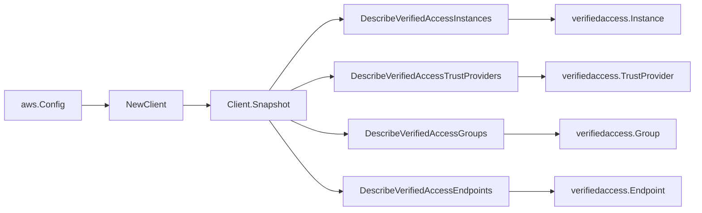

# Amazon Verified Access SDK Adapter

## Purpose

`internal/collector/awscloud/services/verifiedaccess/awssdk` adapts AWS SDK for
Go v2 EC2 Verified Access describe responses to the scanner-owned `Client`
contract. It owns instance, group, endpoint, and trust-provider pagination,
throttle classification, and per-call AWS API telemetry.

## Ownership boundary

This package owns SDK calls for Verified Access. It does not own workflow claims,
credential acquisition, Verified Access fact selection, graph writes, reducer
admission, or query behavior.

## Exported surface

See `doc.go` for the godoc contract.

- `Client` - AWS SDK-backed implementation of `verifiedaccess.Client`.
- `NewClient` - builds a `Client` for one claimed AWS boundary.

## Dependencies

- `internal/collector/awscloud` for account, region, and service boundary labels.
- `internal/collector/awscloud/services/verifiedaccess` for scanner-owned result
  types.
- `internal/telemetry` for AWS API call and throttle instruments.
- AWS SDK for Go v2 `ec2` and Smithy error contracts.

## Telemetry

Verified Access paginator pages are wrapped with:

- `aws.service.pagination.page`
- `eshu_dp_aws_api_calls_total`
- `eshu_dp_aws_throttle_total`

Metric labels stay bounded to service, account, region, operation, and result.
Verified Access ids, names, domains, tags, and raw AWS error payloads stay out of
metric labels.

## Gotchas / invariants

- The adapter reads metadata only. It must never call any Create/Modify/Delete
  Verified Access mutation API, never call `GetVerifiedAccessGroupPolicy` or
  `GetVerifiedAccessEndpointPolicy`, and never read a trust-provider secret.
- The accepted `apiClient` surface is `DescribeVerifiedAccess*`-only by
  construction. The exclusion test fails the build if any method is not a
  Verified Access Describe read or matches a mutation/policy/secret name; do not
  loosen it.
- From a trust provider, copy only the OIDC issuer reference. Never copy the
  OIDC client id, client secret, or token/userinfo endpoints.
- Copy only the customer-managed-KMS-key encryption flag from the SSE
  specification, never the KMS key ARN.
- Verified Access timestamps are RFC3339 strings in the EC2 API; the adapter
  parses them defensively and yields the zero time for empty or unparseable
  values.
- SDK adapters translate AWS records into scanner-owned types; scanner tests
  should not mock AWS SDK pagination.

## Related docs

- `docs/public/services/collector-aws-cloud-scanners.md`
- `docs/public/services/collector-aws-cloud-security.md`
