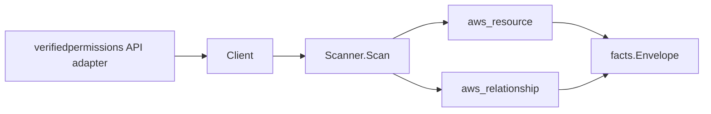

# Amazon Verified Permissions Scanner

## Purpose

`internal/collector/awscloud/services/verifiedpermissions` owns the Amazon
Verified Permissions scanner contract for the AWS cloud collector. It converts
policy store, policy, and identity source metadata into `aws_resource` facts and
emits relationship evidence for policy-in-store and identity-source-in-store
membership and for an identity source's dependency on an Amazon Cognito user
pool.

## Ownership boundary

This package owns scanner-level Verified Permissions fact selection and identity
mapping. It does not own AWS SDK pagination, STS credentials, workflow claims,
fact persistence, graph writes, reducer admission, or query behavior.

## Exported surface

See `doc.go` for the godoc contract.

- `Client` - minimal Verified Permissions metadata read surface consumed by
  `Scanner`.
- `Scanner` - emits policy store, policy, and identity source resources plus
  their relationships for one boundary.
- `Snapshot`, `PolicyStore`, `Policy`, `IdentitySource` - scanner-owned views
  with Cedar policy statement, schema, and policy template body fields
  intentionally absent.

## Dependencies

- `internal/collector/awscloud` for boundaries, resource constants,
  relationship constants, and envelope builders.
- `internal/facts` for emitted fact envelope kinds.

The package depends on a small `Client` interface rather than the AWS SDK for
Go v2 so tests can use fake clients and the runtime adapter can own SDK
behavior.

## Telemetry

This scanner emits no spans or logs directly. `awsruntime.ClaimedSource`
records scan duration and emitted resource counts after `Scanner.Scan` returns.
The `awssdk` adapter records Verified Permissions API call counts, throttles,
and pagination spans.

## Gotchas / invariants

- Verified Permissions facts are metadata only. The scanner must never read or
  persist Cedar policy statement bodies, schema bodies, or policy template
  bodies, must never evaluate an authorization request, and must never call any
  mutation API. Policies are emitted as id, type, and effect only.
- The policy store node publishes its resource_id as the policy store ARN
  (falling back to the policy store id). Both the policy-in-store and
  identity-source-in-store edges are keyed by that same store resource_id so
  they join the store node instead of dangling.
- Policies and identity sources have no AWS-assigned ARN, so their node
  resource_id is the qualified `<policy-store-id>/<id>`, and each entity's own
  edge is sourced on that same value.
- The identity-source-to-Cognito-user-pool edge is emitted only when AWS reports
  a Cognito user pool ARN. The Cognito scanner publishes a user pool node's
  resource_id as the BARE user pool id, so the scanner parses the id out of the
  `arn:<partition>:cognito-idp:...:userpool/<user-pool-id>` ARN and keys the
  target on that id (with `target_arn` left empty, the relguard contract for a
  bare-id-keyed target). A malformed user pool ARN skips the edge rather than
  dangling it. The full ARN survives as an edge attribute.
- The encryption configuration is recorded as a non-secret label (`DEFAULT` or
  `KMS`) only; the customer-managed KMS key ARN and the user-defined encryption
  context are never persisted. Application client id values are never persisted;
  only their count is recorded.
- Emit reported evidence only. Do not infer deployment, workload, repository
  ownership, environment, or deployable-unit truth from policy store, policy, or
  identity source ids, or AWS tags.

## Evidence

Collector Performance Evidence:
`go test ./internal/collector/awscloud/services/verifiedpermissions/...` covers
the bounded Verified Permissions metadata path: one paginated ListPolicyStores
stream, one GetPolicyStore point read per store, one paginated ListPolicies
stream and one paginated ListIdentitySources stream per store, no Cedar body
reads, no schema reads, no authorization evaluation, and no graph writes in the
collector.

No-Regression Evidence: metadata-only control-plane scanner; new read path, no change to existing hot paths. `go test ./internal/collector/awscloud/services/verifiedpermissions/...` green.

No-Observability-Change: reuses shared AWS pagination span + API-call/throttle counters; no telemetry contract change.
