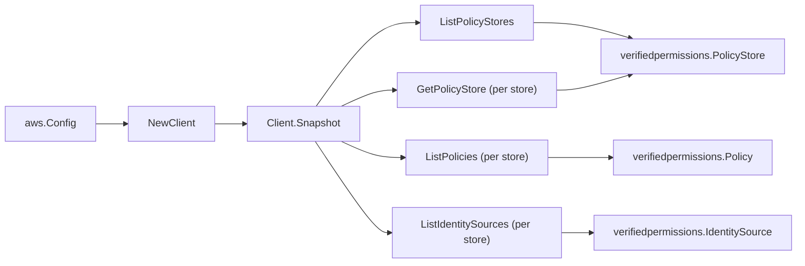

# Amazon Verified Permissions SDK Adapter

## Purpose

`internal/collector/awscloud/services/verifiedpermissions/awssdk` adapts AWS SDK
for Go v2 Verified Permissions responses to the scanner-owned `Client` contract.
It owns policy store pagination, the per-store GetPolicyStore metadata read,
per-store policy and identity source pagination, configuration-union mapping,
throttle classification, and per-call AWS API telemetry.

## Ownership boundary

This package owns SDK calls for Verified Permissions. It does not own workflow
claims, credential acquisition, Verified Permissions fact selection, graph
writes, reducer admission, or query behavior.

## Exported surface

See `doc.go` for the godoc contract.

- `Client` - AWS SDK-backed implementation of `verifiedpermissions.Client`.
- `NewClient` - builds a `Client` for one claimed AWS boundary.

## Dependencies

- `internal/collector/awscloud` for account, region, and service boundary
  labels.
- `internal/collector/awscloud/services/verifiedpermissions` for scanner-owned
  result types.
- `internal/telemetry` for AWS API call and throttle instruments.
- AWS SDK for Go v2 `verifiedpermissions` and Smithy error contracts.

## Telemetry

Verified Permissions paginator pages and point reads are wrapped with:

- `aws.service.pagination.page`
- `eshu_dp_aws_api_calls_total`
- `eshu_dp_aws_throttle_total`

Metric labels stay bounded to service, account, region, operation, and result.
Verified Permissions ARNs, ids, tags, and raw AWS error payloads stay out of
metric labels.

## Gotchas / invariants

- The adapter reads metadata only. It must never call `GetPolicy` (the Cedar
  policy statement body), `GetSchema` (the schema body), `GetPolicyTemplate`
  (the template body), `IsAuthorized`, `BatchIsAuthorized`, or any
  `Create*`/`Update*`/`Delete*`/`Put*` mutation API. The exclusion test fails the
  build if any of these reaches the `apiClient` interface.
- `GetPolicyStore` is requested with `Tags: true` so policy store tags are read
  in the same call. It returns store-level metadata only (validation mode,
  deletion protection, encryption configuration, Cedar version, tags), never a
  Cedar body.
- The encryption configuration union is mapped to a non-secret label
  (`DEFAULT` or `KMS`) only; the customer-managed KMS key ARN and the
  user-defined encryption context are never persisted.
- The identity source configuration union is mapped to a provider kind plus the
  non-secret provider reference (Cognito user pool ARN or OIDC issuer URL). The
  deprecated `Details` struct is read as a fallback for older accounts. The
  application client id values are never persisted; only their count is
  recorded.
- SDK adapters translate AWS records into scanner-owned types; scanner tests
  should not mock AWS SDK pagination.

## Related docs

- `docs/public/services/collector-aws-cloud-scanners.md`
- `docs/public/services/collector-aws-cloud-security.md`
