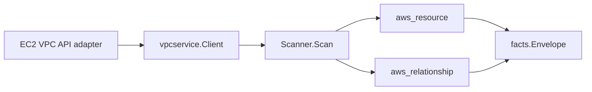

# AWS VPC Scanner

## Purpose

`internal/collector/awscloud/services/vpc` owns the AWS VPC network-fabric
scanner contract for the AWS cloud collector. It converts VPC topology metadata
into `aws_resource` facts and emits relationship evidence between fabric
resources and the EC2-owned VPC/subnet/security-group/ENI surface.

## Ownership boundary with EC2

The VPC scanner and the EC2 scanner together cover AWS VPC networking. They
split ownership by AWS-reported identity so each resource is emitted exactly
once.

| Resource                                | Owner |
| --------------------------------------- | ----- |
| VPC                                     | `services/ec2` |
| Subnet                                  | `services/ec2` |
| Security group                          | `services/ec2` |
| Security group rule                     | `services/ec2` |
| Network interface (ENI)                 | `services/ec2` |
| Route table                             | `services/vpc` |
| Internet gateway                        | `services/vpc` |
| NAT gateway                             | `services/vpc` |
| Network ACL                             | `services/vpc` |
| VPC peering connection                  | `services/vpc` |
| VPC endpoint (gateway and interface)    | `services/vpc` |
| Elastic IP allocation                   | `services/vpc` |
| DHCP option set                         | `services/vpc` |
| Customer gateway                        | `services/vpc` |
| Virtual private gateway                 | `services/vpc` |
| Site-to-site VPN connection             | `services/vpc` |

EC2-owned identities show up only as relationship targets here (`target_type ==
aws_ec2_vpc`, `aws_ec2_subnet`, `aws_ec2_network_interface`, `aws_ec2_instance`).
A focused test in `scanner_test.go`
(`TestVPCResourceTypesDisjointFromEC2`) pins the boundary so a regression
fails fast.

This boundary is intentional: the EC2 scanner already owns the ENI surface as
`aws_resource` facts (instances are out of scope there too and appear only as
ENI-attachment target evidence, never as `aws_ec2_instance` resources), so the
VPC scanner references those identities as relationship targets rather than
re-emitting them. Adding a second emitter for the same `resource_id` would
create duplicate facts with non-deterministic correlation behavior.

## Exported surface

See `doc.go` for the godoc contract.

- `Client` - minimal VPC topology read surface consumed by `Scanner`. Only
  `List*` operations. No mutation method is allowed on this interface; a
  scanner test pins the boundary.
- `Scanner` - emits VPC topology metadata facts for one boundary.
- Scanner-owned resource record types: `RouteTable`, `InternetGateway`,
  `NATGateway`, `NetworkACL`, `VPCPeeringConnection`, `VPCEndpoint`,
  `ElasticIP`, `DHCPOptions`, `CustomerGateway`, `VPNGateway`,
  `VPNConnection`.

## Dependencies

- `internal/collector/awscloud` for boundaries, resource constants,
  relationship constants, and envelope builders.
- `internal/facts` for emitted fact envelope kinds.

The package depends on a small `Client` interface rather than the AWS SDK for
Go v2 so tests can use fake clients and the runtime SDK adapter owns SDK
behavior.

## Telemetry

This scanner emits no spans or logs directly. `awsruntime.ClaimedSource`
records scan duration and emitted resource counts after `Scanner.Scan` returns.
The `awssdk` adapter records VPC API call counts, throttles, and pagination
spans. The collector-wide
`eshu_dp_aws_resources_emitted_total{service="vpc"}` and
`eshu_dp_aws_relationships_emitted_total{service="vpc"}` counters surface
emission volume per region.

## Gotchas / invariants

- VPC topology facts are reported AWS metadata. The scanner never reads or
  persists VPN tunnel pre-shared keys, IAM policy JSON, or any data-plane
  payload.
- The scanner never emits VPC, subnet, security group, security group rule,
  or network interface resources. Those identities belong to the EC2 scanner.
  Cross-package edges reference the EC2-owned identifier directly.
- Route relationships emit only when a route reports a non-empty target ID.
  The `local` gateway in every route table is intentionally not emitted as an
  internet-gateway edge; only `igw-`-prefixed gateway IDs map to the
  internet-gateway relationship.
- Tags are raw AWS tag evidence. Do not infer environment, owner, workload,
  or deployable-unit truth from tags in this package.
- VPC peering emits two `vpc_peering_connects_vpc` edges (requester and
  accepter) when AWS reports both sides. Accepter-only or requester-only
  cases emit one edge.

## Forbidden APIs

Per issue #731 the scanner MUST NOT reach any of these EC2 mutation
operations:

- `CreateVpc`, `DeleteVpc`, `ModifyVpcAttribute`
- `CreateSubnet`, `DeleteSubnet`, `ModifySubnetAttribute`
- `CreateRouteTable`, `DeleteRouteTable`, `AssociateRouteTable`,
  `DisassociateRouteTable`, `CreateRoute`, `DeleteRoute`, `ReplaceRoute`
- `CreateInternetGateway`, `DeleteInternetGateway`,
  `AttachInternetGateway`, `DetachInternetGateway`
- `CreateNatGateway`, `DeleteNatGateway`
- `CreateNetworkAcl`, `DeleteNetworkAcl`, `CreateNetworkAclEntry`,
  `DeleteNetworkAclEntry`, `ReplaceNetworkAclEntry`
- `CreateVpcPeeringConnection`, `DeleteVpcPeeringConnection`,
  `AcceptVpcPeeringConnection`, `RejectVpcPeeringConnection`
- `CreateVpcEndpoint`, `DeleteVpcEndpoint`, `ModifyVpcEndpoint`
- `AuthorizeSecurityGroupIngress`, `AuthorizeSecurityGroupEgress`,
  `RevokeSecurityGroupIngress`, `RevokeSecurityGroupEgress`
- `AllocateAddress`, `ReleaseAddress`, `AssociateAddress`,
  `DisassociateAddress`
- `CreateCustomerGateway`, `DeleteCustomerGateway`
- `CreateVpnGateway`, `DeleteVpnGateway`, `AttachVpnGateway`,
  `DetachVpnGateway`
- `CreateVpnConnection`, `DeleteVpnConnection`, `ModifyVpnConnection`
- `CreateDhcpOptions`, `DeleteDhcpOptions`, `AssociateDhcpOptions`
- `CreateTags`, `DeleteTags`

`TestAPIClientNeverIncludesForbiddenMethods` in `awssdk/client_test.go` proves
none of these are reachable through the adapter's narrow `apiClient`
interface, and `TestAPIClientOnlyReadsListsAndDescribes` rejects any future
method that is not a `Describe*` / `Get*` / `List*` read.
`TestClientInterfaceIsReadOnly` in `scanner_test.go` pins the same
boundary at the scanner-owned `Client` interface level.

## Evidence

Collector Performance Evidence: `go test ./internal/collector/awscloud/services/vpc/...`
covers the bounded VPC topology metadata path: one paginated read per
DescribeXxx (or a single one-shot read for the non-paginated APIs:
DescribeAddresses, DescribeCustomerGateways, DescribeVpnGateways,
DescribeVpnConnections), no mutation calls, and no graph writes in the
collector.

No-Regression Evidence: `go test ./cmd/collector-aws-cloud ./internal/collector/awscloud/...`
covers VPC fabric resource emission, route/network-ACL/peering/endpoint
relationship emission, the EC2/VPC ownership boundary
(`TestVPCResourceTypesDisjointFromEC2`), runtime registration, command
configuration, and the SDK adapter's read-only API surface.

Collector Observability Evidence: VPC uses the existing AWS collector
`aws.service.pagination.page` span plus `eshu_dp_aws_api_calls_total`,
`eshu_dp_aws_throttle_total`, `eshu_dp_aws_resources_emitted_total`,
`eshu_dp_aws_relationships_emitted_total`, and `aws_scan_status` rows. Metric
labels stay bounded to service, account, region, operation, result, and
status.

No-Observability-Change: the existing AWS collector telemetry contract
already diagnoses VPC scans through `aws.service.scan`,
`aws.service.pagination.page`, API/throttle counters, resource/relationship
counters, and `aws_scan_status`.

Collector Deployment Evidence: VPC runs inside the existing hosted
`collector-aws-cloud` runtime, so `/healthz`, `/readyz`, `/metrics`, and
`/admin/status` stay covered by the command wiring and Helm collector
runtime.

## Related docs

- `docs/public/services/collector-aws-cloud.md`
- `docs/public/guides/collector-authoring.md`
- `../ec2/README.md` for the EC2-owned half of the VPC fabric surface.
