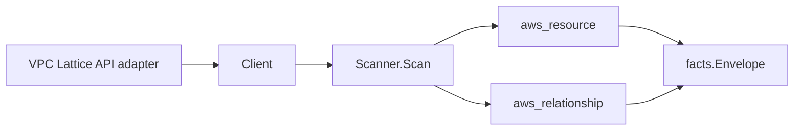

# Amazon VPC Lattice Scanner

## Purpose

`internal/collector/awscloud/services/vpclattice` owns the Amazon VPC Lattice
scanner contract for the AWS cloud collector. It converts VPC Lattice service
network, service, target group, and listener metadata into `aws_resource` facts
and emits relationship evidence for service-network-to-VPC and
service-network-to-service associations, listener-in-service membership,
target-group-to-VPC placement, target-group-to-service use,
target-group-to-target registration (Lambda, EC2 instance, ALB), and the
service-to-ACM-certificate binding.

## Ownership boundary

This package owns scanner-level VPC Lattice fact selection and identity mapping.
It does not own AWS SDK pagination, STS credentials, workflow claims, fact
persistence, graph writes, reducer admission, or query behavior.

## Exported surface

See `doc.go` for the godoc contract.

- `Client` - minimal VPC Lattice metadata read surface consumed by `Scanner`.
- `Scanner` - emits service network, service, target group, and listener
  resources plus their relationships for one boundary.
- `Snapshot`, `ServiceNetwork`, `Service`, `Listener`, `TargetGroup`, `Target`,
  `VPCAssociation`, `ServiceAssociation` - scanner-owned views with auth-policy,
  resource-policy, and data-plane fields intentionally absent.

## Dependencies

- `internal/collector/awscloud` for boundaries, resource constants,
  relationship constants, partition helpers, and envelope builders.
- `internal/facts` for emitted fact envelope kinds.

The package depends on a small `Client` interface rather than the AWS SDK for
Go v2 so tests can use fake clients and the runtime adapter can own SDK
behavior.

## Telemetry

This scanner emits no spans or logs directly. `awsruntime.ClaimedSource`
records scan duration and emitted resource counts after `Scanner.Scan` returns.
The `awssdk` adapter records VPC Lattice API call counts, throttles, and
pagination spans.

## Gotchas / invariants

- VPC Lattice facts are metadata only. The scanner must never read or persist
  auth-policy bodies, resource-policy bodies, or any data-plane payload, and
  must never call a mutation API.
- Service network, service, target group, and listener nodes publish their
  resource_id as the ARN (falling back to the id). Edges key on that same value.
- The service-network-to-VPC and target-group-to-VPC edges target `aws_ec2_vpc`
  by the bare `vpc-` id the EC2 scanner publishes; `target_arn` is never set for
  a bare VPC id.
- The service-network-to-service, target-group-to-service, and
  listener-in-service edges target `aws_vpclattice_service` by the service ARN
  this scanner publishes; the edge resolves once the service node is emitted.
- The service-to-ACM-certificate edge is emitted only when `GetService` reports
  a certificate ARN, and targets `aws_acm_certificate` by that ARN.
- Target-to-resource edges are emitted only when the registered target id
  resolves to the shape its target group type implies: LAMBDA → Lambda function
  ARN (`aws_lambda_function`), INSTANCE → bare `i-` instance id
  (`aws_ec2_instance`, a forward reference until an EC2 instance scanner
  exists), ALB → load balancer ARN (`aws_elbv2_load_balancer`). IP target
  groups register raw IP addresses and are skipped rather than dangle an edge.
- Emit reported evidence only. Do not infer deployment, workload, repository
  ownership, environment, or deployable-unit truth from network, service,
  target group, or listener names, or AWS tags.

## Evidence

Collector Performance Evidence:
`go test ./internal/collector/awscloud/services/vpclattice/...` covers the
bounded VPC Lattice metadata path: one paginated ListServiceNetworks stream
with per-network paginated VPC and service association streams, one paginated
ListServices stream with one GetService point read and one paginated
ListListeners stream per service, one paginated ListTargetGroups stream with one
GetTargetGroup point read and one paginated ListTargets stream per target group,
one ListTagsForResource point read per network/service/target group, no policy
reads, and no graph writes in the collector.

No-Regression Evidence: metadata-only control-plane scanner; new read path, no
change to existing hot paths. `go test ./internal/collector/awscloud/services/vpclattice/...` green.

No-Observability-Change: reuses shared AWS pagination span + API-call/throttle counters; no telemetry contract change.

Collector Deployment Evidence: VPC Lattice runs inside the existing hosted
`collector-aws-cloud` runtime, so `/healthz`, `/readyz`, `/metrics`, and
`/admin/status` stay covered by the command wiring and Helm collector runtime.

## Related docs

- `docs/public/services/collector-aws-cloud.md`
- `docs/public/services/collector-aws-cloud-scanners.md`
- `docs/public/services/collector-aws-cloud-security.md`
