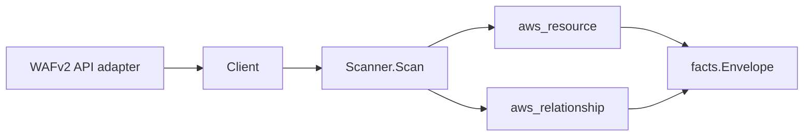

# AWS WAFv2 Scanner

## Purpose

`internal/collector/awscloud/services/wafv2` owns the WAFv2 scanner contract for
the AWS cloud collector. It converts web ACL, rule group, IP set, and regex
pattern set metadata into `aws_resource` facts and emits web-ACL relationship
evidence to protected resources, rule groups, IP sets, and regex pattern sets.
IP set address lists, regex pattern bodies, and rule Statement bodies are never
persisted.

## Ownership boundary

This package owns scanner-level WAFv2 fact selection and identity mapping. It
does not own AWS SDK pagination, scope (REGIONAL/CLOUDFRONT) selection, STS
credentials, workflow claims, fact persistence, graph writes, reducer
admission, or query behavior.

## Exported surface

See `doc.go` for the godoc contract.

- `Client` - minimal WAFv2 metadata read surface consumed by `Scanner`.
- `Scanner` - emits WAFv2 metadata facts and relationships for one boundary.
- `WebACL`, `RuleGroup`, `IPSet`, `RegexPatternSet` - scanner-owned resource
  representations. They carry counts (`AddressCount`, `PatternCount`,
  `RuleCount`) and reference ARNs, never address lists, regex bodies, or rule
  Statement bodies.
- `ManagedRuleSetRef` - vendor and name of a managed rule group referenced by a
  web ACL.
- `ProtectedResource` - ARN and AWS-reported type of a web ACL association.

## Dependencies

- `internal/collector/awscloud` for boundaries, WAFv2 resource and relationship
  constants, and envelope builders.
- `internal/facts` for emitted fact envelope kinds.

The package depends on a small `Client` interface rather than the AWS SDK for Go
v2 so tests use fake clients and the runtime adapter owns SDK behavior.

## Telemetry

This scanner emits no spans or logs directly. `awsruntime.ClaimedSource`
records scan duration and emitted resource counts after `Scanner.Scan` returns
through `eshu_dp_aws_resources_emitted_total{service="wafv2"}` and
`eshu_dp_aws_relationships_emitted_total`. The `awssdk` adapter records WAFv2
API call counts, throttles, and pagination spans.

## Gotchas / invariants

- WAFv2 facts are metadata only. The scanner must never persist IP set address
  lists (private CIDR and threat intel), regex pattern bodies (customer
  detection rules), or rule Statement bodies (threat hypotheses).
- One `wafv2` claim scans one scope. A global-region boundary scans the
  CLOUDFRONT scope; a concrete region scans the REGIONAL scope. The adapter
  selects the scope; the scanner records the reported value on each resource.
- Managed rule set references carry vendor and name only; the managed rule
  contents stay with the vendor and are never read.
- Relationships are emitted only when AWS reports both endpoints (the web ACL
  ARN and the target ARN).
- Tags are raw AWS tag evidence. Do not infer environment, owner, workload, or
  deployable-unit truth from tags in this package.

## Evidence

Collector Performance Evidence: `go test ./internal/collector/awscloud/services/wafv2/...`
covers the bounded WAFv2 metadata path: one marker-paginated list per resource
kind, one detail read per resource, one tag read per resource, and per-web-ACL
regional association reads. IP set and regex set detail reads count entries and
discard the bodies.

No-Regression Evidence: `go test ./cmd/collector-aws-cloud ./internal/collector/awscloud/...`
covers WAFv2 resource fact emission, all four relationship kinds, count-only IP
set and regex set emission, the SDK adapter's read-only interface (reflection
exclusion test), scope selection, runtime registration, and command
configuration.

Collector Observability Evidence: WAFv2 uses the existing AWS collector
`aws.service.pagination.page` span plus `eshu_dp_aws_api_calls_total`,
`eshu_dp_aws_throttle_total`, `eshu_dp_aws_resources_emitted_total`,
`eshu_dp_aws_relationships_emitted_total`, and `aws_scan_status` rows. Metric
labels stay bounded to service, account, region, operation, result, and status.

No-Observability-Change: the existing AWS collector telemetry contract already
diagnoses WAFv2 scans through `aws.service.scan`, `aws.service.pagination.page`,
API/throttle counters, resource/relationship counters, and `aws_scan_status`.

Collector Deployment Evidence: WAFv2 runs inside the existing hosted
`collector-aws-cloud` runtime, so `/healthz`, `/readyz`, `/metrics`, and
`/admin/status` stay covered by the command wiring and Helm collector runtime.

## Related docs

- `docs/public/services/collector-aws-cloud-scanners.md`
- `docs/public/services/collector-aws-cloud-security.md`
- `docs/public/guides/collector-authoring.md`
