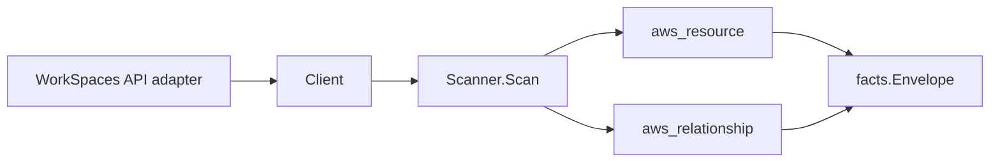

# Amazon WorkSpaces Scanner

## Purpose

`internal/collector/awscloud/services/workspaces` owns the Amazon WorkSpaces
scanner contract for the AWS cloud collector. It converts WorkSpaces virtual
desktop, registered directory, account-owned bundle, and IP access control group
metadata into `aws_resource` facts and emits relationship evidence for
workspace-in-directory, workspace-uses-bundle, workspace-uses-KMS-key, and the
directory's links to the underlying Directory Service directory, placement
subnets, assigned security group, WorkSpaces IAM role, and associated IP access
control groups.

## Ownership boundary

This package owns scanner-level WorkSpaces fact selection and identity mapping.
It does not own AWS SDK pagination, STS credentials, workflow claims, fact
persistence, graph writes, reducer admission, or query behavior.

## Exported surface

See `doc.go` for the godoc contract.

- `Client` - minimal WorkSpaces metadata read surface consumed by `Scanner`.
- `Scanner` - emits WorkSpace, directory, bundle, and IP-group resources plus
  their relationships for one boundary.
- `Snapshot`, `Workspace`, `Directory`, `Bundle`, `IPGroup`, `IPRule` -
  scanner-owned views with credential, registration-code, IP-address, and
  session fields intentionally absent.

## Dependencies

- `internal/collector/awscloud` for boundaries, resource constants,
  relationship constants, partition helpers, and envelope builders.
- `internal/facts` for emitted fact envelope kinds.

The package depends on a small `Client` interface rather than the AWS SDK for
Go v2 so tests can use fake clients and the runtime adapter can own SDK
behavior.

## Telemetry

This scanner emits no spans or logs directly. `awsruntime.ClaimedSource`
records scan duration and emitted resource counts after `Scanner.Scan` returns.
The `awssdk` adapter records WorkSpaces API call counts, throttles, and
pagination spans.

## Gotchas / invariants

- WorkSpaces facts are metadata only. The scanner must never read desktop
  session contents, user credentials, directory registration codes, WorkSpace IP
  addresses, or connection state, and must never call any mutation, reboot,
  rebuild, start, stop, or terminate API. User names are identity metadata and
  are allowed; passwords and registration codes are not.
- The WorkSpaces describe APIs return no ARNs, so the WorkSpace, directory,
  bundle, and IP-group nodes publish a synthesized partition-aware WorkSpaces ARN
  (`arn:<partition>:workspaces:<region>:<account>:<resource>/<id>`) as their
  resource_id, derived via `awscloud.PartitionForBoundary` so the nodes join in
  GovCloud and China, not just commercial. The bare id is the fallback when
  account or region is missing.
- The internal workspace-in-directory edge targets the WorkSpaces directory
  node's synthesized ARN. The directory-to-Directory-Service edge instead
  targets the BARE directory id (`d-...`), which is the resource_id the `ds`
  scanner publishes - the same AWS DirectoryId keys two distinct nodes, and the
  edges must not be confused.
- The directory-to-subnet and directory-to-security-group edges target the BARE
  `subnet-...` / `sg-...` ids the `ec2` scanner publishes, not ARNs.
- The directory-to-IAM-role and workspace-to-KMS-key edges target the role ARN
  and key reference AWS reports; `target_arn` is set only for ARN-shaped values
  so a bare id is never given a fabricated ARN.
- Bundles are scanned for the account's own bundles (owner and compute type are
  recorded); the large AMAZON-provided catalog is not enumerated.
- Emit reported evidence only. Do not infer deployment, workload, repository
  ownership, environment, or deployable-unit truth from WorkSpace, directory,
  bundle, or group names, or AWS tags.

## Evidence

Collector Performance Evidence:
`go test ./internal/collector/awscloud/services/workspaces/...` covers the
bounded WorkSpaces metadata path: one paginated DescribeWorkspaces stream, one
paginated DescribeWorkspaceDirectories stream, one paginated
DescribeWorkspaceBundles stream, one paginated DescribeIpGroups stream, one
DescribeTags point read per resource, no session or connection-status reads, no
mutations, and no graph writes in the collector.

No-Regression Evidence: metadata-only control-plane scanner; new read path, no
change to existing hot paths. `go test ./internal/collector/awscloud/services/workspaces/...`
green.

No-Observability-Change: reuses shared AWS pagination span + API-call/throttle
counters; no telemetry contract change.

Collector Deployment Evidence: WorkSpaces runs inside the existing hosted
`collector-aws-cloud` runtime, so `/healthz`, `/readyz`, `/metrics`, and
`/admin/status` stay covered by the command wiring and Helm collector runtime.

## Related docs

- `docs/public/services/collector-aws-cloud.md`
- `docs/public/services/collector-aws-cloud-scanners.md`
- `docs/public/services/collector-aws-cloud-security.md`
