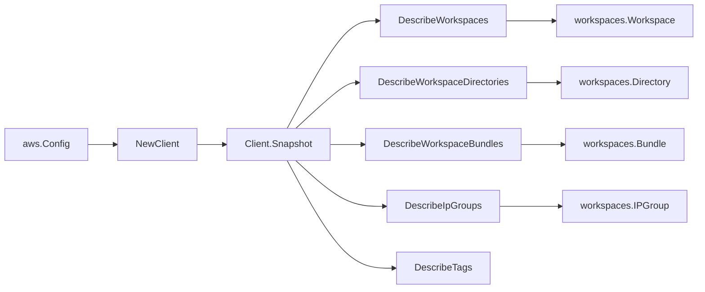

# Amazon WorkSpaces SDK Adapter

## Purpose

`internal/collector/awscloud/services/workspaces/awssdk` adapts AWS SDK for Go
v2 WorkSpaces responses to the scanner-owned `Client` contract. It owns
workspace, directory, bundle, and IP-group pagination, resource-tag reads,
throttle classification, and per-call AWS API telemetry.

## Ownership boundary

This package owns SDK calls for WorkSpaces. It does not own workflow claims,
credential acquisition, WorkSpaces fact selection, graph writes, reducer
admission, or query behavior.

## Exported surface

See `doc.go` for the godoc contract.

- `Client` - AWS SDK-backed implementation of `workspaces.Client`.
- `NewClient` - builds a `Client` for one claimed AWS boundary.

## Dependencies

- `internal/collector/awscloud` for account, region, and service boundary
  labels.
- `internal/collector/awscloud/services/workspaces` for scanner-owned result
  types.
- `internal/telemetry` for AWS API call and throttle instruments.
- AWS SDK for Go v2 `workspaces` and Smithy error contracts.

## Telemetry

WorkSpaces paginator pages and point reads are wrapped with:

- `aws.service.pagination.page`
- `eshu_dp_aws_api_calls_total`
- `eshu_dp_aws_throttle_total`

Metric labels stay bounded to service, account, region, operation, and result.
WorkSpaces ARNs, names, tags, and raw AWS error payloads stay out of metric
labels.

## Gotchas / invariants

- The adapter reads metadata only. It must never call any session,
  connection-status, or credential read (DescribeWorkspacesConnectionStatus,
  DescribeWorkspaceSnapshots, DescribeConnectionAliases, DescribeClientBranding,
  DescribeWorkspaceImagePermissions) and never any Create/Modify/Reboot/Rebuild/
  Start/Stop/Terminate/Restore/Migrate mutation API.
- The describe responses carry fields the scanner deliberately drops: WorkSpace
  IP addresses, directory registration codes, directory DNS server addresses,
  the service-account user name, and SAML/Entra/IDC federation config. The
  mappers must not copy those into scanner-owned types.
- `DescribeTags` keys on the bare WorkSpaces resource id (the WorkSpace,
  directory, bundle, or IP-group id), not an ARN.
- Bundles are paged without an `Owner` filter, which returns the account's own
  bundles; the adapter does not enumerate the AMAZON-provided catalog.
- SDK adapters translate AWS records into scanner-owned types; scanner tests
  should not mock AWS SDK pagination.

## Related docs

- `docs/public/services/collector-aws-cloud-scanners.md`
- `docs/public/services/collector-aws-cloud-security.md`
