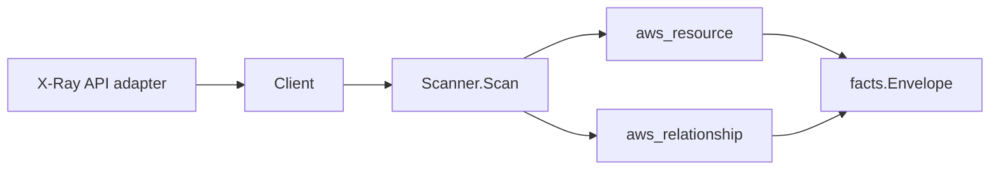

# AWS X-Ray Scanner

## Purpose

`internal/collector/awscloud/services/xray` owns the X-Ray scanner contract for
the AWS cloud collector. It emits X-Ray **configuration** only: trace groups,
sampling rules, and the account-region encryption configuration. It converts
that configuration into `aws_resource` facts and emits relationship evidence for
the encryption-config-to-KMS-key dependency and each sampling-rule-to-service
correlation anchor.

The scanner never reads or persists X-Ray observability payload — traces, trace
summaries, segments, or service-graph (service-map) data. That is monitoring
data, not configuration truth, and is out of scope by construction.

## Ownership boundary

This package owns scanner-level X-Ray configuration fact selection and identity
mapping. It does not own AWS SDK pagination, STS credentials, claims, fact
persistence, graph writes, reducer admission, or query behavior.

## Exported surface

See `doc.go` for the godoc contract.

- `Client` — the configuration-only X-Ray read surface consumed by `Scanner`.
  It exposes exactly `GetGroups`, `GetSamplingRules`, and `GetEncryptionConfig`.
- `Scanner` — emits group, sampling-rule, and encryption-config resources plus
  the KMS-key and service-correlation relationships for one boundary.
- `Group`, `SamplingRule`, `EncryptionConfig` — scanner-owned configuration
  views with no trace, segment, or service-map field.

## API surface (the exact methods the adapter calls)

The scanner uses exactly three read-only X-Ray APIs, matching the
configuration-only contract:

- `GetGroups` — group name, ARN, trace filter expression, insights flags.
- `GetSamplingRules` — rule name, ARN, priority, reservoir, fixed rate, and
  service match criteria.
- `GetEncryptionConfig` — encryption type (NONE/KMS), status, KMS key reference.

No other X-Ray API is reachable. The `awssdk` adapter's `apiClient` interface
omits every trace, service-graph, insight, telemetry, and mutation method, and a
reflection test asserts that surface is exactly the three reads above.

## Relationships

- **encryption config → KMS key** (`xray_encryption_config_uses_kms_key`,
  `target_type=aws_kms_key`): emitted only when the encryption type is KMS and
  AWS reports a key reference. The reported key id/ARN/alias is used as the join
  key directly, because the KMS scanner publishes its key `resource_id` as the
  bare key id (falling back to the key ARN). `target_arn` is set only when the
  reference is ARN-shaped, so a bare id/alias is never given a fabricated ARN.
- **sampling rule → service** (`xray_sampling_rule_matches_service`,
  `target_type=aws_xray_service_correlation`): a labeled correlation anchor
  keyed by `<service_name>/<service_type>`. The rule names a service by the
  string it reports in segments; reducers resolve it to the real service node by
  name during materialization. A wildcard-only (`*`/`*`) rule names no service
  and emits no edge.

## Gotchas / invariants

- X-Ray facts are configuration only. The scanner must not call
  `GetTraceSummaries`, `BatchGetTraces`, `GetTraceGraph`, `GetServiceGraph`,
  `GetTimeSeriesServiceStatistics`, any `GetInsight*`, `PutTraceSegments`,
  `PutTelemetryRecords`, or any Create/Update/Delete/PutEncryptionConfig
  mutation. The group filter expression is persisted as a configuration string,
  never expanded into the traces it selects.
- ARNs are taken as AWS reports them (groups and sampling rules carry their own
  ARN). The only synthesized identity is the encryption-config resource id,
  `<account>/<region>/xray-encryption-config`, which carries no ARN and so needs
  no partition derivation. The KMS edge inherits the key reference's partition
  from the reported ARN, never hardcoding `arn:aws:`.
- The scanner requires no `ESHU_AWS_REDACTION_KEY`: X-Ray configuration carries
  no secret-shaped fields. Filter expressions and sampling criteria are
  operator-authored configuration, not customer payload.

## Evidence

Collector Performance Evidence:
`go test ./internal/collector/awscloud/services/xray/...` covers the bounded
X-Ray configuration path: one paginated `GetGroups` stream, one paginated
`GetSamplingRules` stream, and one `GetEncryptionConfig` point read, with no
trace, service-graph, insight, telemetry, or mutation calls and no graph writes
in the collector. The slice is account-region bounded and adds no pagination
fan-out beyond the two config list reads.

No-Regression Evidence:
`go test ./cmd/collector-aws-cloud ./internal/collector/awscloud/...` covers
X-Ray group, sampling-rule, and encryption-config fact emission, the
encryption-config-to-KMS-key relationship (ARN-keyed and bare-id keyed),
the sampling-rule-to-service correlation anchor, the wildcard-rule no-edge case,
the configuration-only exclusion reflection tests on both the scanner-owned
`Client` interface and the SDK adapter `apiClient` interface, the graph-join
contract via `relguard.AssertObservations`, runtime registration, and the
command configuration that requires no redaction key for an X-Ray-only target.

No-Observability-Change: this scanner adds no new instrument, span, metric
label, or `aws_scan_status` row. It uses the existing AWS collector telemetry
contract — the `aws.service.pagination.page` span plus
`eshu_dp_aws_api_calls_total`, `eshu_dp_aws_throttle_total`,
`eshu_dp_aws_resources_emitted_total`, and `eshu_dp_aws_relationships_emitted_total`
counters — diagnosing X-Ray scans through `aws.service.scan`, the pagination
span, API/throttle counters, resource/relationship counters, and
`aws_scan_status`. Metric labels stay bounded to service, account, region,
operation, result, and status.

Collector Deployment Evidence: X-Ray runs inside the existing hosted
`collector-aws-cloud` runtime, so `/healthz`, `/readyz`, `/metrics`, and
`/admin/status` stay covered by the command wiring and Helm collector runtime.

## Related docs

- `docs/public/services/collector-aws-cloud.md`
- `docs/public/services/collector-aws-cloud-scanners.md`
- `docs/public/services/collector-aws-cloud-security.md`
