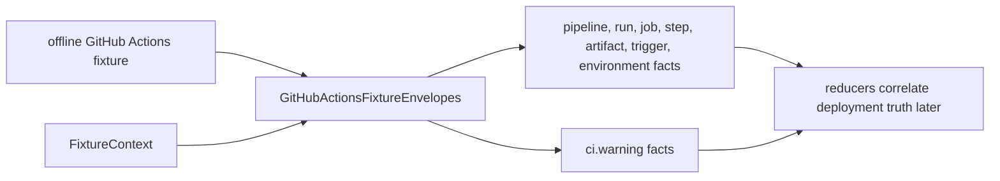

# CI/CD Run Collector Contracts

## Purpose

`internal/collector/cicdrun` owns CI/CD provider normalization for the
`ci_cd_run` collector family. It turns offline fixtures and bounded hosted
GitHub Actions snapshots from `ghactionsruntime` into reported-confidence fact
envelopes that reducers can consume.

The parent package does not call hosted APIs or manage credentials. The
claim-driven GitHub Actions runtime lives in `ghactionsruntime`, which owns
provider polling, request limits, redaction, telemetry, and status. Neither
package ingests logs, reads artifact contents, writes graph state, or promotes
deployment truth.

## Fixture-to-fact flow

The package reports provider runtime evidence from the shared normalized
payload shape. It does not promote CI success, artifacts, or environments to
deployment truth.

## Exported Surface

- `CollectorKind` — durable collector family name: `ci_cd_run`.
- `ProviderGitHubActions` — provider value used for GitHub Actions facts.
- `FixtureContext` — scope, generation, collector instance, fencing token,
  observed time, and source URI copied into emitted envelopes.
- `GitHubActionsFixtureEnvelopes` — parses one fixture-shaped GitHub Actions
  payload and returns CI/CD fact envelopes. Offline fixtures pass that payload
  directly; `ghactionsruntime` marshals its bounded `RunSnapshot` into the same
  shape before calling this normalizer.

## Invariants

- Provider-native IDs and run attempts are part of fact identity, so retries do
  not overwrite prior attempts.
- Facts use `source_confidence=reported` because the fixture represents provider
  runtime metadata.
- Artifact download URLs are stripped when they carry query strings.
- Missing or partial provider payloads emit `ci.warning` facts instead of
  silently claiming complete coverage.
- CI success and environment observations remain evidence only. Reducers decide
  whether stronger artifact or deployment anchors exist.

## Telemetry

This package emits no metrics, spans, or logs directly. Hosted runtime
telemetry belongs to `ghactionsruntime`: provider request counts, fetch
duration, rate limits, fact emission, partial generations, and source spans.
The normalizer proof is bounded by the number of runs, jobs, steps, artifacts,
triggers, and warnings in one payload.

No-Regression Evidence: fixture normalization is covered by
`go test ./internal/collector/cicdrun -run TestGitHubActionsFixture -count=1`,
which exercises one successful run, retry-attempt identity, missing artifact
digest warnings, and partial job metadata warnings without graph writes or
queue work.

No-Observability-Change: this package is a deterministic normalizer and does
not mount a runtime. `ghactionsruntime` owns the hosted provider API request,
rate-limit, fact-emission, partial-generation, redaction, and status signals
for live collection.

### Canonical repository_id (#5418)

Benchmark Evidence: canonicalizing `repository_id` from a raw host/Org/Repo
string to `repository:r_<hex>` via `repositoryidentity.CanonicalRepositoryID`
adds one `NormalizeRemoteURL` + SHA1 per CI fact at emission. Measured on
Apple M5 Max (darwin/arm64, `-count=5`):

| Benchmark | ns/op | B/op | allocs/op |
|-----------|-------|------|-----------|
| `BenchmarkRepositoryID` | ~430–540 | 536 | 11 |
| `BenchmarkGitHubActionsEnvelopesEndToEnd` | ~35,000–40,000 | 54,420 | 680 |

The canonicalization cost (~480 ns) is ~1.2% of total envelope-build time
(~38 µs) for a realistic success fixture (run + 1 job + 1 step + 1 artifact
+ 1 trigger). The old `repositoryID` function (string concat only) ran at
~115 ns/op / 168 B/op / 2 allocs/op; the new path buys a stable
cross-collector join key at a bounded, measured per-fact cost.

No-Regression Evidence: the existing fixture normalization tests
(`TestGitHubActionsFixtureBuildsReducerConsumableFacts`,
`TestGitHubActionsFixturePreservesAttemptsInFactIdentity`,
`TestGitHubActionsFixtureEmitsPartialWarnings`,
`TestGitHubActionsFixturePreservesLargeNumericIDs`,
`TestGitHubActionsFixtureWarnsAndSkipsMalformedChildRecords`,
`TestGitHubActionsFixtureDeduplicatesDuplicateRecords`,
`TestGitHubActionsFixtureRedactsCredentialBearingURLsAndWarningText`,
`TestGitHubActionsFixtureWarnsWhenRunAnchorsMissing`,
`TestGitHubActionsFixtureEmitsWorkflowDefinitionFromProviderIDOnly`) stay
green with only their `repository_id`→`provider_repository_id` assertion
changes. Six new regression tests lock the canonical-id contract:
`TestGitHubActionsFixtureEmitsCanonicalRepositoryID`,
`TestGitHubActionsFixtureCanonicalRepositoryIDMatchesGitCollector`,
`TestGitHubActionsFixtureCanonicalIDHandlesGHESHost`,
`TestGitHubActionsFixtureCanonicalIDFallsBackWhenNoHTMLURL` (exact-equality
strengthened from prefix check),
`TestGitHubActionsFixtureCanonicalIDStableAcrossRunURLs` (two runs, same
repo → identical id), and
`TestGitHubActionsFixtureCanonicalIDHandlesGHESAPIPath`. Three integrity
tests guard edge cases:
`TestRepositoryCanonicalURLRejectsHostlessHTMLURL` (garbage URL → empty),
`TestBuildCICDRunCorrelationDecisionsPassesThroughCanonicalRepositoryID`
(reducer end-to-end), and
`TestLoadRepositoryScopedCICDEvidenceResolvesByCanonicalRepositoryID`
(query readback with namespace isolation). Queue behavior is unchanged (no
new enqueue shape).

No-Observability-Change: the change adds no route, graph query shape, queue
table, worker, lease, runtime knob, metric instrument, or metric label. The
existing `eshu_dp_reducer_executions_total` and
`eshu_dp_reducer_run_duration_seconds` counters, plus the CI/CD run
correlation query handler spans (`query.ci_cd_run_correlations`), diagnose
the end-to-end path unchanged.
