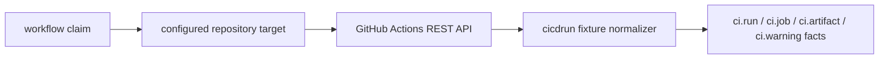

# GitHub Actions Runtime Collector

## Purpose

`ghactionsruntime` owns the hosted GitHub Actions provider polling slice for the
`ci_cd_run` collector family. It fetches bounded workflow-run, job, and artifact
metadata for configured repositories and delegates fact construction to
`internal/collector/cicdrun`.

The package does not read artifact ZIP contents, workflow logs, secrets, graph
state, or query state. Reducers decide whether emitted run and artifact evidence
proves a source-to-image bridge.

## Ownership boundary

This package owns claim-to-provider polling for GitHub Actions. It validates
runtime targets, calls bounded REST endpoints, redacts artifact download URLs,
and returns `ci.*` source facts through the collector commit boundary.

It does not own workflow planning, credential environment resolution, chart
wiring, reducer admission, graph writes, API reads, or deployment truth.

## Exported surface

See `doc.go` for the godoc contract. Callers use:

- `SourceConfig`, `TargetConfig`, and `NewClaimedSource` to construct a
  claim-aware source.
- `ClaimedSource.NextClaimed` to resolve one `workflow.WorkItem`.
- `Client`, `GitHubClient`, and `RunSnapshot` to fetch or provide bounded
  GitHub Actions runtime data.
- `ErrRateLimited` to preserve provider throttling classification.

## Dependencies

The package imports `internal/collector` for `CollectedGeneration`,
`internal/collector/cicdrun` for fact normalization, `internal/scope` for scope
identity, and `internal/workflow` for claim rows. The only external boundary is
Go's `net/http` client.

## Telemetry

This package emits no metrics, spans, or logs. Provider request, rate-limit,
fact-emission, partial-generation, and status telemetry must be added by the
deployable runtime slice before production enablement.

## Gotchas / invariants

- Targets must be explicitly configured with `scope_id`, `repository`, `token`,
  and `allowed_repositories`.
- `max_runs`, `max_jobs`, and `max_artifacts` bound provider request shape.
- Provider HTTP response bodies are closed after each bounded JSON decode or
  error-body read so long-running claim loops do not leak connections.
- Token values and token-bearing URLs never enter facts, logs, metrics, or
  status payloads.
- Artifact `archive_download_url` values are persisted only after query strings
  and fragments are removed.
- CI success, job names, artifact names, and environment names remain provider
  evidence only. Reducers decide whether stronger artifact or deployment
  anchors exist.

## Related docs

- `docs/public/reference/collector-reducer-readiness.md`
- `docs/public/reference/http-api/evidence-and-supply-chain.md`
- `go/internal/collector/cicdrun/README.md`

## Runtime flow

## Evidence

No-Regression Evidence: `go test ./internal/collector/cicdrun/ghactionsruntime
-count=1` and `golangci-lint run ./internal/collector/cicdrun/ghactionsruntime`
prove claim validation, bounded GitHub Actions snapshot collection, fixture
normalization, artifact URL redaction, and checked HTTP response cleanup without
live provider access.

No-Observability-Change: this package introduces the runtime source contract
only. The deployable command and Helm slice must add provider request, rate
limit, fact-emission, partial-generation, and status telemetry before production
enablement.
