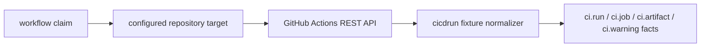

# GitHub Actions Runtime Collector

## Purpose

`ghactionsruntime` owns the hosted GitHub Actions provider polling slice for the
`ci_cd_run` collector family. It fetches bounded workflow-run, job, and artifact
metadata for configured repositories and delegates fact construction to
`internal/collector/cicdrun`.

The package does not read artifact ZIP contents, workflow logs, secrets, graph
state, or query state. Reducers decide whether emitted run and artifact evidence
proves a source-to-image bridge.

## Ownership boundary

This package owns claim-to-provider polling for GitHub Actions. It validates
runtime targets, calls bounded REST endpoints, redacts artifact download URLs,
and returns `ci.*` source facts through the collector commit boundary.

It does not own workflow planning, credential environment resolution, chart
wiring, reducer admission, graph writes, API reads, or deployment truth.

## Exported surface

See `doc.go` for the godoc contract. Callers use:

- `SourceConfig`, `TargetConfig`, and `NewClaimedSource` to construct a
  claim-aware source.
- `ClaimedSource.NextClaimed` to resolve one `workflow.WorkItem`.
- `Client`, `GitHubClient`, and `RunSnapshot` to fetch or provide bounded
  GitHub Actions runtime data.
- `ErrRateLimited` to preserve provider throttling classification.

## Dependencies

The package imports `internal/collector` for `CollectedGeneration`,
`internal/collector/cicdrun` for fact normalization, `internal/scope` for scope
identity, and `internal/workflow` for claim rows. The only external boundary is
Go's `net/http` client.

## Telemetry

This package emits `ci_cd_run.observe` and `ci_cd_run.fetch` spans when callers
provide a tracer. It records provider request, fetch-duration, rate-limit,
fact-emission, and partial-generation metrics when callers provide
`telemetry.Instruments`.

Metric labels stay bounded to provider, status class, fact kind, and partial
reason. Repository names, workflow run IDs, artifact names, URLs, token
environment names, token values, and provider response bodies stay out of
labels.

## Gotchas / invariants

- Targets must be explicitly configured with `scope_id`, `repository`, `token`,
  and `allowed_repositories`.
- `max_runs`, `max_jobs`, and `max_artifacts` bound provider request shape.
- Provider HTTP response bodies are closed after each bounded JSON decode or
  error-body read so long-running claim loops do not leak connections.
- Token values and token-bearing URLs never enter facts, logs, metrics, or
  status payloads.
- Artifact `archive_download_url` values are persisted only after query strings
  and fragments are removed.
- CI success, job names, artifact names, and environment names remain provider
  evidence only. Reducers decide whether stronger artifact or deployment
  anchors exist.

## Related docs

- `docs/public/reference/collector-reducer-readiness.md`
- `docs/public/reference/http-api/evidence-and-supply-chain.md`
- `go/internal/collector/cicdrun/README.md`

## Runtime flow

## Evidence

Collector Performance Evidence: `go test ./internal/collector/cicdrun/ghactionsruntime
-count=1` proves each claim fetches at most one bounded run page, one bounded
job page, and one bounded artifact page using configured `max_runs`, `max_jobs`,
and `max_artifacts`; no repository fanout or artifact ZIP download happens in
this runtime.

Collector Observability Evidence: `go test
./internal/collector/cicdrun/ghactionsruntime ./internal/telemetry -count=1`
proves `ci_cd_run.observe`, `ci_cd_run.fetch`,
`eshu_dp_ci_cd_run_provider_requests_total`,
`eshu_dp_ci_cd_run_fetch_duration_seconds`,
`eshu_dp_ci_cd_run_rate_limited_total`,
`eshu_dp_ci_cd_run_facts_emitted_total`, and
`eshu_dp_ci_cd_run_partial_generations_total` are wired without repository,
run, artifact, URL, or token labels.

Collector Deployment Evidence: `go test ./internal/runtime -run
TestHelmCICDRunCollectorDeployment -count=1` and `helm lint deploy/helm/eshu`
prove the hosted `eshu-collector-cicd-run` Deployment, metrics Service,
ServiceMonitor, NetworkPolicy, and PodDisruptionBudget render only when the
matching claim-driven `ci_cd_run` collector instance is enabled.

No-Regression Evidence: `go test ./internal/collector/cicdrun/ghactionsruntime
-count=1` and `golangci-lint run ./internal/collector/cicdrun/ghactionsruntime`
prove claim validation, bounded GitHub Actions snapshot collection, fixture
normalization, artifact URL redaction, checked HTTP response cleanup, provider
request metrics, rate-limit metrics, fact-emission metrics, partial-generation
metrics, and source spans without live provider access.

Observability Evidence: the hosted command wires the source with
`telemetry.NewInstruments` and the shared status server. Central collector
status evidence also admits active `ci_cd_run` facts through the bounded
Postgres status query.
