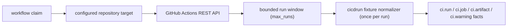

# GitHub Actions Runtime Collector

## Purpose

`ghactionsruntime` owns the hosted GitHub Actions provider polling slice for the
`ci_cd_run` collector family. Every claim cycle fetches a bounded window of the
target's most recent runs (`max_runs`, default 10, hard cap 100) plus bounded
job and artifact metadata for each run in the window, and delegates fact
construction to `internal/collector/cicdrun` once per run. Re-fetching the same
window on a later cycle is an idempotent upsert at projection (each run's facts
are keyed by provider run ID), not a persistent watermark or cursor.

The package does not read artifact ZIP contents, workflow logs, secrets, graph
state, or query state. Reducers decide whether emitted run and artifact evidence
proves a source-to-image bridge.

## Ownership boundary

This package owns claim-to-provider polling for GitHub Actions. It validates
runtime targets, calls bounded REST endpoints, redacts artifact download URLs,
and returns `ci.*` source facts through the collector commit boundary.

It does not own workflow planning, credential environment resolution, chart
wiring, reducer admission, graph writes, API reads, or deployment truth.

## Exported surface

See `doc.go` for the godoc contract. Callers use:

- `SourceConfig`, `TargetConfig`, and `NewClaimedSource` to construct a
  claim-aware source.
- `ClaimedSource.NextClaimed` to resolve one `workflow.WorkItem`.
- `Client`, `GitHubClient`, `RunSnapshot`, and `RunPage` to fetch or provide a
  bounded window of GitHub Actions runtime data (`Client.FetchRuns` returns one
  `RunPage`, which carries one `RunSnapshot` per fetched run plus a `Truncated`
  signal for whether more runs exist beyond the window).
- `ErrRateLimited` to preserve provider throttling classification.
- `RateLimitError` to carry bounded GitHub retry guidance from `Retry-After` or
  `X-RateLimit-Reset` into shared claim retry pacing.

## Dependencies

The package imports `internal/collector` for `CollectedGeneration`,
`internal/collector/cicdrun` for fact normalization, `internal/collector/sdk`
for shared bounded HTTP primitives, `internal/scope` for scope identity, and
`internal/workflow` for claim rows. The only external boundary is Go's
`net/http` client.

## Telemetry

This package emits `ci_cd_run.observe` and `ci_cd_run.fetch` spans when callers
provide a tracer. It records provider request, fetch-duration, rate-limit,
fact-emission, and partial-generation metrics when callers provide
`telemetry.Instruments`.

Metric labels stay bounded to provider, status class, fact kind, and partial
reason. Repository names, workflow run IDs, artifact names, URLs, token
environment names, token values, and provider response bodies stay out of
labels.

## Gotchas / invariants

- Targets must be explicitly configured with `scope_id`, `repository`, `token`,
  and `allowed_repositories`.
- `max_runs`, `max_jobs`, and `max_artifacts` bound provider request shape. An
  omitted or zero `max_runs` resolves to `defaultMaxRuns` (10); the hard cap
  stays 100. A fetched runs page that is full (GitHub's `total_count` exceeds
  the fetched window, or the full-page heuristic when `total_count` is absent)
  emits a `ci.warning` fact with `reason: "runs_truncated"` on the newest run
  in the window and records
  `eshu_dp_ci_cd_run_partial_generations_total{reason="runs_truncated"}`.
- Consumers of `ci.run`/`ci.artifact`/etc. facts must key by `run_id` (and
  `run_attempt`), never assume "the only run fact in a generation is the
  latest run": GitHub returns runs newest-first, but nothing downstream of
  this package preserves emission order as recency. The reducer/query
  consumers already key everything by run ID for this reason.
- Provider HTTP response bodies are closed after each bounded JSON decode or
  status classification so long-running claim loops do not leak connections.
- Non-rate-limit provider status failures are returned as bounded SDK
  `HTTPError` values without provider response bodies. The runtime still uses a
  local JSON decoder with `UseNumber` so GitHub run, job, and artifact IDs do
  not lose precision.
- GitHub 429 responses, 403 responses with `X-RateLimit-Remaining: 0`, and
  403 responses carrying `Retry-After` return `RateLimitError`. The shared
  claim runner records the existing rate-limit metrics and delays the next
  visible retry by the provider guidance when it is longer than the poll
  interval.
- Token values and token-bearing URLs never enter facts, logs, metrics, or
  status payloads.
- Artifact `archive_download_url` values are persisted only after query strings
  and fragments are removed.
- CI success, job names, artifact names, and environment names remain provider
  evidence only. Reducers decide whether stronger artifact or deployment
  anchors exist.

## Related docs

- `docs/public/reference/collector-reducer-readiness.md`
- `docs/public/reference/http-api/evidence-and-supply-chain.md`
- `go/internal/collector/cicdrun/README.md`

## Runtime flow

## Evidence

Collector Performance Evidence: `go test ./internal/collector/cicdrun/ghactionsruntime
-count=1` proves each claim fetches exactly one bounded run page (`per_page`
already equals `max_runs`, so the runs request itself is bounded — see
`TestGitHubClientFetchRunsUsesBoundedActionsEndpoints` and
`TestGitHubClientFetchRunsCollectsEveryRunInTheWindow`) plus one bounded job
page and one bounded artifact page per run in the fetched window (bounded by
`max_jobs`/`max_artifacts` per run, `max_runs` runs). Per-run job/artifact
fetch volume scales up to `max_runs`x versus the pre-#5338 single-run fetch;
No-Regression Evidence below states the bounded worst case. No repository
fanout or artifact ZIP download happens in this runtime.

Collector Observability Evidence: `go test
./internal/collector/cicdrun/ghactionsruntime ./internal/telemetry -count=1`
proves `ci_cd_run.observe`, `ci_cd_run.fetch`,
`eshu_dp_ci_cd_run_provider_requests_total`,
`eshu_dp_ci_cd_run_fetch_duration_seconds`,
`eshu_dp_ci_cd_run_rate_limited_total`,
`eshu_dp_ci_cd_run_facts_emitted_total`, and
`eshu_dp_ci_cd_run_partial_generations_total` are wired without repository,
run, artifact, URL, or token labels.

Collector Deployment Evidence: `go test ./internal/runtime -run
TestHelmCICDRunCollectorDeployment -count=1` and `helm lint deploy/helm/eshu`
prove the hosted `eshu-collector-cicd-run` Deployment, metrics Service,
ServiceMonitor, NetworkPolicy, and PodDisruptionBudget render only when the
matching claim-driven `ci_cd_run` collector instance is enabled.

No-Regression Evidence: `go test ./internal/collector/cicdrun/ghactionsruntime
-count=1` and `golangci-lint run ./internal/collector/cicdrun/ghactionsruntime`
prove claim validation, bounded GitHub Actions snapshot collection, fixture
normalization, artifact URL redaction, checked HTTP response cleanup, safe SDK
HTTP error wrapping for non-rate-limit provider statuses, provider request
metrics, rate-limit metrics, fact-emission metrics, partial-generation metrics,
and source spans without live provider access.

No-Regression Evidence: `go test ./internal/collector ./internal/collector/cicdrun/ghactionsruntime -run 'TestClaimedServiceHonorsRetryAfterOnRetryableCollectFailure|TestGitHubClientReturnsRateLimitRetryGuidance|TestClaimedSourceRecordsRateLimitTelemetry' -count=1` proves GitHub rate-limit retry guidance sets durable claim `visible_at`, keeps `errors.Is(err, ErrRateLimited)` working, records rate-limit metrics, and leaves CI/CD fact output shape unchanged on successful reads.

No-Regression Evidence (#5338 PR B, multi-run collection): the per-claim
job/artifact fetch volume now multiplies by up to `max_runs`x versus the
pre-#5338 single-run fetch (one runs-list request stays constant; job and
artifact requests go from 2 total to up to `2 * max_runs`). This is a bounded
external HTTP fan-out against GitHub's API, not a hot graph/reducer/database
path: `max_runs` defaults to 10 and hard-caps at 100, so worst case is 200
additional bounded HTTP requests per claim cycle, paced by the existing claim
poll interval and GitHub rate-limit backoff (`ErrRateLimited`/`RateLimitError`)
that already govern this runtime. `go test
./internal/collector/cicdrun/ghactionsruntime -count=1` proves the bounded
per-run request shape (`TestGitHubClientFetchRunsCollectsEveryRunInTheWindow`)
and that a full runs page still bounds to `max_runs` runs
(`TestGitHubClientFetchRunsMarksTruncatedWhenMoreRunsExistBeyondTheWindow`,
`TestClaimedSourceBoundsToMaxRunsAndEmitsRunsTruncatedWarning`).
`TestClaimedSourceReemittingTheSameRunsWindowIsIdempotent` proves re-fetching
the same window across claim cycles yields the same `StableFactKey` per run
(the stateless-idempotent design substituting for a persistent
watermark/cursor).

Observability Evidence: the hosted command wires the source with
`telemetry.NewInstruments` and the shared status server. Central collector
status evidence also admits active `ci_cd_run` facts through the bounded
Postgres status query.
