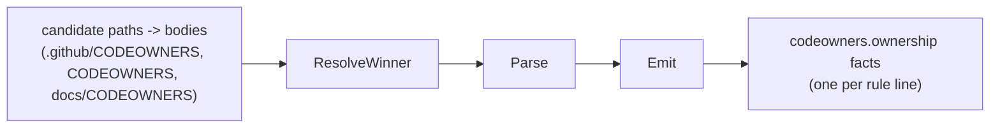

# CODEOWNERS Collector

## Purpose

`internal/collector/codeowners` parses a repository's GitHub `CODEOWNERS` file
into durable `codeowners.ownership` fact envelopes (issue #5419, epic #5415).
It is the producer half of the codeowners domain: Phase 1 already shipped the
fact contract (`facts.CodeownersOwnershipFactKind`,
`facts.CodeownersSchemaVersionV1`, and the typed
`sdk/go/factschema/codeowners/v1.Ownership` payload); this package turns a
resolved CODEOWNERS file body into that contract's envelopes. The reducer,
projector, and read surface that consume these facts are out of scope here
(Phases 3-5).

This package is a pure **normalizer**: it does not select which files reach
it, does not know repository scope/generation identifiers beyond what the
caller passes in, and does not call the reducer or query packages. The Git
collector (`go/internal/collector`) owns file discovery and the content-stream
wiring; it calls `IsCandidatePath` while discovering repository files,
accumulates candidate CODEOWNERS bodies while streaming content facts, and
calls `ResolveWinner` and `Emit` once per repository generation.

## CODEOWNERS grammar (GitHub's documented syntax)

Reference:
[About code owners](https://docs.github.com/en/repositories/managing-your-repositorys-settings-and-features/customizing-your-repository/about-code-owners).

- Blank lines (including whitespace-only lines) are ignored.
- A line whose first non-whitespace character is `#` is a whole-line comment.
  There is no inline trailing-comment syntax.
- A line opening with `[` or `^[` is a CODEOWNERS *section* header (GitHub's
  optional-section-with-minimum-approvers feature). Sections are out of scope
  for this parser: a section header line — including one that declares
  default owners on the same line — is treated as a non-rule and skipped.
- Every other non-blank line is a rule line: whitespace-separated tokens where
  the first token is the glob pattern and every remaining token is an owner
  (`@user`, `@org/team`, or an email address), carried verbatim.
- A rule line with a pattern and zero owner tokens removes default ownership
  in GitHub's own semantics; it asserts no ownership claim, so `Parse` drops
  it rather than emitting an owner-less rule.
- CODEOWNERS resolves ownership **last-match-wins**: for a given path, the
  last pattern in the file that matches wins over any earlier match. `Rule`
  carries `OrderIndex` — its 0-based position among emitted rule lines only —
  so a downstream consumer can sort by `OrderIndex` and take the
  highest-index match. This package does not itself match paths against
  patterns; that is a downstream (Phase 3+) concern.
- GitHub honors exactly three CODEOWNERS locations per repository, and only
  the first-found one: `.github/CODEOWNERS` > root `CODEOWNERS` >
  `docs/CODEOWNERS`.

## Fixture-to-fact flow

## Exported surface

- `CollectorKind` — durable collector family name: `codeowners`.
- `Rule` — one parsed pattern-to-owners mapping (`Pattern`, `Owners`,
  `OrderIndex`).
- `Parse` — parses one CODEOWNERS file body into ordered rules.
- `CandidatePaths` — the three recognized repo-relative CODEOWNERS locations,
  in precedence order.
- `IsCandidatePath` — reports whether a repo-relative path is exactly one of
  the three recognized locations.
- `ResolveWinner` — given a map of present candidate paths to bodies, returns
  the single highest-precedence present file.
- `FixtureContext` — scope, generation, collector instance, fencing token,
  observed time, and the resolved source URI copied into emitted envelopes.
- `Emit` — parses the resolved winning file and returns one
  `codeowners.ownership` envelope per rule.

## Payload contract

Every envelope's payload is built from the typed
`sdk/go/factschema/codeowners/v1.Ownership` struct via
`factschema.EncodeCodeownersOwnership`, never a hand-built map (Contract
System v1 §3.1; see `eshu-contract-rigor`). The stable key is derived from
`(repo_id, source_path, pattern, order_index)`, so re-emitting an unchanged
rule in a later generation reuses the same key and the fact store upserts
instead of duplicating.

## Invariants

- Pure normalizer: no file discovery, no repository/scope/generation
  identifier minting, no reducer or query imports in production code.
- `schema_version` is always `facts.CodeownersSchemaVersionV1`
  (`1.0.0`).
- `source_confidence` is always `observed`: CODEOWNERS is read directly from a
  repo artifact.
- A pattern line with zero owner tokens is never emitted — it carries no
  ownership claim.
- The GitHub sections feature (`[Section-name]`, `^[Section-name][2]`) is
  explicitly out of scope: section header lines are skipped as non-rules, not
  partially interpreted.
- Location precedence is `.github/CODEOWNERS` > `CODEOWNERS` >
  `docs/CODEOWNERS`; only the first-present file's rules are ever emitted.

## No-Regression Evidence

`go test ./internal/collector/codeowners -count=1` covers: parser behavior
(comments, blank lines, inline whitespace, multiple owners, `@user` /
`@org/team` / email owner tokens, pattern-only lines dropped, section headers
skipped, CRLF line endings), location precedence (every present/absent
combination of the three candidates), and envelope emission (schema version,
collector kind, source ref, stable-key differentiation across repo/source
path/pattern/order index, optional `collector_instance_id`).

Collector Performance Evidence: this package introduces no runtime, worker, or
queue. `Parse`, `ResolveWinner`, and `Emit` are pure library functions that run
in a single linear pass over one small file's lines; cost is linear in file
size with no hot-path Cypher and no new query.

Collector Observability Evidence: not applicable — this package mounts no
runtime and exposes no health/readiness/metrics surface. Facts flow through
the Git collector's existing observe/stream/fact-emission telemetry.

No-Observability-Change: this package adds no metrics, spans, or logs of its
own.
