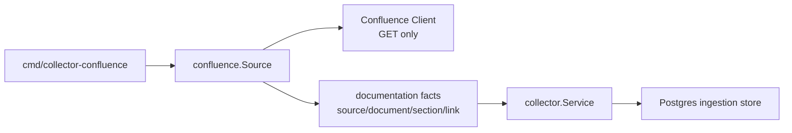

# Collector Confluence

## Purpose

`internal/collector/confluence` reads Confluence Cloud documentation evidence
and emits source-neutral documentation facts. It is intentionally read-only:
the package gathers truth for Eshu's data plane and does not update Confluence.

## Where This Fits In The Pipeline

## Internal Flow

`Source.Next` performs one bounded collection generation. It loads either a
space page list or a root page tree, filters non-current pages, keeps the
latest visible revision per page ID, computes a stable generation ID from page
versions, and returns fact envelopes through `collector.FactsFromSlice`.

For page trees, `ErrPermissionDenied` from a child page is counted as a
partial-sync failure and collection continues. Other client errors fail the
generation because the collector cannot prove the source state.

## Exported Surface

- `Source` - implements `collector.Source`
- `SourceConfig` and `LoadConfig` - env-backed Confluence config loading
- `Client` - source evidence interface used by `Source`
- `HTTPClient` and `NewHTTPClient` - Confluence Cloud REST API v2 reader
- `ErrPermissionDenied` - permission-gap sentinel for page tree collection
- `Space`, `Page`, `PageVersion`, `PageBody`, `Label`, and `Links` - the
  source response shape normalized into documentation facts

## Configuration

`LoadConfig` reads:

- `ESHU_CONFLUENCE_BASE_URL`
- `ESHU_CONFLUENCE_SPACE_ID`
- `ESHU_CONFLUENCE_SPACE_KEY`
- `ESHU_CONFLUENCE_ROOT_PAGE_ID`
- `ESHU_CONFLUENCE_EMAIL`
- `ESHU_CONFLUENCE_API_TOKEN`
- `ESHU_CONFLUENCE_BEARER_TOKEN`
- `ESHU_CONFLUENCE_PAGE_LIMIT`
- `ESHU_CONFLUENCE_POLL_INTERVAL`

Exactly one bounded scope is required: `ESHU_CONFLUENCE_SPACE_ID` or
`ESHU_CONFLUENCE_ROOT_PAGE_ID`. Credentials must be read-only and are supplied
as either bearer token or email plus API token. `ESHU_CONFLUENCE_POLL_INTERVAL`
uses Go duration syntax and defaults to `5m`, which avoids tight re-reads
against large spaces.

## Fact Output

Each generation emits:

- one `documentation_source` fact
- one `documentation_document` fact per visible current page
- one `documentation_section` body fact per document
- one `documentation_link` fact per extracted storage-body link
- optional `documentation_entity_mention` and `documentation_claim_candidate`
  facts when a caller supplies a `doctruth.Extractor` and structured claim
  hints

Document facts preserve canonical URI, revision ID, labels, owner references,
ACL summary, content hash, source metadata, and document freshness. Section
facts persist the source-native Confluence storage body in Postgres as
`content` with `content_format=storage`, so downstream documentation updater
services can build diffs without asking the collector to write back to
Confluence. Confluence source and document ACL summaries are marked
`credential_viewable` and partial when page restrictions are not collected;
downstream evidence packet producers must still prove
`viewer_can_read_source=true` before exposing excerpts or body content.

The optional truth extraction seam is deterministic and read-only. The
Confluence collector does not infer claims from broad prose and does not load an
entity catalog by itself; callers provide those inputs when the runtime has
already gathered them from Eshu.

## Operational Notes

- HTTP access is `GET` only and maps 403/404 responses to
  `ErrPermissionDenied`.
- Sync logs and metrics report counts, status, and scope identifiers only. Page
  titles, body content, and excerpts are not emitted as telemetry fields.
- Pagination follows Confluence `_links.next` values without duplicating the
  configured context path, so Atlassian Cloud base URLs that include `/wiki`
  work with both `/api/v2/...` and `/wiki/api/v2/...` next links.
- Empty spaces are valid and emit a source fact with `page_count=0`.
- Duplicate titles are safe because stable document identity uses Confluence
  page ID, not title.
- Stale or deleted pages are skipped unless their status is current.
- Source metadata reports `page_count`, `failure_count`, and `sync_status`.

## Related Docs

- `go/cmd/collector-confluence/README.md`
- `go/internal/collector/README.md`
- `docs/docs/guides/collector-authoring.md`
