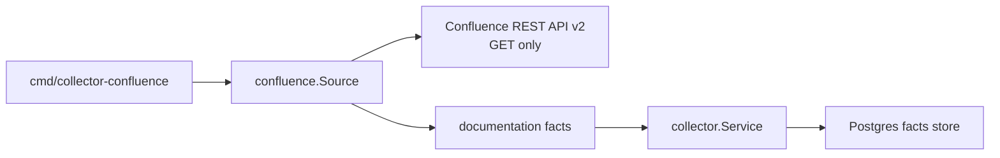

# Collector Confluence

`internal/collector/confluence` reads Confluence Cloud documentation evidence and
emits Eshu documentation facts. The package is read-only. It never writes back to
Confluence and it does not infer source truth without caller-provided extraction
hints.

## Runtime Flow



`Source.Next` performs one bounded collection generation. `Source.NextObserved`
uses the same path and returns `collector.CollectorObservation`, but starts the
shared `collector.observe` span only after the source has ruled out a drained
idle poll. The collection path loads either a space page list or a root page
tree, filters non-current pages, keeps the latest visible revision per page ID,
computes a stable generation ID from page versions, and returns fact envelopes
through `collector.FactsFromSlice`. When configured with explicit multiple
space IDs, each call emits one generation for one space; the drained idle poll
resets the list so the next poll cycle starts from the first configured space.

The collection path runs in one of two modes:

- **Space scope**: fetch the configured space, list its pages, and enrich each
  page with body and metadata.
- **Root-page scope**: walk the configured root page tree, then fetch each
  visible page.

Pages that are not current are skipped. Duplicate page IDs collapse to the
latest visible revision. Permission gaps from child pages are counted as partial
sync failures and collection continues; other client failures fail the
generation because the collector cannot prove source state.

## Configuration

`LoadConfig` reads these environment variables:

- `ESHU_CONFLUENCE_BASE_URL`
- `ESHU_CONFLUENCE_SPACE_ID`
- `ESHU_CONFLUENCE_SPACE_IDS`
- `ESHU_CONFLUENCE_SPACE_KEY`
- `ESHU_CONFLUENCE_ROOT_PAGE_ID`
- `ESHU_CONFLUENCE_EMAIL`
- `ESHU_CONFLUENCE_API_TOKEN`
- `ESHU_CONFLUENCE_BEARER_TOKEN`
- `ESHU_CONFLUENCE_PAGE_LIMIT`
- `ESHU_CONFLUENCE_POLL_INTERVAL`

Exactly one bounded scope mode is required: `ESHU_CONFLUENCE_SPACE_ID`,
`ESHU_CONFLUENCE_SPACE_IDS`, or `ESHU_CONFLUENCE_ROOT_PAGE_ID`.
`ESHU_CONFLUENCE_SPACE_IDS` is a comma-separated allowlist of numeric space IDs;
blank does not mean all spaces, and duplicate or empty list entries fail
startup. Credentials must be read-only and are supplied as either bearer token
or email plus API token. `ESHU_CONFLUENCE_POLL_INTERVAL` uses Go duration syntax
and defaults to `5m`, which avoids tight re-reads against large spaces.

## Fact Output

Each generation emits:

- one `documentation_source` fact
- one `documentation_document` fact per visible current page
- one `documentation_section` fact for each page body
- one `documentation_link` fact per extracted storage-body link
- optional `documentation_entity_mention` and
  `documentation_claim_candidate` facts when the caller supplies a
  `doctruth.Extractor` and claim hints

Document identity uses the Confluence page ID, not title text. Section facts
preserve the source-native Confluence storage body in Postgres as
`content_format=storage` so downstream documentation services can diff source
content without asking the collector to mutate Confluence.

Source and document access-control summaries are marked
`credential_viewable` and partial when page restrictions are not collected.
Evidence packet producers must still prove `viewer_can_read_source=true` before
exposing excerpts or body content.

## Safety Rules

- HTTP access is `GET` only.
- 403 and 404 responses map to `ErrPermissionDenied`.
- Empty spaces are valid and emit a source fact with `page_count=0`.
- Atlassian Cloud base URLs with `/wiki` are supported for direct API calls and
  `_links.next` pagination links.
- Logs and metrics report counts, status, failure class, and bounded source
  operations only. Page IDs, titles, URLs, paths, body content, and excerpts do
  not belong in metric labels.

## Verification

Run focused checks after changing this package:

```bash
go test ./internal/collector/confluence ./cmd/collector-confluence -count=1
go run ./cmd/eshu docs verify ../go/internal/collector/confluence --limit 1000 --fail-on contradicted,missing_evidence
```

## Related Docs

- `go/cmd/collector-confluence/README.md`
- `go/internal/collector/README.md`
- `docs/public/guides/collector-authoring.md`
