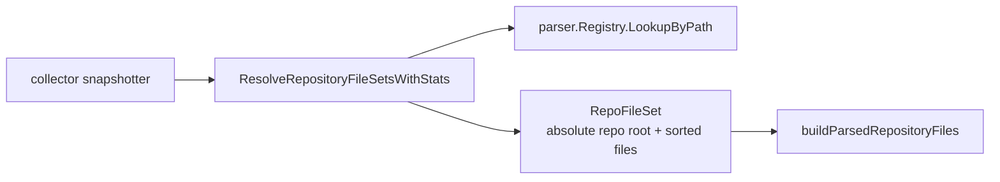

# Collector Discovery

`internal/collector/discovery` resolves parser-supported files inside a
checked-out repository into stable per-repo file sets. The git collector calls
this package once per snapshot before parsing files.

## Runtime Flow



## Core Responsibilities

- Normalize the scan root to an absolute path and resolve symlinks when the
  filesystem can do so.
- Walk the scan root with `filepath.WalkDir`.
- Skip ignored directories, hidden paths, ignored extensions, unsupported
  parser paths, configured path globs, and symlinks that resolve outside the
  scan root.
- Group accepted files by the nearest `.git` marker. Files without a `.git`
  ancestor are grouped under the scan root.
- Sort files deterministically and apply optional `.gitignore` and
  `.eshuignore` filtering.
- Return `DiscoveryStats` so the collector can explain what was excluded.

When no supported files are discovered, the package still returns one
`RepoFileSet` for the scan root with an empty file list. That keeps downstream
snapshot handling deterministic for empty repositories.

## Ignore Rules

Discovery applies skip rules in this order:

1. Directory-name skips from `Options.IgnoredDirs`.
2. Hidden path skips when `Options.IgnoreHidden` is enabled, except paths under
   `Options.PreservedHiddenPrefixes`.
3. User path globs from `Options.IgnoredPathGlobs`, with
   `Options.PreservedPathGlobs` allowed to keep a narrower subtree.
4. File extension skips from `Options.IgnoredExtensions`.
5. Parser support checks through `SupportedFileMatcher`.
6. External symlink rejection.
7. Optional repo-local `.gitignore` and `.eshuignore` filtering.

Root-anchored ignore patterns stay rooted at the discovered `RepoRoot`. Do not
treat `/name` as a suffix match; that can drop nested source packages that only
share the same final path segment.

## Output Contract

`RepoFileSet.RepoRoot` and every path in `RepoFileSet.Files` are absolute paths.
Callers that need repo-relative paths must rebase with
`filepath.Rel(RepoRoot, file)`.

`RepoFileSet.Files` is sorted with `sort.Strings`. Downstream parser and fact
emission code can rely on stable ordering for the same repository state.

`SupportedFileMatcher` is required. Passing `nil` returns an error because
discovery cannot decide which files are indexable without the parser registry
or another caller-provided matcher.

## Telemetry Boundary

This package does not emit metrics or spans directly. It returns
`DiscoveryStats`, and the collector snapshotter records those counters through
`eshu_dp_discovery_files_skipped_total` with the skip reason attached.

The advisory report behind `eshu index --discovery-report` is built from the
same stats.

## Verification

Run focused checks after changing this package:

```bash
go test ./internal/collector/discovery -count=1
go run ./cmd/eshu docs verify ../go/internal/collector/discovery --limit 1000 --fail-on contradicted,missing_evidence
```

## Related Docs

- `go/internal/collector/README.md`
- `go/internal/parser/README.md`
- `docs/public/reference/local-testing.md`
- `docs/public/architecture.md`
