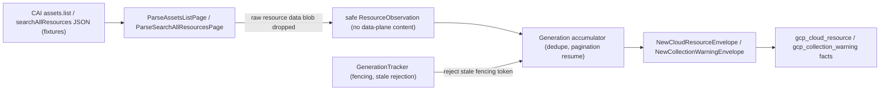

# GCP Cloud Collector

## Purpose

`internal/collector/gcpcloud` owns the first GCP cloud collection slice. It
parses Cloud Asset Inventory (CAI) `assets.list` and `searchAllResources`
response pages into safe observations, normalizes Google Cloud identity, redacts
sensitive label values and IAM member identities, and emits the
`gcp_cloud_resource` and `gcp_collection_warning` source fact envelopes.

This package does not call Google Cloud APIs, schedule collector runs, write
graph rows, persist raw provider payloads, or admit reducer truth. The
claim-driven runtime binary, reducer admission, API/MCP readback, and chart path
are follow-up slices outside this reader stack. See
[GCP Cloud Collector Contract](../../../../docs/public/reference/gcp-cloud-collector-contract.md).

## Collection flow



Only the source reader sees raw CAI payloads. Everything leaving this package is
a redacted fact, a bounded warning, or a normalized identity.

## Exported surface

- `CollectorKind` — durable `collector_kind` value `gcp`.
- `Boundary`, `ResourceObservation`, `WarningObservation` — claim and
  observation contracts.
- `ParentScopeKind` (`organization`, `folder`, `project`) with `Valid`.
- `ParseAssetsListPage`, `ParseSearchAllResourcesPage`, `AssetsListPage` —
  fixture-driven CAI parsing.
- `AssetTypeFamily`, `LocationBucket`, `NormalizeAncestry`, `Ancestry`,
  `ProjectIDFromFullName` — normalization helpers.
- `FingerprintLabelValues`, `MemberClass`, `FingerprintMember`,
  `RedactionPolicyVersion` — redaction.
- `NewCloudResourceEnvelope`, `NewCollectionWarningEnvelope`,
  `ExtensionSchemaVersionDefault` — durable envelope construction.
- `Generation`, `NewGeneration`, `GenerationTracker`, `NewGenerationTracker`,
  `ErrStaleGeneration` — generation accumulation and fencing.
- Warning kinds and outcomes (`WarningKind*`, `Outcome*`) with `ValidWarningKind`
  and `ValidOutcome`.
- `Metrics`, `NewMetrics`, `ClaimStatus*` — scoped OTEL instruments with bounded
  labels.

## Invariants

- GCP cloud data is reported source evidence (`source_confidence=reported`). Do
  not materialize graph truth here.
- Preserve the CAI full resource name verbatim for exact reducer joins; add
  normalized fields alongside it.
- Stable fact keys derive from fact kind, full resource name, asset type, content
  family, and provider update time. Duplicate delivery converges; stale
  generations are rejected by fencing token.
- Never persist raw IAM policy JSON, secret values, object contents, startup
  scripts, public or private IP addresses, or provider response bodies. The
  parser drops the raw resource data blob.
- Fingerprint IAM member identities and sensitive label values with the keyed
  `redact` package; never persist raw user, group, or service-account emails.
- Keep the payload redaction versioned with `RedactionPolicyVersion`.
- Metric labels and status keys are bounded enums only: collector kind, claim
  status, CAI operation, parent scope kind, asset family, content family, status
  class, fact kind, warning kind, and outcome. Never put full resource names,
  project ids, labels, IAM members, URLs, or credential names in labels.

## Verification

```bash
cd go && go test ./internal/collector/gcpcloud ./internal/facts -count=1
cd go && go build ./...
cd go && golangci-lint run ./internal/collector/gcpcloud/...
```

## Performance and Observability Evidence

No-Regression Evidence: this slice adds a new, isolated fixture-driven parsing
package and changes no existing hot path. Baseline: no GCP collector existed;
after: bounded in-memory normalization of Cloud Asset Inventory pages with no
Cypher, no graph or Postgres writes, no worker/lease/queue, and no claim-driven
runtime binary. Backend/version: none touched (NornicDB/Neo4j, Postgres, and the
reducer are unchanged; fact kinds are additive). Input shape: bounded CAI
`assets.list`/`searchAllResources` fixture pages; work is O(resources x pages)
single-pass with page-token dedupe, so terminal output is one bounded generation
of `gcp_cloud_resource`/`gcp_collection_warning` facts (row count equals
deduped fixture resources plus one warning per unsupported kind/scope). Why safe:
no live calls in tests, stale generations are rejected by fencing token, and
re-emission of the same generation is idempotent, all proven by fixture tests.

Observability Evidence: the package exports bounded-label data-plane metrics
`eshu_dp_gcp_cloud_claims_total`, `_api_calls_total`, `_pages_total`,
`_page_token_resumes_total`, `_facts_emitted_total`, `_warnings_total`, and
`_freshness_lag_seconds`. Labels are bounded enums only (collector kind, claim
status, CAI operation, parent scope kind, asset family, content family, status
class, fact kind, warning kind, outcome); a test asserts no full resource name,
project id, label, IAM member, or URL appears in any label. An operator reads
partial-scope coverage, page-token resumes, freshness lag, and warning counts to
answer whether a scan is complete, fresh, throttled, or partial.
