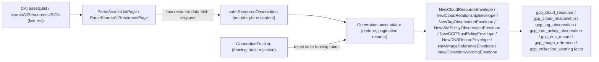

# GCP Cloud Collector

## Purpose

`internal/collector/gcpcloud` owns the first GCP cloud collection slice. It
parses Cloud Asset Inventory (CAI) `assets.list` and `searchAllResources`
response pages into safe observations, normalizes Google Cloud identity, redacts
container names, sensitive label values, IAM member identities, and DNS record
values, and emits the `gcp_cloud_resource`, `gcp_cloud_relationship`,
`gcp_tag_observation`, `gcp_iam_policy_observation`, `gcp_dns_record`,
`gcp_image_reference`, and `gcp_collection_warning` source fact envelopes. From
the same IAM bindings it also emits the secrets/IAM mirror
(`gcp_iam_principal`, `gcp_iam_trust_policy`, `gcp_iam_permission_policy`) for
service-account grantees and ServiceAccount impersonation bindings, so the
reducer can correlate GCP IAM into the secrets/IAM read models (#2347/#2369).
Those facts carry only redaction-safe member fingerprints, target email digests,
bounded impersonation modes, role names, and resource identity; raw member
email, target service-account email, workload-pool subject, namespace, and
Kubernetes ServiceAccount names stay out of fact payloads.

This package does not call Google Cloud APIs, schedule collector runs, write
graph rows, persist raw provider payloads, or admit reducer truth. The
fixture-backed and claimed-live `cmd/collector-gcp-cloud` runtime wiring, shared
cloud inventory admission/readback, tag evidence admission, image identity
admission, relationship resolution, and IAM trust facts live in sibling packages
and reducers. Claim-enabled scheduler activation, opt-in direct/effective tag
API evidence, and chart values are implemented; live smoke proof remains gated
follow-up work. See
[GCP Cloud Collector Contract](../../../../docs/public/reference/gcp-cloud-collector-contract.md).

## Collection flow



Only the source reader sees raw CAI payloads. Everything leaving this package is
a redacted fact, a bounded warning, or a normalized identity.

## Exported surface

- `CollectorKind` — durable `collector_kind` value `gcp`.
- `Boundary`, `ResourceObservation`, `WarningObservation` — claim and
  observation contracts.
- `ParentScopeKind` (`organization`, `folder`, `project`) with `Valid`.
- `ParseAssetsListPage`, `ParseSearchAllResourcesPage`, `AssetsListPage` —
  fixture-driven CAI parsing.
- `AssetTypeFamily`, `LocationBucket`, `NormalizeAncestry`, `Ancestry`,
  `ProjectIDFromFullName` — normalization helpers.
- `FingerprintLabelValues`, `MemberClass`, `FingerprintMember`,
  `RedactionPolicyVersion` — redaction.
- `NewCloudResourceEnvelope`, `NewCollectionWarningEnvelope`,
  `NewCloudRelationshipEnvelope`, `RelationshipObservation`,
  `NewTagObservationEnvelope`, `TagObservation`,
  `NewIAMPolicyObservationEnvelope`, `IAMPolicyObservation`,
  `NewDNSRecordEnvelope`, `DNSRecordObservation`,
  `NewImageReferenceEnvelope`, `ImageReferenceObservation`,
  `ExtensionSchemaVersionDefault` — durable envelope construction.
- `Generation`, `NewGeneration`, `GenerationTracker`, `NewGenerationTracker`,
  `ErrStaleGeneration` — generation accumulation and fencing.
- Warning kinds and outcomes (`WarningKind*`, `Outcome*`) with `ValidWarningKind`
  and `ValidOutcome`.
- `Metrics`, `NewMetrics`, `ClaimStatus*` — scoped OTEL instruments with bounded
  labels.

## Invariants

- GCP cloud data is reported source evidence (`source_confidence=reported`). Do
  not materialize graph truth here.
- Preserve the CAI full resource name verbatim for exact reducer joins; add
  normalized fields alongside it.
- Stable fact keys derive from fact kind, full resource name, asset type, content
  family, and provider update time. Duplicate delivery converges; stale
  generations are rejected by fencing token.
- Never persist raw IAM policy JSON, secret values, object contents, startup
  scripts, environment variable values, public or private IP addresses, or
  provider response bodies. The parser drops the raw resource data blob.
- Fingerprint IAM member identities, DNS record names and targets, and
  sensitive label values with the keyed `redact` package; fingerprint container
  names before they leave image-reference observations; never persist raw user,
  group, service-account, DNS record value, or container-name text.
- ServiceAccount impersonation bindings on `iam.googleapis.com/ServiceAccount`
  resources emit `gcp_iam_trust_policy` instead of ordinary permission grants.
  The parser retains `resource.data.email` only for ServiceAccount resources and
  only long enough to compute the target member fingerprint and email digest.
- Keep the payload redaction versioned with `RedactionPolicyVersion`.
- Metric labels and status keys are bounded enums only: collector kind, claim
  status, CAI operation, parent scope kind, asset family, content family, status
  class, fact kind, warning kind, and outcome. Never put full resource names,
  project ids, labels, IAM members, DNS names, image references, URLs, or
  credential names in labels.

## Verification

```bash
cd go && go test ./internal/collector/gcpcloud ./internal/facts -count=1
cd go && go build ./...
cd go && golangci-lint run ./internal/collector/gcpcloud/...
```

## Performance and Observability Evidence

No-Regression Evidence: this source-fact slice adds an isolated fixture-driven
parsing package and changes no existing hot path. Baseline: no GCP source-fact
reader existed; after: bounded in-memory normalization of Cloud Asset Inventory
pages with no Cypher, no graph or Postgres writes, no worker/lease/queue, and no
live provider call. Backend/version: none touched by this package
(NornicDB/Neo4j, Postgres, and the reducer are unchanged by the reader; fact
kinds are additive). Input shape: bounded CAI
`assets.list`/`searchAllResources` fixture pages; work is O(resources x pages)
single-pass with page-token dedupe plus bounded fact-family passes for parsed
relationships, labels, IAM bindings, and DNS records, so terminal output is one
bounded generation of
`gcp_cloud_resource`, `gcp_cloud_relationship`, `gcp_tag_observation`,
`gcp_iam_policy_observation`, `gcp_dns_record`, and
`gcp_image_reference`, and `gcp_collection_warning` facts (row count
equals deduped fixture resources plus labeled resources with usable label keys,
relationships with usable source/target/type evidence,
IAM bindings with usable members, DNS record sets with usable type/name/zone
identity, Cloud Run service/job container images with usable image reference or
digest evidence, and one warning per unsupported kind/scope). Why safe: no live
calls in tests, stale generations are rejected by fencing token, and
re-emission of the same generation is idempotent, all proven by fixture tests.

Observability Evidence: the package exports bounded-label data-plane metrics
`eshu_dp_gcp_cloud_claims_total`, `_api_calls_total`, `_pages_total`,
`_page_token_resumes_total`, `_facts_emitted_total`, `_warnings_total`, and
`_freshness_lag_seconds`. Labels are bounded enums only (collector kind, claim
status, CAI operation, parent scope kind, asset family, content family, status
class, fact kind, warning kind, outcome); tag, IAM, and DNS emission use the
existing fact-kind dimension for `gcp_tag_observation`,
`gcp_iam_policy_observation`, and `gcp_dns_record`; relationship emission uses
the same fact-kind dimension for `gcp_cloud_relationship` and adds no new label
shape.
Image-reference emission uses the same fact-kind dimension for
`gcp_image_reference` and adds no new label shape.
A test asserts no full resource name, project id, label, IAM member, DNS name,
image reference, or URL appears in any label. An operator reads partial-scope
coverage, page-token resumes, freshness lag, fact-kind counts, and warning
counts to answer whether a scan is complete, fresh, throttled, or partial.
