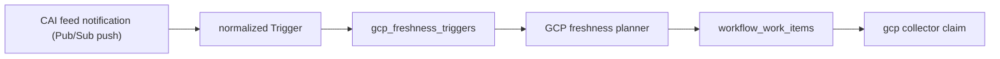

# GCP Freshness Triggers

## Purpose

`internal/collector/gcpcloud/freshness` defines the normalized GCP freshness
trigger contract for Cloud Asset Inventory (CAI) feed wake-up signals
delivered over a Pub/Sub push subscription. It maps a CAI TemporalAsset
notification to a bounded GCP collector claim target: parent scope kind,
parent scope id, asset type, and location.

Freshness triggers do not make graph truth fresh. They only ask the normal GCP
collector to rescan a bounded slice. Scheduled scans remain authoritative.

## Flow

## Exported Surface

- `Trigger` - normalized GCP event input with parent scope, asset type, and
  location.
- `StoredTrigger` - durable trigger row with delivery and coalescing keys.
- `Target` - GCP collector claim target derived from a trigger.
- `NewStoredTrigger` - validates and builds stable durable keys.
- `NormalizePubSubPush` - normalizes a Cloud Asset Inventory feed
  notification delivered as a Pub/Sub push request body into a bounded
  trigger without GCP API calls.
- `ErrWelcomeMessage` - returned when the push body is the bare-string
  welcome message CAI sends on first feed subscription, not a TemporalAsset;
  callers must treat this as a benign no-op.
- `EventKindAssetChange` and `EventKindAssetDeleted` - bounded trigger kinds.
- `TriggerStatusQueued`, `TriggerStatusClaimed`, `TriggerStatusHandedOff`, and
  `TriggerStatusFailed` - durable handoff states.

## Invariants

- A trigger must name one concrete parent scope kind
  (`organization`/`folder`/`project`), parent scope id, and asset type.
  Wildcards in any of these are rejected before workflow work can be planned.
- `FreshnessKey` coalesces by
  `(parent_scope_kind, parent_scope_id, asset_type, location)` because GCP
  collectors scan scope/asset-type tuples, not individual resource names.
- The parent scope kind and id are derived from the CAI `ancestors` list on
  the asset; the most specific ancestor (index 0) wins. Missing or
  unparseable ancestors are a malformed event and are rejected.
- The raw CAI asset blob, IAM policy, and resource body are never retained;
  only bounded scope identity fields survive on the normalized `Trigger`.
- Metadata-only: this package never persists raw asset data, IPs, members, or
  the push body.

## Telemetry

The runtime that receives or hands off triggers records
`eshu_dp_gcp_freshness_events_total{kind,action}`. The trigger contract keeps
the label set bounded: kind is one of `asset_change` or `asset_deleted`, and
action is a closed intake or handoff action.
