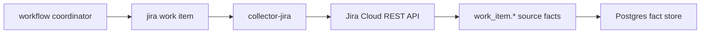

# Jira Collector

The Jira collector is a claim-driven source collector for Jira work-item
evidence. It reads bounded Jira Cloud updated windows, fetches each changed
issue's changelog and remote links, and emits:

- `work_item.record`
- `work_item.transition`
- `work_item.external_link`

It does not call PagerDuty, GitHub, deployment systems, or graph backends. Jira
facts can enrich incident context later when another reducer or query can prove
a link, but a PagerDuty incident does not need a Jira ticket to be useful.

## Runtime Contract

Target credentials are resolved from environment variables named by
`token_env` and optional `email_env`. The token value is never included in
facts, metric labels, status errors, or requested scope sets.

## Boundaries

- Metrics are labeled by provider and fact kind only.
- Remote-link URLs and Jira self/browse URLs have sensitive query parameters
  removed before they enter envelopes.
- Duplicate remote links inside one issue collection are collapsed by provider
  link ID, global ID, or URL.
- Empty Jira projects or updated windows commit a successful empty generation.

No-Regression Evidence: focused collector tests cover envelope redaction,
provider failure classification, empty windows, and bounded REST endpoints.
