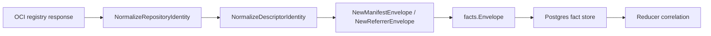

# OCI Registry Collector Contracts

## Purpose

`internal/collector/ociregistry` owns OCI registry identity normalization and
fact-envelope construction for the future `oci_registry` collector family. It
turns repository, tag, descriptor, manifest, index, referrer, and warning
observations into reported-confidence facts.

This package implements the contract slice from
`docs/docs/adrs/2026-05-10-oci-container-registry-collector.md`. ECR and JFrog
Docker/OCI repositories use this lane. JFrog package feeds use
`internal/collector/packageregistry`.

## Ownership boundary

This package owns local identity rules and fact-envelope construction only.
Distribution HTTP clients, Docker Hub and GHCR token mapping, JFrog
repository-key mapping, ECR token conversion, and Harbor, Google Artifact
Registry, and Azure Container Registry endpoint normalization live in provider
subpackages. `ociruntime` owns runtime scan orchestration and telemetry.
Workflow claims, graph writes, reducer correlation, and query surfaces belong to later
collector, reducer, storage, and query slices.

## Exported surface

See `doc.go` for the godoc contract.

- `Provider` — provider adapter identity such as ECR or JFrog.
- `RepositoryIdentity` — raw provider, registry, and repository tuple.
- `NormalizedRepositoryIdentity` — stable repository identity and scope ID.
- `NormalizeRepositoryIdentity` — registry/repository normalization.
- `DescriptorIdentity` — raw repository, digest, and media-type tuple.
- `NormalizedDescriptorIdentity` — digest-addressed descriptor identity.
- `NormalizeDescriptorIdentity` — digest and media-type validation.
- `Descriptor` — OCI descriptor payload.
- `RepositoryObservation` — one repository ready for envelope emission.
- `NewRepositoryEnvelope` — builds an `oci_registry.repository` fact.
- `TagObservation` — one mutable tag-to-digest observation.
- `NewTagObservationEnvelope` — builds an
  `oci_registry.image_tag_observation` fact.
- `ManifestObservation` — one image manifest ready for envelope emission.
- `NewManifestEnvelope` — builds an `oci_registry.image_manifest` fact.
- `IndexObservation` — one image index ready for envelope emission.
- `NewImageIndexEnvelope` — builds an `oci_registry.image_index` fact.
- `DescriptorObservation` — one descriptor ready for envelope emission.
- `NewDescriptorEnvelope` — builds an `oci_registry.image_descriptor` fact.
- `ReferrerObservation` — one subject/referrer pair ready for envelope
  emission.
- `NewReferrerEnvelope` — builds an `oci_registry.image_referrer` fact.
- `WarningObservation` — one non-fatal OCI collection warning.
- `NewWarningEnvelope` — builds an `oci_registry.warning` fact.

Envelope builders validate generation and collector-instance boundaries before
emitting facts. Descriptor builders require a valid `sha256:` digest and media
type; tag builders keep the tag in the payload while anchoring correlation on
the resolved digest. `FactID` includes `scope_id` and `generation_id`, while
`StableFactKey` remains the source-stable identity inside a generation.

## Dependencies

- `internal/facts` for durable fact constants, `Envelope`, `Ref`, and stable ID
  generation.

## Provider support

| Package | Role |
| --- | --- |
| `distribution` | Provider-neutral OCI Distribution API calls for ping, tags, manifests, and referrers. |
| `dockerhub` | Docker Hub host normalization, official-library naming, and pull-token-backed live smoke tests. |
| `ghcr` | GitHub Container Registry repository validation and pull-token-backed live smoke tests. |
| `jfrog` | Artifactory Docker/OCI repository-key mapping and opt-in live smoke tests. |
| `ecr` | Amazon ECR host mapping, auth-token conversion, and opt-in live smoke tests. |
| `harbor` | Harbor registry endpoint and project/repository normalization with opt-in live smoke tests. |
| `gar` | Google Artifact Registry location-scoped docker.pkg.dev host and repository-path normalization with opt-in live smoke tests. |
| `acr` | Azure Container Registry `<registry>.azurecr.io` host and repository-path normalization with opt-in live smoke tests. |

## Telemetry

The envelope package emits no metrics, spans, or logs directly. The
`ociruntime` adapter records the runtime scan metrics:

| Metric | Type | Labels | Purpose |
| --- | --- | --- | --- |
| `eshu_dp_oci_registry_api_calls_total` | Counter | `provider`, `operation`, `result` | Registry API success/failure volume. |
| `eshu_dp_oci_registry_tags_observed_total` | Counter | `provider`, `result` | Tags accepted into the bounded scan. |
| `eshu_dp_oci_registry_manifests_observed_total` | Counter | `provider`, `media_family` | Manifest, index, and descriptor volume. |
| `eshu_dp_oci_registry_referrers_observed_total` | Counter | `provider`, `artifact_family` | SBOM, signature, attestation, vulnerability, unknown, and other referrers. |
| `eshu_dp_oci_registry_scan_duration_seconds` | Float64 histogram | `provider`, `result` | Per-repository scan latency before durable commit. |

The runtime also emits `oci_registry.scan` and `oci_registry.api_call` spans.

## Gotchas / invariants

- Digest identity wins. Tags are mutable observations and must stay weak.
- `FactID` is generation-specific so repeated registry observations preserve
  history instead of overwriting prior rows.
- ECR is OCI registry evidence, not package-registry evidence.
- Docker Hub and GHCR use repository-scoped bearer tokens before Distribution
  tag and manifest reads.
- JFrog Docker/OCI repositories use this package; JFrog npm, Maven, PyPI,
  NuGet, Go, and Generic repositories use `packageregistry`.
- Harbor, GAR, and ACR adapters only normalize provider endpoint shape and
  credential plumbing; they delegate OCI behavior to the shared Distribution
  client.
- Credentials and sensitive query parameters must not enter payloads or source
  references.
- Unknown OCI annotation values are redacted unless explicitly allowlisted.
- Referrers API absence is a warning fact, not evidence that a subject digest
  has no SBOMs, signatures, or attestations.
- Missing registry digest headers are warning evidence. `ociruntime` may
  compute the OCI digest from exact manifest bytes, but it must never infer a
  digest from repository or tag text.
- Private registry names, repository paths, tags, and digests must not become
  metric labels.

## Related docs

- `docs/docs/adrs/2026-05-10-oci-container-registry-collector.md`
- `docs/docs/adrs/2026-05-12-package-registry-collector.md`
