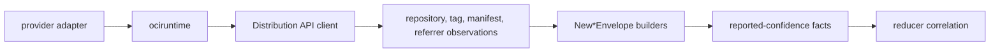

# internal/collector/ociregistry

`internal/collector/ociregistry` owns OCI registry identity normalization and
reported-confidence fact construction for the `oci_registry` collector family.
It turns repository, tag, descriptor, manifest, index, referrer, and warning
observations into durable fact envelopes.

This package does not call live registries, schedule workflow claims, choose
provider credentials, write graph rows, or decide package/source ownership.

## Runtime Flow



## Core Responsibilities

- Normalize registry provider, registry host, and repository identity.
- Normalize digest-addressed descriptor identity.
- Build fact envelopes for repositories, mutable tag observations, manifests,
  image indexes, descriptors, referrers, and warnings.
- Validate generation, collector instance, fencing token, media type, and
  digest boundaries before fact emission.
- Keep tag evidence separate from digest identity.
- Redact unknown OCI annotation values unless they are explicitly allowlisted.
- Keep `FactID` generation-specific while keeping `StableFactKey`
  source-stable inside a generation.

## Evidence Types

| Evidence | Meaning |
| --- | --- |
| `oci_registry.repository` | Source-reported registry repository identity. |
| `oci_registry.image_tag_observation` | Mutable tag-to-digest observation. |
| `oci_registry.image_manifest` | Digest-addressed image manifest evidence. |
| `oci_registry.image_index` | Digest-addressed image index evidence. |
| `oci_registry.image_descriptor` | Descriptor evidence for known or unknown media types. |
| `oci_registry.image_referrer` | Subject/referrer relationship evidence. |
| `oci_registry.warning` | Non-fatal collection warning, such as missing Referrers API support. |

## Provider Support

| Package | Owns |
| --- | --- |
| `distribution` | Provider-neutral OCI Distribution API calls. |
| `dockerhub` | Docker Hub repository names, official-library normalization, and pull-token client construction. |
| `ghcr` | GitHub Container Registry repository validation and pull-token client construction. |
| `jfrog` | Artifactory Docker/OCI repository-key mapping and client construction. |
| `ecr` | Amazon ECR registry host mapping and auth-token conversion. |
| `harbor` | Harbor endpoint and project/repository normalization. |
| `gar` | Google Artifact Registry `docker.pkg.dev` endpoint normalization. |
| `acr` | Azure Container Registry `<registry>.azurecr.io` endpoint normalization. |
| `ociruntime` | Target scans, workflow claims, runtime metrics, spans, and fact handoff. |

JFrog Docker/OCI repositories use this package. JFrog npm, Maven, PyPI, NuGet,
Go, and generic package feeds use `internal/collector/packageregistry`.
ECR is OCI registry evidence, not package-registry evidence.

## Telemetry Boundary

The root envelope package emits no metrics, spans, or logs. `ociruntime` records
runtime scan metrics and spans:

- `eshu_dp_oci_registry_api_calls_total`
- `eshu_dp_oci_registry_tags_observed_total`
- `eshu_dp_oci_registry_manifests_observed_total`
- `eshu_dp_oci_registry_referrers_observed_total`
- `eshu_dp_oci_registry_scan_duration_seconds`
- `oci_registry.scan`
- `oci_registry.api_call`

Metric labels must stay bounded to provider, operation, result, media family,
artifact family, and scan result. Registry hosts, repository names, tags, and
digests are high-cardinality and may describe private topology.

## Safety Rules

- Digest identity wins. Tags are mutable observations.
- Credentials and sensitive query parameters must not enter payloads, source
  references, logs, docs, or metric labels.
- Referrers API absence is a warning fact, not proof that a subject digest has
  no SBOMs, signatures, attestations, or vulnerabilities.
- Missing registry digest headers are warning evidence. `ociruntime` may compute
  the OCI digest from exact manifest bytes, but must never infer a digest from
  repository or tag text.
- Unknown media types can become descriptor evidence only when the registry
  reports a valid digest.
- Reducers own correlation and graph promotion.

## Verification

```bash
go test ./internal/collector/ociregistry/... -count=1
go test ./cmd/collector-oci-registry -count=1
go run ./cmd/eshu docs verify ../go/internal/collector/ociregistry \
  --limit 1000 --fail-on contradicted,missing_evidence
```

Run provider live tests only when the required provider credentials and public
smoke targets are intentionally configured outside repo files.

## Related Docs

- [Collector Readiness](../../../../docs/public/reference/collector-reducer-readiness.md)
- [Collector Authoring](../../../../docs/public/guides/collector-authoring.md)
- [OCI Registry Runtime](ociruntime/README.md)
