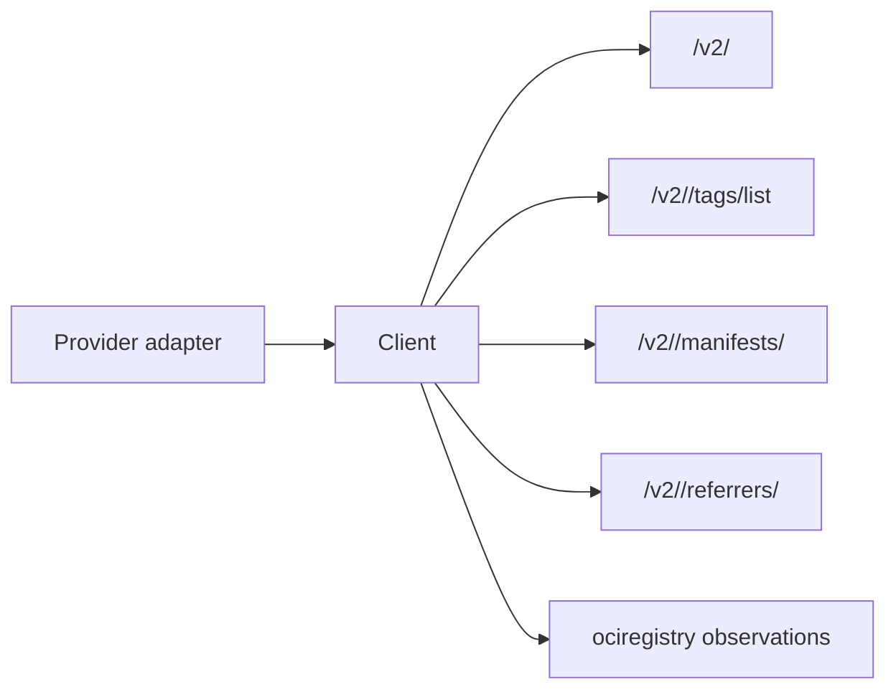

# OCI Distribution Client

## Purpose

`internal/collector/ociregistry/distribution` owns the provider-neutral OCI
Distribution HTTP calls used by the future `oci_registry` runtime. It validates
registry challenges, requests bearer tokens, lists tags, fetches manifests and
image indexes, and lists referrers where the registry supports the Referrers
API.

## Ownership boundary

This package owns OCI wire calls only. ECR token acquisition, JFrog repository
URL construction, registry discovery, workflow claims, telemetry, graph writes,
and query surfaces belong outside this package.

## Exported surface

- `ClientConfig` — base URL, auth, and HTTP client settings.
- `Client` — bounded OCI Distribution HTTP client.
- `TokenConfig` — Distribution bearer-token request settings.
- `Ping` — validates a registry API endpoint or auth challenge.
- `FetchBearerToken` — requests a pull token from a token service.
- `ListTags` — reads tag names for one repository.
- `GetManifest` — reads manifest or index bytes plus digest/media metadata.
- `GetBlob` — reads a content blob by digest with a bounded body cap.
- `ListReferrers` — reads descriptors attached to one subject digest.
- `ManifestResponse` — raw manifest body with content digest and media type.
- `BlobResponse` — raw blob body with digest and media type.
- `ReferrersResponse` — descriptors returned by the Referrers API.

## Dependencies

This package depends on the Go standard library, `internal/collector/sdk` for
bounded HTTP helper contracts, and `internal/collector/ociregistry` for
descriptor data.

## Telemetry

This package emits no metrics, spans, or logs. Runtime telemetry wraps the
client in the future claim-driven collector.

## Gotchas / invariants

- `Ping` treats `401 Unauthorized` with `Docker-Distribution-Api-Version` or
  `WWW-Authenticate` as a valid Distribution endpoint challenge.
- `FetchBearerToken` accepts both `token` and `access_token` response fields.
- Request paths escape repository names and references segment-by-segment while
  preserving repository slashes.
- Endpoint resolution preserves the `/v2/` trailing slash required by registry
  challenge probes.
- Credentials are request headers only. Error text and failure details include
  bounded operation/status class, not tokens, registry hosts, repository paths,
  tags, digests, URLs, or response bodies.
- `ListReferrers` reports unsupported Referrers API as an error so callers can
  emit an `oci_registry.warning`.
- The client installs an explicit redirect credential policy when the caller did
  not set its own `CheckRedirect`: same-host redirect hops re-apply the registry
  credential so multi-hop registry fetches (for example ECR manifest/blob hops)
  keep authenticating, and cross-host hops never receive the credential so a
  presigned object-store URL is reached without an extra `Authorization` header.
  An injected client that sets `CheckRedirect` keeps full control of redirects.

## Evidence

No-Regression Evidence (#2381): `go test ./internal/collector/sdk ./internal/collector/ociregistry/distribution ./internal/collector/ociregistry/ociruntime ./internal/collector/sbomruntime ./cmd/collector-oci-registry ./cmd/collector-sbom-attestation -count=1` proves OCI Distribution keeps `/v2/` auth-challenge ping handling, repository path escaping, tag/manifest/blob/referrers request behavior, token request query shaping, 404/405 referrer warning behavior, blob body caps, and registry failure-class/details while status and transport failures now unwrap bounded SDK `HTTPError` causes.

No-Observability-Change (#2381): Distribution remains telemetry-free. The OCI runtime continues to wrap calls with `oci_registry.scan` and `oci_registry.api_call` spans plus existing OCI registry metrics and warning facts; the SDK emits no telemetry directly, and no registry host, repository path, tag, digest, URL, token, or credential value was added to metric labels or status details.

## Related docs

- `docs/public/deployment/service-runtimes-collectors.md`
