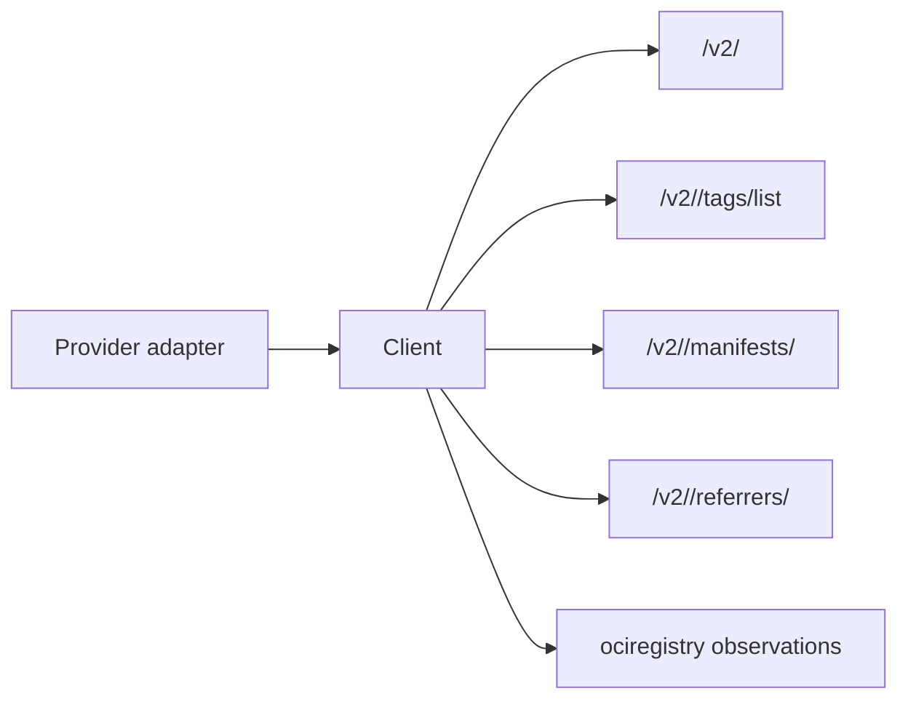

# OCI Distribution Client

## Purpose

`internal/collector/ociregistry/distribution` owns the provider-neutral OCI
Distribution HTTP calls used by the future `oci_registry` runtime. It validates
registry challenges, requests bearer tokens, lists tags, fetches manifests and
image indexes, and lists referrers where the registry supports the Referrers
API.

## Ownership boundary

This package owns OCI wire calls only. ECR token acquisition, JFrog repository
URL construction, registry discovery, workflow claims, telemetry, graph writes,
and query surfaces belong outside this package.

## Exported surface

- `ClientConfig` — base URL, auth, and HTTP client settings.
- `Client` — bounded OCI Distribution HTTP client.
- `TokenConfig` — Distribution bearer-token request settings.
- `Ping` — validates a registry API endpoint or auth challenge.
- `FetchBearerToken` — requests a pull token from a token service.
- `ListTags` — reads tag names for one repository.
- `GetManifest` — reads manifest or index bytes plus digest/media metadata.
- `ListReferrers` — reads descriptors attached to one subject digest.
- `ManifestResponse` — raw manifest body with content digest and media type.
- `ReferrersResponse` — descriptors returned by the Referrers API.

## Dependencies

This package depends only on the Go standard library and
`internal/collector/ociregistry` for descriptor data.

## Telemetry

This package emits no metrics, spans, or logs. Runtime telemetry wraps the
client in the future claim-driven collector.

## Gotchas / invariants

- `Ping` treats `401 Unauthorized` with `Docker-Distribution-Api-Version` or
  `WWW-Authenticate` as a valid Distribution endpoint challenge.
- `FetchBearerToken` accepts both `token` and `access_token` response fields.
- Request paths escape repository names and references segment-by-segment while
  preserving repository slashes.
- Endpoint resolution preserves the `/v2/` trailing slash required by registry
  challenge probes.
- Credentials are request headers only. Error text includes method, path, and
  status class, not tokens.
- `ListReferrers` reports unsupported Referrers API as an error so callers can
  emit an `oci_registry.warning`.

## Related docs

- `docs/docs/adrs/2026-05-10-oci-container-registry-collector.md`
