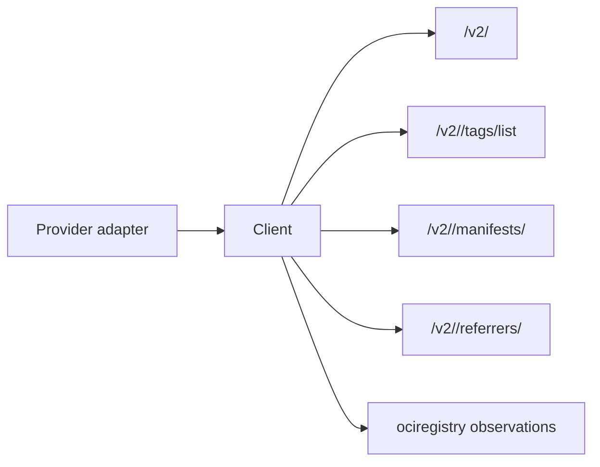

# OCI Distribution Client

## Purpose

`internal/collector/ociregistry/distribution` owns the provider-neutral OCI
Distribution HTTP calls used by the future `oci_registry` runtime. It validates
registry challenges, requests bearer tokens, lists tags, fetches manifests and
image indexes, and lists referrers where the registry supports the Referrers
API.

## Ownership boundary

This package owns OCI wire calls only. ECR token acquisition, JFrog repository
URL construction, registry discovery, workflow claims, telemetry, graph writes,
and query surfaces belong outside this package.

```mermaid
flowchart LR
  A["Provider adapter"] --> B["Client"]
  B --> C["/v2/"]
  B --> D["/v2/<name>/tags/list"]
  B --> E["/v2/<name>/manifests/<ref>"]
  B --> F["/v2/<name>/referrers/<digest>"]
  B --> G["ociregistry observations"]
```

## Exported surface

- `ClientConfig` — base URL, auth, and HTTP client settings.
- `Client` — bounded OCI Distribution HTTP client.
- `TokenConfig` — Distribution bearer-token request settings.
- `Ping` — validates a registry API endpoint or auth challenge.
- `FetchBearerToken` — requests a pull token from a token service.
- `ListTags` — reads a bounded tag window for one repository and reports
  whether that window is complete.
- `TagListResponse` — unique observed tags plus the explicit completeness bit
  consumed by the OCI runtime.
- `GetManifest` — reads manifest or index bytes plus digest/media metadata.
- `GetBlob` — reads a content blob by digest with a bounded body cap.
- `ListReferrers` — reads descriptors attached to one subject digest.
- `ManifestResponse` — raw manifest body with content digest and media type.
- `BlobResponse` — raw blob body with digest and media type.
- `ReferrersResponse` — descriptors returned by the Referrers API.

## Dependencies

This package depends on the Go standard library, `internal/collector/sdk` for
bounded HTTP helper contracts, and `internal/collector/ociregistry` for
descriptor data.

## Telemetry

This package emits no metrics, spans, or logs. Runtime telemetry wraps the
client in the future claim-driven collector.

## Gotchas / invariants

- `Ping` treats `401 Unauthorized` with `Docker-Distribution-Api-Version` or
  `WWW-Authenticate` as a valid Distribution endpoint challenge.
- `FetchBearerToken` accepts both `token` and `access_token` response fields.
- Request paths escape repository names and references segment-by-segment while
  preserving repository slashes.
- Tag listing requests `limit+1` entries and follows OCI `rel="next"` links
  only while the unique result remains below the requested limit. Continuation
  URLs must keep the original scheme, host, port, and exact repository
  `/tags/list` path. Cycles, pages that make no progress, unsafe links, page
  count limits, and response-size limits return the bounded partial result with
  `Complete=false`.
- Endpoint resolution preserves the `/v2/` trailing slash required by registry
  challenge probes.
- Credentials are request headers only. Error text and failure details include
  bounded operation/status class, not tokens, registry hosts, repository paths,
  tags, digests, URLs, or response bodies.
- `ListReferrers` reports unsupported Referrers API as an error so callers can
  emit an `oci_registry.warning`.
- The client installs an explicit redirect credential policy when the caller did
  not set its own `CheckRedirect`: same-host redirect hops re-apply the registry
  credential so multi-hop registry fetches (for example ECR manifest/blob hops)
  keep authenticating, and cross-host hops never receive the credential so a
  presigned object-store URL is reached without an extra `Authorization` header.
  An injected client that sets `CheckRedirect` keeps full control of redirects.

## Evidence

No-Regression Evidence (#2381): `go test ./internal/collector/sdk ./internal/collector/ociregistry/distribution ./internal/collector/ociregistry/ociruntime ./internal/collector/sbomruntime ./cmd/collector-oci-registry ./cmd/collector-sbom-attestation -count=1` proves OCI Distribution keeps `/v2/` auth-challenge ping handling, repository path escaping, tag/manifest/blob/referrers request behavior, token request query shaping, 404/405 referrer warning behavior, blob body caps, and registry failure-class/details while status and transport failures now unwrap bounded SDK `HTTPError` causes.

No-Observability-Change (#2381): Distribution remains telemetry-free. The OCI runtime continues to wrap calls with `oci_registry.scan` and `oci_registry.api_call` spans plus existing OCI registry metrics and warning facts; the SDK emits no telemetry directly, and no registry host, repository path, tag, digest, URL, token, or credential value was added to metric labels or status details.

No-Regression Evidence (#3113): the client now owns an explicit redirect credential policy. `NewClient` returns a per-client shallow copy of the caller's `*http.Client` carrying a `CheckRedirect` bound to that client's registry host and credentials, so a shared `*http.Client` reused across registries keeps independent per-host redirect policies (`Transport`/`Timeout`/`Jar` preserved). Same-host redirect hops re-authenticate and cross-host hops never receive the credential. Input shape: one manifest/blob GET that the registry answers with a same-host or cross-host redirect; no graph, queue, or backend writes are involved. Proven by `go test ./internal/collector/ociregistry/distribution -count=1` (20 tests), including `TestClientGetBlobKeepsAuthOnSameHostRedirect`, `TestClientGetBlobDropsAuthOnCrossHostRedirect`, and `TestNewClientDoesNotMutateSharedHTTPClientRedirectPolicy`. The first redirect test fails with `registry_auth_denied` before the fix.

No-Observability-Change (#3113): the redirect policy adds no metrics, spans, or status fields and logs nothing. The credential is request-header only and never appears in error text, logs, or metric labels; operators continue to diagnose auth failures through the existing registry failure class/details surface.

No-Observability-Change (#5854): tag pagination adds no metric labels, logs, or
status fields. The OCI runtime already records `list_tags` API-call outcomes,
counts retained tags, and emits `tag_list_truncated` warning evidence whenever
`TagListResponse.Complete` is false. Continuation validation happens before a
request, so credentials are never sent to a different origin or repository
path.

Collector Performance Evidence: Benchmark Evidence (#5854) on an Apple M5 Max,
`go test ./internal/collector/ociregistry/distribution -run '^$' -bench '^BenchmarkClientListTagsSinglePage$' -benchmem -count=5`
measured the same one-page, two-tag `httptest` response before and after
Link-aware pagination. Median latency improved from 38,430 ns/op to
36,878 ns/op (4.0% lower). Median allocation moved from 6,359 B/op and
80 allocs/op to 6,556 B/op and 83 allocs/op (3.1% and 3.8% higher) for the
explicit limit query and completeness contract. The success path still makes
one request. `TestClientListTagsStopsAtLimitPlusOne` proves a registry that
ignores the requested page size retains at most `limit+1` unique tags and makes
one request; `TestClientListTagsStopsAtPageBound` proves continuation traffic
stops at 32 requests.

Collector Observability Evidence: `eshu_dp_oci_registry_api_calls_total` with
`operation="list_tags"` records request success or failure,
`eshu_dp_oci_registry_tags_observed_total` records the retained window, and the
existing `tag_list_truncated` warning fact records incomplete enumeration for
the reducer.

Collector Deployment Evidence: the change adds no runtime, port, process,
Service, ServiceMonitor, Helm value, environment variable, or resource
requirement. Existing OCI registry collector deployments use the same client
factory and runtime wiring.

## Related docs

- `docs/public/deployment/service-runtimes-collectors.md`
