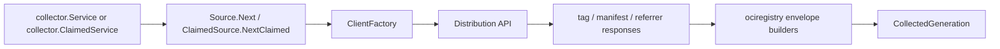

# OCI Registry Runtime Adapter

## Purpose

`internal/collector/ociregistry/ociruntime` turns configured OCI registry
targets into `collector.CollectedGeneration` values. It scans tags, manifests,
image indexes, descriptors, and referrers, then hands fact envelopes to the
shared collector service.

## Runtime Flow

## Exported Surface

- `Config` and `TargetConfig` describe bounded repository scan inputs.
- `RegistryClient` is the Distribution API contract used by scans.
- `ClientFactory` and `ClientFactoryFunc` create provider-specific clients.
- `Source` implements `collector.Source` for OCI registry targets.
- `ClaimedSource` implements `collector.ClaimedSource` by resolving a
  workflow `scope_id` to exactly one configured target and using the claimed
  generation ID for idempotent retries.

Internal manifest helpers parse OCI and Docker-compatible response bodies,
classify media families, and compute digest fallback values from exact manifest
bytes when a registry omits the digest header.

## Telemetry

`Source` records OCI registry runtime metrics when instruments are provided:

| Metric | Type | Labels | Purpose |
| --- | --- | --- | --- |
| `eshu_dp_oci_registry_api_calls_total` | Counter | `provider`, `operation`, `result` | Counts ping, tag-list, manifest, and referrer API calls and their success or error result. |
| `eshu_dp_oci_registry_tags_observed_total` | Counter | `provider`, `result` | Counts bounded tag observations that will drive manifest reads. |
| `eshu_dp_oci_registry_manifests_observed_total` | Counter | `provider`, `media_family` | Counts digest objects by `image_manifest`, `image_index`, or `descriptor`. |
| `eshu_dp_oci_registry_referrers_observed_total` | Counter | `provider`, `artifact_family` | Counts referrer artifacts by bounded family: `sbom`, `signature`, `attestation`, `vulnerability`, `unknown`, or `other`. |
| `eshu_dp_oci_registry_scan_duration_seconds` | Float64 histogram | `provider`, `result` | Measures one target scan from client creation through fact envelope construction. |

Trace spans:

| Span | Purpose |
| --- | --- |
| `oci_registry.scan` | One target scan. Use it to see whether the repository scan or the later commit is slow. |
| `oci_registry.api_call` | One registry API call. The `operation` span attribute is `ping`, `list_tags`, `get_manifest`, or `list_referrers`. |

Metric labels deliberately exclude registry hosts, repository names, tags, and
digests. Those values are high cardinality and may describe private topology.

## Invariants

- Tags are mutable observations; digest identity wins.
- Claimed scans must match one configured target by normalized `scope_id`; an
  unmatched claim releases without emitting facts.
- Referrers API absence emits a warning fact instead of false negative truth.
- Missing Docker-Content-Digest headers emit warning evidence. When manifest
  bytes are present, the runtime computes the OCI digest from those exact bytes
  and emits `computed_manifest_digest` warning evidence.
- Unknown media types still become descriptor evidence when the registry
  reports a valid digest.
- Provider-specific auth and endpoint shape stay outside this package behind
  `ClientFactory`.

## Related Docs

- `go/internal/collector/ociregistry/README.md`
- `go/internal/collector/README.md`
- `go/internal/telemetry/README.md`
