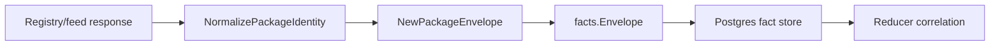

# Package Registry Collector Contracts

## Purpose

`internal/collector/packageregistry` owns package-registry identity
normalization and fact-envelope construction for the future `package_registry`
collector family. It turns package/feed metadata into reported-confidence
facts. It does not call registries yet, write graph state, or decide ownership.

This package implements the first slice of
`docs/docs/adrs/2026-05-12-package-registry-collector.md`: contract fixtures
and stable package identity.

## Ownership boundary

This package owns local package identity rules, `package_registry.package`
envelope construction, and `package_registry.package_version` envelope
construction. Live registry clients, workflow claims, runtime
telemetry, graph writes, reducer correlation, and query surfaces belong to later
collector, reducer, storage, and query slices.

## Exported surface

See `doc.go` for the godoc contract.

- `Ecosystem` — package-native identity family.
- `Visibility` — source-reported package visibility.
- `PackageIdentity` — raw package tuple from a feed.
- `NormalizedPackageIdentity` — feed-aware stable identity.
- `NormalizePackageIdentity` — ecosystem normalization for npm, PyPI, Go
  modules, Maven, NuGet, and generic package feeds.
- `PackageObservation` — one package identity observation ready for envelope
  emission.
- `NewPackageEnvelope` — builds a `package_registry.package` fact with
  `source_confidence=reported`.
- `PackageVersionObservation` — one package version observation ready for
  envelope emission.
- `NewPackageVersionEnvelope` — builds a `package_registry.package_version`
  fact with `source_confidence=reported`.

## Dependencies

- `internal/facts` for durable fact constants, `Envelope`, `Ref`, and stable ID
  generation.

## Telemetry

This package emits no metrics, spans, or logs. Runtime collector telemetry will
live in the future package-registry runtime slice.

## Gotchas / invariants

- Registry facts are evidence. Reducers must corroborate package ownership or
  dependency truth before graph promotion.
- ECR is OCI registry evidence, not package-registry evidence. JFrog can emit
  both OCI and package-registry facts, depending on repository type.
- Stable IDs use normalized package identity, not raw display names.
- Version fact IDs use `<package_id>@<version>` so artifact metadata and
  deprecation/yank/unlisted flags stay attached to the package-native version.
- Private package names, feed URLs, versions, and artifact paths must not become
  metric labels.

## Related docs

- `docs/docs/adrs/2026-05-12-package-registry-collector.md`
- `docs/docs/adrs/2026-05-10-oci-container-registry-collector.md`
- `docs/docs/guides/collector-authoring.md`
