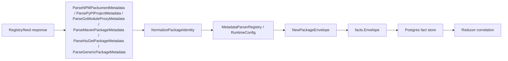

# Package Registry Collector Contracts

## Purpose

`internal/collector/packageregistry` owns package-registry identity
normalization, bounded target configuration, parser registration, and
fact-envelope construction for the `package_registry` collector family.
It turns local package/feed metadata into reported-confidence facts. It does
not write graph state or decide ownership.

This package implements the first slices of
`docs/docs/adrs/2026-05-12-package-registry-collector.md`: contract fixtures,
stable package identity, bounded runtime target configuration, local metadata
fixture parsers, parser registration, and reported-confidence fact envelopes
for package, version, dependency, artifact, source-hint, hosting, and warning
evidence. Generic/JFrog metadata can also emit registry-reported advisory hints
and registry events when the source fixture exposes those streams. Artifactory
package fixtures can wrap package-native metadata and add repository topology
only as `repository_hosting` evidence.

## Ownership boundary

This package owns local package identity rules, bounded target config,
package-native fixture parser registration, and fact-envelope construction for
package-registry evidence. Live metadata fetches and workflow claims live in
`packageruntime`; graph writes, reducer correlation, and query surfaces belong
to later reducer, storage, and query slices.

## Exported surface

See `doc.go` for the godoc contract.

- `Ecosystem` — package-native identity family.
- `Visibility` — source-reported package visibility.
- `RuntimeConfig` — collector runtime boundary for bounded package-registry
  targets.
- `TargetConfig` — one provider, ecosystem, registry, and scope target.
- `PackageIdentity` — raw package tuple from a feed.
- `NormalizedPackageIdentity` — feed-aware stable identity.
- `MetadataParserContext` — collector boundary copied into parsed fixture
  observations.
- `MetadataParser` — one ecosystem-native metadata parser function.
- `MetadataParserRegistry` — explicit ecosystem parser registry for future
  runtime sources.
- `DefaultMetadataParserRegistry` — registry containing npm, PyPI, Go module,
  Maven, NuGet, and Generic fixture parsers.
- `ParsedMetadata` — package, version, dependency, artifact, source-hint,
  vulnerability-hint, registry-event, hosting, and warning observations
  produced from one metadata document.
- `NormalizePackageIdentity` — ecosystem normalization for npm, PyPI, Go
  modules, Maven, NuGet, and generic package feeds.
- `ParseNPMPackumentMetadata` — parses one npm packument fixture into
  observations.
- `ParsePyPIProjectMetadata` — parses one PyPI JSON API fixture into
  observations.
- `ParseGoModuleProxyMetadata` — parses one offline GOPROXY `.info`, `.mod`,
  zip URL, and checksum bundle into observations.
- `ParseMavenPackageMetadata` — parses one Maven POM XML fixture into
  observations.
- `ParseNuGetPackageMetadata` — parses one NuGet nuspec XML fixture into
  observations.
- `ParseArtifactoryPackageMetadata` — parses one Artifactory package-feed
  wrapper by delegating to the package-native parser and appending provider
  repository topology as hosting evidence.
- `ParseArtifactoryPackageMetadataWithRegistry` — parses the same wrapper with
  the caller's parser registry so runtime-owned parser registrations stay in
  force.
- `ParseGenericPackageMetadata` — parses one provider-specific generic package
  fixture into observations, including JFrog-style advisory and event streams
  when present.
- `PackageObservation` — one package identity observation ready for envelope
  emission.
- `NewPackageEnvelope` — builds a `package_registry.package` fact with
  `source_confidence=reported`.
- `PackageVersionObservation` — one package version observation ready for
  envelope emission.
- `NewPackageVersionEnvelope` — builds a `package_registry.package_version`
  fact with `source_confidence=reported`.
- `PackageDependencyObservation` — one package version dependency ready for
  envelope emission.
- `NewPackageDependencyEnvelope` — builds a
  `package_registry.package_dependency` fact with
  `source_confidence=reported`.
- `PackageArtifactObservation` — one package version artifact ready for
  envelope emission.
- `NewPackageArtifactEnvelope` — builds a `package_registry.package_artifact`
  fact with `source_confidence=reported`.
- `SourceHintObservation` — one repository, homepage, SCM, or provenance hint
  ready for envelope emission.
- `NewSourceHintEnvelope` — builds a `package_registry.source_hint` fact with
  `source_confidence=reported`.
- `VulnerabilityHintObservation` — one registry-reported advisory ready for
  envelope emission without assigning severity policy.
- `NewVulnerabilityHintEnvelope` — builds a
  `package_registry.vulnerability_hint` fact with
  `source_confidence=reported`.
- `RegistryEventObservation` — one source-reported publish, delete, unlist,
  deprecate, yank, relist, or metadata mutation event ready for envelope
  emission.
- `NewRegistryEventEnvelope` — builds a `package_registry.registry_event` fact
  with `source_confidence=reported`.
- `RepositoryHostingObservation` — one provider/feed topology record ready for
  envelope emission.
- `NewRepositoryHostingEnvelope` — builds a
  `package_registry.repository_hosting` fact with
  `source_confidence=reported`.
- `WarningObservation` — one non-fatal collector warning ready for envelope
  emission.
- `NewWarningEnvelope` — builds a `package_registry.warning` fact with
  `source_confidence=reported`.

## Dependencies

- `internal/facts` for durable fact constants, `Envelope`, `Ref`, and stable ID
  generation.

## Telemetry

This package emits no metrics, spans, or logs. Runtime collector telemetry lives
in `packageruntime` and uses the `eshu_dp_package_registry_*` metric family.

## Gotchas / invariants

- Registry facts are evidence. Reducers must corroborate package ownership or
  dependency truth before graph promotion.
- ECR is OCI registry evidence, not package-registry evidence. JFrog can emit
  both OCI and package-registry facts, depending on repository type.
- Artifactory package metadata is an adapter around package-native metadata.
  Repository type, upstream ID, and upstream URL are hosting evidence only; they
  do not prove source ownership or package consumption.
- Stable IDs use normalized package identity, not raw display names.
- `FactID` includes `scope_id` and `generation_id`, while `StableFactKey`
  remains the source-stable identity inside a generation. This preserves
  historical rows when the same package is observed again.
- Package-registry envelope payloads carry `correlation_anchors` so reducers can
  join reported evidence without re-parsing source-specific payload fields.
- Version fact IDs use `<package_id>@<version>` so artifact metadata and
  deprecation/yank/unlisted flags stay attached to the package-native version.
- Dependency fact IDs use normalized source and dependency package identities
  plus package-native dependency scope fields.
- Artifact fact IDs use normalized package version identity plus a stable
  source-native artifact key.
- Source hint and warning envelopes strip URL credentials and sensitive query
  parameters before payload or source-reference emission.
- Metadata parsers and `RuntimeConfig` are shared runtime contracts. They do
  not make HTTP calls, claim workflow leases, crawl registries, commit facts,
  or infer ownership.
- New ecosystems should add a parser and register it with
  `MetadataParserRegistry`; do not route package-manager behavior through one
  opaque adapter.
- Private package names, feed URLs, versions, and artifact paths must not become
  metric labels.

## Related docs

- `docs/docs/adrs/2026-05-12-package-registry-collector.md`
- `docs/docs/adrs/2026-05-10-oci-container-registry-collector.md`
- `docs/docs/guides/collector-authoring.md`
