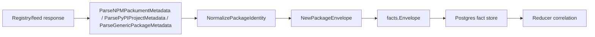

# Package Registry Collector Contracts

## Purpose

`internal/collector/packageregistry` owns package-registry identity
normalization and fact-envelope construction for the future `package_registry`
collector family. It turns package/feed metadata into reported-confidence
facts. It does not call registries yet, write graph state, or decide ownership.

This package implements the first slices of
`docs/docs/adrs/2026-05-12-package-registry-collector.md`: contract fixtures,
stable package identity, local metadata fixture parsers, and
reported-confidence fact envelopes for package, version, dependency, artifact,
source-hint, hosting, and warning evidence.

## Ownership boundary

This package owns local package identity rules, package-native fixture parsing,
and fact-envelope construction for package-registry evidence. Live registry
clients, workflow claims, runtime telemetry, graph writes, reducer correlation,
and query surfaces belong to later collector, reducer, storage, and query
slices.

## Exported surface

See `doc.go` for the godoc contract.

- `Ecosystem` — package-native identity family.
- `Visibility` — source-reported package visibility.
- `PackageIdentity` — raw package tuple from a feed.
- `NormalizedPackageIdentity` — feed-aware stable identity.
- `MetadataParserContext` — collector boundary copied into parsed fixture
  observations.
- `ParsedMetadata` — package, version, dependency, artifact, source-hint,
  hosting, and warning observations produced from one metadata document.
- `NormalizePackageIdentity` — ecosystem normalization for npm, PyPI, Go
  modules, Maven, NuGet, and generic package feeds.
- `ParseNPMPackumentMetadata` — parses one npm packument fixture into
  observations.
- `ParsePyPIProjectMetadata` — parses one PyPI JSON API fixture into
  observations.
- `ParseGenericPackageMetadata` — parses one provider-specific generic package
  fixture into observations.
- `PackageObservation` — one package identity observation ready for envelope
  emission.
- `NewPackageEnvelope` — builds a `package_registry.package` fact with
  `source_confidence=reported`.
- `PackageVersionObservation` — one package version observation ready for
  envelope emission.
- `NewPackageVersionEnvelope` — builds a `package_registry.package_version`
  fact with `source_confidence=reported`.
- `PackageDependencyObservation` — one package version dependency ready for
  envelope emission.
- `NewPackageDependencyEnvelope` — builds a
  `package_registry.package_dependency` fact with
  `source_confidence=reported`.
- `PackageArtifactObservation` — one package version artifact ready for
  envelope emission.
- `NewPackageArtifactEnvelope` — builds a `package_registry.package_artifact`
  fact with `source_confidence=reported`.
- `SourceHintObservation` — one repository, homepage, SCM, or provenance hint
  ready for envelope emission.
- `NewSourceHintEnvelope` — builds a `package_registry.source_hint` fact with
  `source_confidence=reported`.
- `RepositoryHostingObservation` — one provider/feed topology record ready for
  envelope emission.
- `NewRepositoryHostingEnvelope` — builds a
  `package_registry.repository_hosting` fact with
  `source_confidence=reported`.
- `WarningObservation` — one non-fatal collector warning ready for envelope
  emission.
- `NewWarningEnvelope` — builds a `package_registry.warning` fact with
  `source_confidence=reported`.

## Dependencies

- `internal/facts` for durable fact constants, `Envelope`, `Ref`, and stable ID
  generation.

## Telemetry

This package emits no metrics, spans, or logs. Runtime collector telemetry will
live in the future package-registry runtime slice.

## Gotchas / invariants

- Registry facts are evidence. Reducers must corroborate package ownership or
  dependency truth before graph promotion.
- ECR is OCI registry evidence, not package-registry evidence. JFrog can emit
  both OCI and package-registry facts, depending on repository type.
- Stable IDs use normalized package identity, not raw display names.
- Version fact IDs use `<package_id>@<version>` so artifact metadata and
  deprecation/yank/unlisted flags stay attached to the package-native version.
- Dependency fact IDs use normalized source and dependency package identities
  plus package-native dependency scope fields.
- Artifact fact IDs use normalized package version identity plus a stable
  source-native artifact key.
- Source hint and warning envelopes strip URL credentials and sensitive query
  parameters before payload or source-reference emission.
- Metadata parsers are local fixture parsers. They do not make HTTP calls,
  claim workflow leases, crawl registries, or infer ownership.
- Private package names, feed URLs, versions, and artifact paths must not become
  metric labels.

## Related docs

- `docs/docs/adrs/2026-05-12-package-registry-collector.md`
- `docs/docs/adrs/2026-05-10-oci-container-registry-collector.md`
- `docs/docs/guides/collector-authoring.md`
