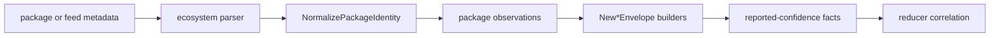

# internal/collector/packageregistry

`internal/collector/packageregistry` owns package-registry identity
normalization, bounded target configuration, metadata parser registration, and
reported-confidence fact construction for the `package_registry` collector
family.

This package does not fetch live metadata, claim workflow work, write graph
state, or decide ownership. Runtime fetching lives in `packageruntime`; graph
promotion belongs to reducer, storage, and query packages.

## Runtime Flow



## Core Responsibilities

- Normalize package identity for npm, PyPI, Go modules, Maven, NuGet, generic,
  and Artifactory package-wrapper inputs.
- Validate bounded runtime target config.
- Register ecosystem-native metadata parsers.
- Parse local metadata documents into observations.
- Build fact envelopes for packages, versions, dependencies, artifacts,
  source hints, vulnerability hints, registry events, repository hosting, and
  warnings.
- Preserve source-reported evidence as reported confidence until reducers
  corroborate ownership or dependency truth.

## Evidence Types

| Evidence | Meaning |
| --- | --- |
| `package_registry.package` | Source-reported package identity. |
| `package_registry.package_version` | Source-reported version metadata. |
| `package_registry.package_dependency` | Source-reported dependency edge. |
| `package_registry.package_artifact` | Source-reported artifact metadata. |
| `package_registry.source_hint` | Repository, homepage, SCM, or provenance hint. |
| `package_registry.vulnerability_hint` | Registry-reported advisory hint, not severity policy. |
| `package_registry.registry_event` | Publish, delete, unlist, deprecate, yank, relist, or metadata mutation event. |
| `package_registry.repository_hosting` | Provider/feed topology evidence. |
| `package_registry.warning` | Non-fatal collector warning. |

## Parser Boundary

`MetadataParserRegistry` keeps ecosystem parser registration explicit. New
ecosystems should add a parser and register it instead of routing behavior
through one opaque generic adapter.

Artifactory package metadata is a wrapper around package-native metadata.
Repository type, upstream ID, and upstream URL are hosting evidence only; they
do not prove source ownership or package consumption.

ECR belongs to OCI registry evidence, not package-registry evidence. JFrog may
emit OCI or package-registry evidence depending on repository type.

## Identity And Fact Rules

- Stable IDs use normalized package identity, not display names.
- `FactID` includes `scope_id` and `generation_id`.
- `StableFactKey` remains source-stable inside a generation.
- Version fact IDs use `<package_id>@<version>`.
- Dependency fact IDs include normalized source and dependency package identity
  plus package-native dependency scope.
- Artifact fact IDs include normalized package-version identity plus a stable
  source-native artifact key.
- Envelope payloads carry `correlation_anchors` so reducers can join evidence
  without re-parsing source-specific payload fields.
- Source hints and warning envelopes strip URL credentials and sensitive query
  parameters before payload or source-reference emission.

## Verification

```bash
go test ./internal/collector/packageregistry -count=1
go test ./internal/collector/packageregistry/packageruntime -count=1
go run ./cmd/eshu docs verify ../go/internal/collector/packageregistry \
  --limit 1000 --fail-on contradicted,missing_evidence
```

Run `go test ./cmd/collector-package-registry -count=1` when command wiring or
collector deployment configuration changes.

## Related Docs

- [Package Registry Runtime](packageruntime/README.md)
- [Collector Package](../README.md)
- [Collector Readiness](../../../../docs/public/reference/collector-reducer-readiness.md)
- [Collector Authoring](../../../../docs/public/guides/collector-authoring.md)
