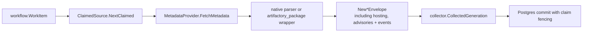

# Package Registry Runtime

## Purpose

`internal/collector/packageregistry/packageruntime` owns the claim-driven
runtime for `package_registry` collector work. It maps one workflow claim to
one configured package-registry target, fetches that target's metadata document,
parses it with `packageregistry.MetadataParserRegistry` or the Artifactory
package wrapper when configured, and returns fact envelopes to
`collector.ClaimedService`.

## Flow

## Exported Surface

- `SourceConfig` validates collector instance ID, bounded targets, provider,
  and optional telemetry handles.
- `TargetConfig` stores parsed target identity plus runtime-only endpoint,
  document format, and credential material.
- `MetadataProvider` fetches one bounded metadata document for a target.
- `HTTPMetadataProvider` performs the first production metadata fetch path
  using an explicit `metadata_url`.
- `ClaimedSource` implements `collector.ClaimedSource`.

## Telemetry

The runtime records:

- `eshu_dp_package_registry_observe_duration_seconds`
- `eshu_dp_package_registry_requests_total`
- `eshu_dp_package_registry_facts_emitted_total`
- `eshu_dp_package_registry_rate_limited_total`
- `eshu_dp_package_registry_generation_lag_seconds`
- `eshu_dp_package_registry_parse_failures_total`

Labels stay bounded to provider, ecosystem, result/status class, fact kind, and
document type. Package names, private feed URLs, versions, and artifact paths
must stay out of metrics.

## Invariants

- A claimed source only collects the configured `scope_id` from the workflow
  item. Unknown scope IDs fail the claim instead of falling back to another
  target.
- `document_format` defaults to `native`. `artifactory_package` is allowed only
  as a wrapper around package-native metadata; Artifactory repository topology
  remains hosting evidence.
- `collector_instance_id`, `generation_id`, and `fencing_token` come from the
  workflow claim path and are copied into every emitted fact.
- Advisory and registry-event observations are bounded by the same configured
  package and version limits as dependencies, artifacts, and source hints.
- Credentials stay in `TargetConfig` runtime fields. They must not be copied to
  facts, logs, metric labels, or docs.
- `HTTPMetadataProvider` accepts one explicit metadata URL per target; it does
  not crawl feeds or enumerate registries.

## Related Docs

- [Package registry ADR](../../../../../docs/docs/adrs/2026-05-12-package-registry-collector.md)
- [Service runtimes](../../../../../docs/docs/deployment/service-runtimes.md)
