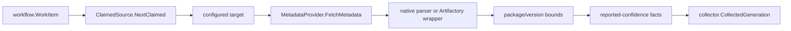

# internal/collector/packageregistry/packageruntime

`internal/collector/packageregistry/packageruntime` owns the claim-driven
runtime for `package_registry` collector work. It maps one workflow claim to one
configured target, fetches one bounded metadata document, parses it, and returns
a `collector.CollectedGeneration`.

## Runtime Flow



## Exported Surface

| API | Contract |
| --- | --- |
| `SourceConfig` | Validates collector instance, targets, provider, and telemetry handles. |
| `TargetConfig` | Stores runtime target identity, endpoint, document format, and credentials. |
| `MetadataProvider` | Fetches one bounded metadata document. |
| `HTTPMetadataProvider` | Fetches an explicit metadata URL with bounded HTTP behavior. |
| `ClaimedSource` | Implements `collector.ClaimedSource` for package-registry work. |

## Runtime Rules

- Unknown claim `scope_id` values fail the claim instead of falling back to a
  different target.
- `document_format` defaults to `native`.
- `artifactory_package` wraps package-native metadata and keeps Artifactory
  repository topology as hosting evidence.
- `collector_instance_id`, `generation_id`, and `fencing_token` come from the
  workflow claim path and are copied into emitted facts.
- `package_limit` is strict: exceeding it fails the claim.
- `version_limit` is truncating: the runtime keeps the first deterministic
  version set, drops dependent observations for truncated versions, and emits a
  package-scoped `version_limit_truncated` warning fact.
- Credentials stay in runtime config. Do not copy them to facts, logs, metric
  labels, or docs.
- `HTTPMetadataProvider` accepts one explicit metadata URL per target. It does
  not crawl feeds or enumerate registries.

## Telemetry

The runtime records package-registry observe duration, request count, facts
emitted, rate-limit count, generation lag, and parse-failure count.

Metric labels must stay bounded to provider, ecosystem, result or status class,
fact kind, and document type. Package names, private feed URLs, versions, and
artifact paths must stay out of metric labels.

## Verification

```bash
go test ./internal/collector/packageregistry/packageruntime -count=1
go test ./cmd/collector-package-registry -count=1
go run ./cmd/eshu docs verify ../go/internal/collector/packageregistry \
  --limit 1000 --fail-on contradicted,missing_evidence
```

Run `helm lint deploy/helm/eshu` when collector deployment values or
ServiceMonitor wiring changes.

## Related Docs

- [Package Registry Contracts](../README.md)
- [Collector Readiness](../../../../../docs/public/reference/collector-reducer-readiness.md)
- [Service Runtimes](../../../../../docs/public/deployment/service-runtimes.md)
