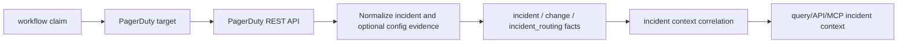

# PagerDuty Collector Contracts

## Purpose

`internal/collector/pagerduty` owns PagerDuty incident-context collection and
optional live PagerDuty configuration validation for the `pagerduty` collector
family. It turns PagerDuty incidents, incident log entries, related change
events, optional related-change coverage warnings, and opt-in
service/integration configuration observations into reported-confidence source
facts that incident-context reducers and read models can correlate later with
runtime, image, commit, pull-request, and work-item evidence.

This package intentionally does not write graph truth, create Jira work items,
or infer deployment impact. PagerDuty is the alerting source: it can say what
incident fired, which service was attached, how the incident moved through its
lifecycle, which provider change events PagerDuty already relates to the
incident, and optionally what live PagerDuty service/integration state existed
when the collector read the API. Other collectors own Jira, GitHub, registry,
CI/CD, and runtime evidence.

## Fixture-to-fact flow

## Exported Surface

- `ProviderPagerDuty` - durable provider name: `pagerduty`.
- `EnvelopeContext` - scope, generation, collector instance, fencing token,
  observed time, and source URI copied into emitted envelopes.
- `NewIncidentRecordEnvelope` - converts one PagerDuty incident into an
  `incident.record` fact.
- `NewLifecycleEventEnvelope` - converts one PagerDuty incident log entry into
  an `incident.lifecycle_event` fact.
- `NewChangeRecordEnvelope` - converts one PagerDuty related change event into
  a `change.record` fact.
- `NewObservedPagerDutyServiceEnvelope` - converts one live PagerDuty service
  into an `incident_routing.observed_pagerduty_service` fact.
- `NewObservedPagerDutyIntegrationEnvelope` - converts one live PagerDuty
  service integration into an
  `incident_routing.observed_pagerduty_integration` fact.
- `HTTPClient` - bounded PagerDuty REST client for incidents, log entries, and
  related change events. When `ConfigValidationEnabled` is true, it also reads
  bounded service and service-integration configuration metadata.
- `ClaimedSource` - workflow-claim adapter used by `collector-pagerduty`.

## Invariants

- Provider-native incident, log-entry, and change-event IDs are preserved in
  payload and fact identity.
- Facts use `source_confidence=reported` because the provider API reports the
  source state.
- Stable fact keys are scoped by provider, `scope_id`, and provider record ID
  so duplicate delivery converges under retries.
- Source URLs are sanitized before emission. Token-like query parameters are
  stripped from `SourceRef.SourceURI`.
- The HTTP client requires a token and a configured target before sending a
  request. Runtime configuration stores only `token_env`; the token value is
  resolved by the command process.
- Related change-event evidence is optional enrichment. If PagerDuty allows
  incident and lifecycle reads but hides related change events, the collector
  emits a coverage warning and keeps the readable incident evidence. Retryable
  related-change failures still retry the claim.
- Incidents, incident log entries, incident related change events, services,
  and service integrations all follow PagerDuty's classic offset pagination
  (the response `more` field) instead of reading only the first page. Each
  fetch is triple-bounded by `PaginationMaxPages` (target field
  `pagination_max_pages`, default `10`), `PaginationMaxRecords`
  (`pagination_max_records`, default `1000`, ceiling `5000` — kept below
  PagerDuty's offset-10000 serving limit), and the request context deadline.
  Hitting either bound while the provider still reports `more:true` sets
  `Truncated` on the result and emits a `reason=truncated` coverage warning
  for that resource; natural exhaustion of `more` never does.
- PagerDuty facts never emit Jira work-item facts, GitHub pull-request facts,
  deployment truth, image truth, or code truth.
- Collection is bounded by a time window, incident limit, log-entry limit,
  related-change limit, and optional service allowlist.
- Live configuration validation is optional per target. It emits observed
  source facts and coverage warnings only; it does not overwrite Terraform
  declared or applied evidence, and reducers own later comparison.
- Service names, escalation-policy names, team names, integration summaries,
  routing keys, and token-like URL parameters are omitted, fingerprinted, or
  represented by redaction flags before fact emission.

## Telemetry

The claim source records:

- `pagerduty.observe`
- `pagerduty.fetch`
- `eshu_dp_pagerduty_provider_requests_total`
- `eshu_dp_pagerduty_facts_emitted_total`
- `eshu_dp_pagerduty_rate_limited_total`
- `eshu_dp_pagerduty_config_resources_observed_total`
- `eshu_dp_pagerduty_config_drift_candidates_total`
- `eshu_dp_pagerduty_config_partial_failures_total`
- `eshu_dp_pagerduty_config_redactions_total`
- `eshu_dp_pagerduty_fetch_duration_seconds`
- `eshu_dp_pagerduty_generation_lag_seconds`

Metric labels use bounded provider, status-class, and fact-kind values only.
Incident IDs, titles, service names, escalation-policy names, URLs, token
environment names, integration names, routing keys, warning resource IDs, and
token values stay out of labels.

Collector Performance Evidence: request work is bounded by
`IncidentLookback`, `IncidentLimit`, `LogEntryLimit`, `ChangeEventLimit`,
`AllowedServiceIDs`, `ConfigResourceLimit`, `PaginationMaxPages`, and
`PaginationMaxRecords`. The focused
`go test ./internal/collector/pagerduty -count=1` proof covers envelope
identity, redaction, claimed-source idempotency, provider failure classes, HTTP
request shape, service allowlist query parameters, optional live config
collection, permission-hidden related-change enrichment, partial failures,
rate-limit classification, and offset-pagination follow-through (multi-page
fetch, single-page no-truncation, and bound-hit truncation for incidents,
services, and integrations).

Collector Observability Evidence: the hosted runtime exposes the shared
`/healthz`, `/readyz`, `/metrics`, and `/admin/status` surface through
`collector.ClaimedService`. Partial claims emit
`incident_routing.coverage_warning` facts, increment
`eshu_dp_pagerduty_facts_emitted_total` by fact kind, and record
`status_class=partial` on provider request and fetch-duration metrics.

Collector Deployment Evidence: this package is wired by the
`collector-pagerduty` binary and the public Helm `pagerDutyCollector` runtime.
The chart renders the Deployment, metrics Service, ServiceMonitor,
NetworkPolicy, and PDB while preserving the claim-driven workflow-coordinator
boundary.
