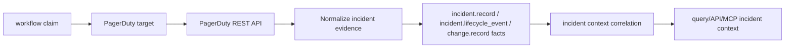

# PagerDuty Collector Contracts

## Purpose

`internal/collector/pagerduty` owns PagerDuty incident-context collection for
the `pagerduty` collector family. It turns PagerDuty incidents, incident log
entries, and related change events into reported-confidence source facts that
incident-context reducers and read models can correlate later with runtime,
image, commit, pull-request, and work-item evidence.

This package intentionally does not write graph truth, create Jira work items,
or infer deployment impact. PagerDuty is the alerting source: it can say what
incident fired, which service was attached, how the incident moved through its
lifecycle, and which provider change events PagerDuty already relates to the
incident. Other collectors own Jira, GitHub, registry, CI/CD, and runtime
evidence.

## Fixture-to-fact flow

## Exported Surface

- `ProviderPagerDuty` - durable provider name: `pagerduty`.
- `EnvelopeContext` - scope, generation, collector instance, fencing token,
  observed time, and source URI copied into emitted envelopes.
- `NewIncidentRecordEnvelope` - converts one PagerDuty incident into an
  `incident.record` fact.
- `NewLifecycleEventEnvelope` - converts one PagerDuty incident log entry into
  an `incident.lifecycle_event` fact.
- `NewChangeRecordEnvelope` - converts one PagerDuty related change event into
  a `change.record` fact.
- `HTTPClient` - bounded PagerDuty REST client for incidents, log entries, and
  related change events.
- `ClaimedSource` - workflow-claim adapter used by `collector-pagerduty`.

## Invariants

- Provider-native incident, log-entry, and change-event IDs are preserved in
  payload and fact identity.
- Facts use `source_confidence=reported` because the provider API reports the
  source state.
- Stable fact keys are scoped by provider, `scope_id`, and provider record ID
  so duplicate delivery converges under retries.
- Source URLs are sanitized before emission. Token-like query parameters are
  stripped from `SourceRef.SourceURI`.
- The HTTP client requires a token and a configured target before sending a
  request. Runtime configuration stores only `token_env`; the token value is
  resolved by the command process.
- PagerDuty facts never emit Jira work-item facts, GitHub pull-request facts,
  deployment truth, image truth, or code truth.
- Collection is bounded by a time window, incident limit, log-entry limit,
  related-change limit, and optional service allowlist.

## Telemetry

The claim source records:

- `pagerduty.observe`
- `pagerduty.fetch`
- `eshu_dp_pagerduty_provider_requests_total`
- `eshu_dp_pagerduty_facts_emitted_total`
- `eshu_dp_pagerduty_rate_limited_total`
- `eshu_dp_pagerduty_fetch_duration_seconds`
- `eshu_dp_pagerduty_generation_lag_seconds`

Metric labels use bounded provider, status-class, and fact-kind values only.
Incident IDs, titles, service names, escalation-policy names, URLs, token
environment names, and token values stay out of labels.

Collector Performance Evidence: request work is bounded by
`IncidentLookback`, `IncidentLimit`, `LogEntryLimit`, `ChangeEventLimit`, and
`AllowedServiceIDs`. The focused
`go test ./internal/collector/pagerduty -count=1` proof covers envelope
identity, redaction, claimed-source idempotency, provider failure classes, HTTP
request shape, and service allowlist query parameters.

Collector Observability Evidence: the hosted runtime exposes the shared
`/healthz`, `/readyz`, `/metrics`, and `/admin/status` surface through
`collector.ClaimedService`.

Collector Deployment Evidence: this package is wired by the
`collector-pagerduty` binary. Public Helm chart rendering is not part of this
slice, so operators should run it as a local or custom hosted claim-driven
runtime until the chart path lands.
