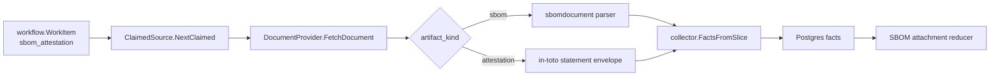

# SBOM Runtime

`internal/collector/sbomruntime` is the claim-driven hosted runtime for SBOM
and attestation sources. It maps one workflow work item to one configured
document target, fetches the document, redacts source locators, and emits
typed `sbom.*` or `attestation.*` fact envelopes.

## Boundary

- OCI registry collection discovers `oci_registry.image_referrer` descriptors.
- This runtime fetches configured document URLs or the blob behind an OCI
  referrer artifact manifest.
- `sbomdocument` parses CycloneDX and SPDX JSON SBOM bodies.
- This runtime parses in-toto statement metadata and emits
  `attestation.statement` plus optional separate
  `attestation.signature_verification` facts.
- Reducers attach SBOM/attestation facts to image truth and decide verification
  status.
- Bounded SBOM **generation** does not live here. The scanner-worker analyzer
  in `internal/collector/scannerworker/sbomgenerator` is the lane for building
  new CycloneDX-compatible source facts from a repository, image, or artifact
  target when the scanner-worker source can provide a subject digest. This
  runtime stays focused on fetching and parsing already-published documents.

Parser-emitted SBOM document facts keep `verification_status` blank. A hosted
target may carry a verification result only as a separate signature verification
fact for attestation statements. Unsigned SBOMs remain parse-only evidence until
the reducer sees independent verification evidence.

## Claim Flow

## Operational Notes

- `source_type=configured_source` requires an HTTP(S) `document_url`.
- `source_type=oci_referrer` requires provider, registry, repository,
  subject digest, and referrer digest.
- Source URIs stored in facts remove user info, query strings, and fragments.
- Document identity is stable across observations when the same source record
  and document digest are observed again.
- The runtime does not emit `oci_registry.*` facts; those remain owned by the
  OCI registry collector.
