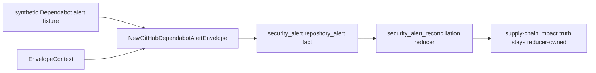

# Security Alert Collector Contracts

## Purpose

`internal/collector/securityalerts` owns repository-scoped provider security
alert normalization for the `security_alert` collector family. It turns
provider alert payloads into reported-confidence source facts that reducers can
compare against Eshu-owned package consumption and vulnerability impact
evidence.

This package intentionally does not implement workflow claims, database
commits, graph writes, hosted polling, or canonical impact admission.

## Fixture-to-fact flow

Provider alert state remains source evidence. Reducers decide whether owned
package-consumption evidence and owned vulnerability impact evidence corroborate
the provider alert.

## Exported Surface

- `CollectorKind` — durable collector family name: `security_alert`.
- `EnvelopeContext` — scope, generation, collector instance, fencing token,
  observed time, and source URI copied into emitted envelopes.
- `NewGitHubDependabotAlertEnvelope` — converts one Dependabot alert payload
  into a `security_alert.repository_alert` fact.
- `GitHubDependabotClient` — bounded GitHub Dependabot alert HTTP client shape
  for explicitly allowlisted repositories.

## Invariants

- Provider-native alert ID and number are preserved in payload and fact
  identity.
- Facts use `source_confidence=reported` because the provider alert is source
  evidence.
- Dependency ecosystem/name, manifest path, scope, relationship, GHSA/CVE IDs,
  vulnerable range, patched version, severity, CVSS, EPSS, CWE, timestamps, and
  source URL remain provider-reported fields.
- Token-bearing query parameters are stripped before source URLs or source refs
  are emitted.
- The GitHub client requires a token and explicit repository allowlist before
  it sends an HTTP request.
- Provider alerts are never emitted as `reducer_supply_chain_impact_finding`
  facts. Reducers reconcile provider state with Eshu-owned evidence.

## Telemetry

This package emits no metrics, spans, or logs. The current slice is a
deterministic normalizer plus a request-shape client; hosted runtime telemetry
belongs in a later collector runtime that owns credentials, rate limits,
claiming, fact commits, health/readiness, and status.

Collector Performance Evidence: the current slice performs deterministic
single-alert normalization and one bounded Dependabot request page capped by
`RepositoryAlertLimit`; there is no claim loop, queue drain, graph write, or
batch worker in this package. The focused `go test ./internal/collector/securityalerts -run TestGitHubDependabot -count=1`
proof covers the bounded fixture and request-guard paths.

Collector Observability Evidence: live collection is not enabled here. The
future hosted runtime must add provider request duration/status, rate-limit,
facts-emitted, partial-generation, redaction, health/readiness, and admin-status
signals before polling is allowed.

Collector Deployment Evidence: no service, Helm value, ServiceMonitor, workflow
claim, or deployed collector image is introduced by this package. Deployment
work remains gated on a later hosted collector slice with credential and
allowlist configuration.

No-Regression Evidence: `go test ./internal/collector/securityalerts -run TestGitHubDependabot -count=1`
proves Dependabot fixtures preserve provider alert fields, sanitize token-bearing
URLs, and refuse missing-token or non-allowlisted repository requests before
HTTP.

No-Observability-Change: this package does not mount a hosted runtime or start a
worker. Later live collection must add provider request counts, rate-limit
signals, redaction proof, fact-emission counts, partial-generation warnings, and
status before polling is enabled.
