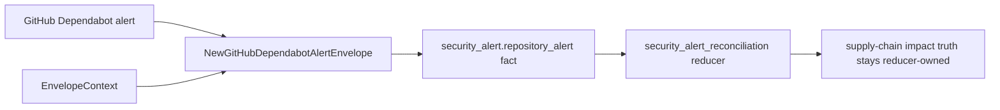

# Security Alert Collector Contracts

## Purpose

`internal/collector/securityalerts` owns repository-scoped provider security
alert normalization for the `security_alert` collector family. It turns
provider alert payloads into reported-confidence source facts that reducers can
compare against Eshu-owned package consumption and vulnerability impact
evidence.

This package intentionally does not implement database commits, graph writes,
or canonical impact admission. The claim-driven hosted runtime lives in
`go/internal/collector/securityalerts/alertruntime` and uses this package only
to request provider alerts and build source facts.

## Fixture-to-fact flow

Provider alert state remains source evidence. Reducers decide whether owned
package-consumption evidence and owned vulnerability impact evidence corroborate
the provider alert.

## Exported Surface

- `CollectorKind` — durable collector family name: `security_alert`.
- `EnvelopeContext` — scope, generation, collector instance, fencing token,
  observed time, and source URI copied into emitted envelopes.
- `NewGitHubDependabotAlertEnvelope` — converts one Dependabot alert payload
  into a `security_alert.repository_alert` fact.
- `GitHubDependabotClient` — bounded GitHub Dependabot alert HTTP client.
  `ListRepositoryAlertsPages` reads one allowlisted repository
  (`/repos/{owner}/{repo}/dependabot/alerts`); `ListOrganizationAlertsPages`
  reads one organization (`/orgs/{org}/dependabot/alerts`) with each returned
  alert carrying its source repository for per-repository fan-out.
- `GitHubDependabotRepository` — the per-alert repository object populated only
  by the organization endpoint, used to derive per-repository fact scopes.

## Invariants

- Provider-native alert ID and number are preserved in payload and fact
  identity.
- Facts use `source_confidence=reported` because the provider alert is source
  evidence.
- Dependency ecosystem/name, manifest path, scope, relationship, GHSA/CVE IDs,
  vulnerable range, patched version, severity, CVSS, EPSS, CWE, timestamps, and
  source URL remain provider-reported fields.
- Token-bearing query parameters are stripped before source URLs or source refs
  are emitted.
- The GitHub client requires a token and explicit repository allowlist before
  it sends an HTTP request.
- The GitHub client reuses the shared collector SDK for bounded default HTTP
  clients, base URL validation, safe `HTTPError` wrapping, shared failure class
  constants, and `Retry-After` parsing. GitHub-specific cursor traversal and
  rate-limit metadata stay local.
- The GitHub Dependabot repository-alert and organization-alert clients follow
  provider `rel=next` cursor links and never send a legacy `page` query
  parameter; cross-host next links are ignored so bearer tokens are not
  forwarded outside the configured provider host. Both endpoints share one
  bounded pagination loop, so truncation, per-page clamping, and rate-limit
  handling stay identical.
- Organization alerts (`/orgs/{org}/dependabot/alerts`) preserve each alert's
  source `repository`. The hosted runtime derives a per-repository scope from
  it so org fan-out facts carry the same `repository_id` shape as the
  per-repository path and reducer reconciliation is unchanged.
- The GitHub Dependabot repository-alert client requests the provider's
  `state=open` view so newer fixed alerts in default provider ordering cannot
  hide older open alerts inside the bounded `max_pages` contract.
- Provider alerts are never emitted as `reducer_supply_chain_impact_finding`
  facts. Reducers reconcile provider state with Eshu-owned evidence.

## Telemetry

This package emits no metrics, spans, or logs by itself. Runtime telemetry is
owned by `alertruntime` and the `collector-security-alerts` binary: provider
request totals, provider fetch duration, provider rate-limit counts,
repository-alert fact counts, `security_alert.observe`, and
`security_alert.fetch`.

Collector Performance Evidence: request work is bounded by explicit repository
allowlists, `RepositoryAlertLimit`, the provider `state=open` filter, and
runtime `max_pages`. The focused
`go test ./internal/collector/securityalerts -run TestGitHubDependabot -count=1`
proof covers open-alert filtering when fixed alerts precede older open alerts,
cursor pagination, request guards, cross-host next-link rejection, rate-limit
metadata, safe SDK HTTP error wrapping, HTTP-date `Retry-After` parsing, and
redaction.

No-Observability-Change: SDK adoption changes only request construction,
provider failure wrapping, and retry-header parsing. Runtime metrics and spans
remain owned by `alertruntime`, with labels bounded to provider, status class,
and fact kind.

Collector Observability Evidence: the hosted runtime exposes the shared
`/healthz`, `/readyz`, `/metrics`, and `/admin/status` surface through
`collector.ClaimedService`.

Collector Deployment Evidence: the `collector-security-alerts` binary,
remote-E2E Compose service, pprof overlay, Helm Deployment, metrics Service,
ServiceMonitor, NetworkPolicy, and PDB are rendered from the hosted runtime
configuration. Credentials are resolved from pod environment variables named
by `token_env`; token values are not stored in collector-instance JSON, facts,
metric labels, or status errors.
