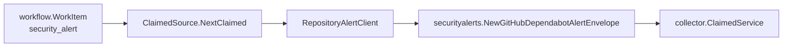

# securityalerts/alertruntime

This package runs hosted provider security-alert collection behind workflow
claims. The runtime accepts explicit targets, validates each repository against
its allowlist, resolves credentials before construction, and calls the provider
client only for the claimed `scope_id`.

The first provider is GitHub Dependabot repository alerts. `ClaimedSource`
returns only `security_alert.repository_alert` facts from
`go/internal/collector/securityalerts`; reducer-owned impact/readiness truth
stays outside this package.

Operationally useful signals are emitted on the caller-provided telemetry
handle: provider request totals, emitted fact totals, rate-limit totals, fetch
duration histograms, and security-alert observe/fetch spans. Labels are bounded
to provider, status class, and fact kind.

Security Review Evidence: target configuration must name a credential
environment variable and an explicit repository allowlist before the runtime can
construct a provider client. Provider errors are mapped to bounded failure
classes, token-bearing source URLs are redacted by the envelope builder, metric
labels avoid repositories and package names, and provider alerts are emitted
only as `security_alert.repository_alert` source facts.

Observability Evidence: `TestClaimedSourceEmitsRepositoryAlertFactsOnly` proves
the runtime emits repository-alert source facts with redacted source URLs, while
`TestClaimedSourceReturnsBoundedFailureWithoutRepositoryOrToken` proves provider
failures do not expose tokens or repository names.
