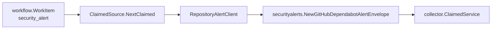

# securityalerts/alertruntime

This package runs hosted provider security-alert collection behind workflow
claims. The runtime accepts explicit targets, resolves credentials before
construction, and calls the provider client only for the claimed `scope_id`.
Each target is `repository`-scoped (validated against its `allowed_repositories`
allowlist) or `org`-scoped (validated to carry an `organization` and no
repository allowlist).

The first provider is GitHub Dependabot alerts. Repository targets poll one
repository; org targets poll `GET /orgs/{org}/dependabot/alerts` and fan the
response out into per-repository facts whose `scope_id` is derived from each
alert's source repository (`security-alert:github:<owner>/<repo>`), so a single
org target produces the same per-repository fact shape as N repository targets.
`ClaimedSource` returns only `security_alert.repository_alert` facts from
`go/internal/collector/securityalerts`; reducer-owned impact/readiness truth
stays outside this package.
`ClaimedSource.PreflightProviderAccess` uses the same target map and provider
client to prove configured provider access before workflow claims are processed.
It makes one bounded provider request per target and never emits facts.

Operationally useful signals are emitted on the caller-provided telemetry
handle: provider request totals, emitted fact totals, rate-limit totals, fetch
duration histograms, and security-alert observe/fetch spans. Labels are bounded
to provider, status class, and fact kind.
The runtime uses shared collector SDK failure classes for status labels but
keeps Dependabot-specific rate-limit metadata on its local `ProviderFailure`
wrapper.

Security Review Evidence: target configuration must name a credential
environment variable and an explicit repository allowlist before the runtime can
construct a provider client. Provider errors are mapped to bounded failure
classes, token-bearing source URLs are redacted by the envelope builder, metric
labels avoid repositories and package names, and provider alerts are emitted
only as `security_alert.repository_alert` source facts.

Observability Evidence: `TestClaimedSourceEmitsRepositoryAlertFactsOnly` proves
the runtime emits repository-alert source facts with redacted source URLs, while
`TestClaimedSourceReturnsBoundedFailureWithoutRepositoryOrToken` proves provider
failures do not expose tokens or repository names.
`TestClaimedSourceMarksProviderCoverageIncompleteWhenOpenAlertPagesAreTruncated`
proves a capped open-alert provider read marks emitted facts with
`source_freshness=partial`, `collection_coverage_state=incomplete`, the open
state filter, bounded pages fetched, and the incomplete reason instead of
looking complete.
`TestClaimedSourcePreflightProviderAccessIsBoundedAndRedacted` proves the
preflight path requests exactly one provider page and returns the bounded
`auth_denied` class without leaking token or repository values.
`TestNewClaimedSourceRejectsCredentialBearingAPIBaseURL` proves SDK base URL
validation rejects credential-bearing provider endpoints at construction time
without echoing the credential. `TestClaimedSourceClassifiesSDKHTTPError`
proves shared SDK HTTP failures still map to the runtime's bounded status
classes and terminal decision.

No-Regression Evidence: security-alert refreshes include a stable freshness
digest over the bounded Dependabot alert snapshot, provider pagination status,
and truncation state. `TestClaimedSourceSetsStableFreshnessHintForUnchangedAlerts`
proves unchanged provider snapshots keep the same digest across different
workflow generation IDs, allowing Postgres to skip no-op refreshes instead of
moving `active_generation_id` while reducer reconciliation drains.
`TestSecurityAlertFreshnessHintIgnoresProviderAlertOrder` proves the digest is
order-insensitive for provider result ordering, and
`TestSecurityAlertFreshnessHintChangesWhenProviderTruthChanges` proves provider
state changes still create a new freshness boundary.

Observability Evidence: this change reuses the existing collector commit
telemetry for skipped refreshes (`refresh_skipped=true` logs and
`RecordSkippedRefresh`) and the security-alert API/MCP `source_freshness` and
coverage summaries for partial provider reads. It does not add new metric
labels. The digest value is not emitted as a label, so alert, repository,
package, and URL values remain out of metrics.
Preflight provider requests reuse the existing `security_alert.observe` and
`security_alert.fetch` spans plus provider request and fetch-duration metrics
with provider and status-class labels only.
SDK adoption does not add metric labels or status payload fields.
