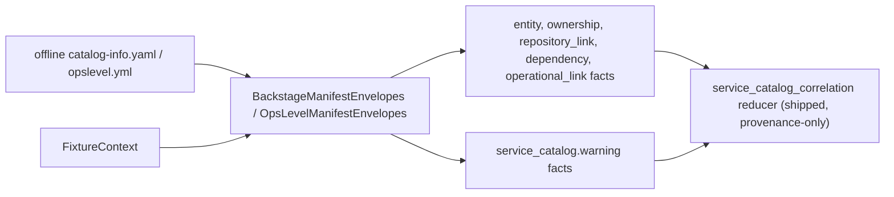

# Service Catalog Manifest Collector

## Purpose

`internal/collector/servicecatalog` owns fixture-backed service-catalog manifest
normalization for the `service_catalog` collector family. It turns repo-hosted
catalog descriptors (Backstage `catalog-info.yaml`, OpsLevel `opslevel.yml`, and
later Cortex) into observed-confidence `service_catalog.*` fact envelopes that
the already shipped `service_catalog_correlation` reducer domain consumes.

This package is the **producer** side. The consumer half — projector intent
(`buildServiceCatalogCorrelationReducerIntent`), reducer handler/writer
(`ServiceCatalogCorrelationHandler`), query store
(`ListServiceCatalogCorrelations`), the `list_service_catalog_correlations` MCP
tool, and the `ServiceCatalogCorrelations` telemetry counter — already ships and
is **provenance only with zero graph writes**. This package adds no fact kinds,
no schema change, and no graph writes.

It intentionally does not implement hosted catalog API polling, credentials,
filesystem discovery, graph writes, or canonical service/workload promotion.

## Fixture-to-fact flow

Both provider entry points normalize into the same provider-agnostic
`catalogEntity` shape and reuse the shared envelope builders in
`facts_builder.go`, so payload-key fidelity is identical across providers.

## Exported surface

- `CollectorKind` — durable collector family name: `service_catalog`.
- `ProviderBackstage` — provider value used for Backstage facts.
- `ProviderOpsLevel` — provider value used for OpsLevel facts.
- `ProviderOpsLevelNamespace` — entity-ref namespace segment for OpsLevel
  components (`opslevel`), keeping OpsLevel refs distinct from other providers'
  refs in the shared reducer entity key.
- `FixtureContext` — scope, generation, collector instance, fencing token,
  observed time, and repo-relative source URI copied into emitted envelopes.
- `BackstageManifestEnvelopes` — parses one offline Backstage manifest (possibly
  multi-document) and returns service-catalog fact envelopes.
- `OpsLevelManifestEnvelopes` — parses one offline OpsLevel `opslevel.yml`
  manifest (possibly multi-document) and returns service-catalog fact envelopes.

### OpsLevel repository resolution

OpsLevel references a repository by `provider` + a `name` slug
(`Org/Group/repo`), never a full URL. The producer expands a known public git
provider (`github`, `gitlab`, `bitbucket`, `azure_devops`) plus the slug into a
derivable `repository_url` (for example `github` + `eshu-hq/checkout-api` ->
`https://github.com/eshu-hq/checkout-api`). An unknown or self-hosted provider,
or a slug that is not a path, stays a name-only `repository_name` locator, which
the reducer rejects because a bare name cannot prove repository ownership. The
producer never fabricates a `repository_id`. The OpsLevel block is always a
component; its free-form `type` (service, database, ...) flows into
`entity_type`, while the entity ref is anchored on the first declared alias (or
the slugified name) under the `opslevel` namespace.

## Payload-key fidelity (the contract)

The shipped reducer index (`reducer/service_catalog_correlation_index.go`) reads
specific payload keys. Emitting a different key silently collapses correlation
to `unresolved`/`rejected`. The producer honors these keys:

- `service_catalog.entity`: `provider`, `entity_ref`, `entity_type`,
  `display_name`, `lifecycle`, `tier`. `service_id` and `workload_id` are
  **deliberately absent**.
- `service_catalog.ownership`: `provider`, `entity_ref`, `owner_ref`.
- `service_catalog.repository_link`: `provider`, `entity_ref`, and the declared
  locator — `repository_url` (verbatim declared URL) or `repository_name`
  (name-only slug). `repository_id` is **never fabricated**.
- `service_catalog.warning`: `provider`, `reason`, `message` (redacted), and
  `entity_ref` when known.

The declared repository URL is emitted verbatim into `repository_url`; the
reducer applies its own git-URL canonicalization, which preserves the
exact-vs-derived distinction (for example a `.git` suffix yields `derived`, an
identical URL yields `exact`). The producer does not pre-canonicalize into
`normalized_url`, because the reducer re-canonicalizes the value it reads and a
bare host/path key would fail re-canonicalization.

`dependency` facts are emitted for read-surface completeness and forward
compatibility; the reducer index does not consume them yet, so they must not
change an entity's correlation outcome.

## Invariants

- Fixture-backed until a hosted runtime slice is explicitly opened.
- No HTTP clients, credentials, filesystem discovery, graph writes, reducer
  imports, or query imports in production code (the reducer is imported in test
  code only, for the round-trip contract test).
- Every emitted fact carries `schema_version = 1.0.0`
  (`facts.ServiceCatalogSchemaVersionV1`). For a known service-catalog fact kind,
  a blank or mismatched `schema_version` is a hard error at the projector
  (`validateServiceCatalogSchemaVersion` aborts the projection); it is never a
  benign skip, so producers must always stamp the supported version.
- `source_confidence = observed` because manifests are read directly from a repo
  artifact.
- Catalog names and owners never mint `repository_id`, `service_id`, or
  `workload_id`. Correlation is the reducer's job.
- Token-bearing or query-string URLs are stripped before emission; redacted
  operational links emit a warning instead of dropping the entity.
- Degraded documents (unsupported version, missing name, duplicate entity) emit
  warnings, never silent drops. Multi-document manifests are parsed per
  document so one bad document does not abort the file.

## Telemetry

This slice emits no metrics or spans; it is a deterministic offline normalizer.
Producer counters (`service_catalog_facts_emitted_total`,
`service_catalog_manifest_warnings_total`,
`service_catalog_manifests_parsed_total`) and a `servicecatalog.collect` span
are deferred to the telemetry + Compose-proof slice (design memo PR-4). The
shipped downstream `ServiceCatalogCorrelations{outcome}` reducer counter remains
the diagnosis chain for "facts emitted but zero exact correlations."

No-Regression Evidence: fixture normalization for both providers is covered by
`go test ./internal/collector/servicecatalog -count=1`, which exercises typed
contract emission, the reducer round-trip reaching exact/derived/unresolved/
rejected/stale/ambiguous outcomes, blank `service_id`/`workload_id`/
`repository_id` assertions, warning emission for unsupported version, missing
ref, duplicate entity, and redacted link, empty input, and idempotent
re-emission — without graph writes or queue work. The OpsLevel slice adds the
same matrix over `opslevel.yml` fixtures, including the provider-host repository
URL derivation (known provider -> derivable URL; unknown/self-hosted provider ->
name-only locator that the reducer rejects).

Collector Performance Evidence: this slice introduces no runtime, no claim, no
worker, no queue, and no graph write. Both `BackstageManifestEnvelopes` and
`OpsLevelManifestEnvelopes` are pure library functions that parse one offline
manifest in a single linear pass: cost is linear in the number of manifest
documents and emitted facts, with no hot-path Cypher and no new query. There is
no new hot path, so the performance contract is satisfied with this
no-regression note rather than a benchmark, proven by
`go test ./internal/collector/servicecatalog -count=1`.

Collector Observability Evidence: not applicable for this slice — it mounts no
runtime and exposes no `/healthz`, `/readyz`, `/metrics`, or `/admin/status`
surface. The shipped downstream `ServiceCatalogCorrelations{outcome}` reducer
counter remains the operator diagnosis chain. Producer counters and a
`servicecatalog.collect` span are deferred to the telemetry + Compose-proof
slice (design memo PR-4), which must land before live collection is enabled. See
the `No-Observability-Change:` marker below.

Collector Deployment Evidence: no deployment artifact, binary, Compose service,
Helm Deployment, metrics Service, or ServiceMonitor is added or changed by this
slice. The package is a fixture-backed library with no live collection path, so
there is intentionally nothing to deploy or scrape yet. Wiring a hosted
claim-based runtime (with health/readiness, metrics, ServiceMonitor, and Helm)
is deferred to a future runtime slice, exactly as `cicdrun` remains
fixture-only.

No-Observability-Change: this package mounts no runtime and adds no metrics,
spans, or logs. The later telemetry slice must add fact-emission, warning, and
parse-result signals before live collection is enabled.
