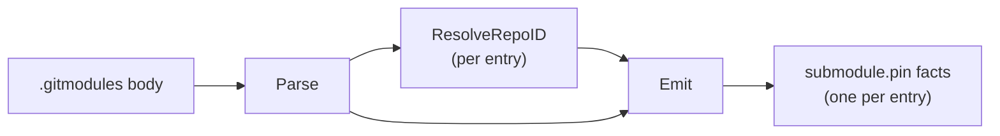

# Submodule Collector

## Purpose

`internal/collector/submodule` parses a repository's `.gitmodules` file into
durable `submodule.pin` fact envelopes (issue #5420 Phase 2a, epic #5415). It
is the Phase 2a producer half of the submodule-graph domain: Phase 1 already
shipped the fact contract (`facts.SubmodulePinFactKind`,
`facts.SubmoduleSchemaVersionV1`, and the typed
`sdk/go/factschema/submodule/v1.Pin` payload); this package turns a parent
repository's `.gitmodules` file into that contract's envelopes.

This phase is deliberately narrow:

- It does **not** resolve the pinned gitlink commit SHA itself. `Emit`
  accepts an optional `FixtureContext.PinnedSHAResolver` callback and fills
  `Pin.PinnedSHA` per entry when the caller sets one, but the resolver's
  actual git-tree read (`gitSubmoduleGitlinkSHA`, a local
  `git ls-tree HEAD -- <path>` read) lives in the Git collector
  (`go/internal/collector/git_submodule_pinned_sha.go`, issue #5420 Phase 2b),
  not in this package. `Pin.PinnedSHA` stays `nil` when no resolver is set.
- It does **not** resolve a *relative* submodule URL (`../sibling.git`,
  `./nested`) against the parent repository's own remote. Those stay
  unresolved (`Pin.ResolvedRepoID` nil) until a later phase.
- The reducer, projector, and read surface that consume `submodule.pin`
  facts are out of scope here.

This package is a pure **normalizer**: it does not select which files reach
it, does not know repository scope/generation identifiers beyond what the
caller passes in, and does not call the reducer or query packages. The Git
collector (`go/internal/collector`) owns file discovery and the content-stream
wiring; it calls `IsGitmodulesPath` while discovering repository files,
accumulates the candidate `.gitmodules` body while streaming content facts,
and calls `Emit` once per repository generation.

## `.gitmodules` grammar (git-config syntax, subset)

Reference: [git-config syntax](https://git-scm.com/docs/git-config#_syntax).

`.gitmodules` is a git-config file. Each submodule is declared in its own
extended section, `[submodule "<name>"]`, followed by indented `key = value`
lines (at minimum `path` and `url`):

```ini
[submodule "libfoo"]
	path = lib/foo
	url = https://github.com/example/libfoo.git
[submodule "libbar"]
	path = lib/bar
	url = ../libbar.git
```

- Blank lines (including whitespace-only lines) are ignored.
- A line whose first non-whitespace character is `#` or `;` is a whole-line
  comment. Inline trailing comments (a bare `#`/`;` after a value on the same
  line) are out of scope.
- A line opening with `[` starts a new section, ending whatever section
  preceded it. Only `[submodule "<name>"]` — section name `submodule`
  (case-insensitive) plus a double-quoted subsection — is treated as a
  submodule section; a bare `[submodule]` (no subsection, a different
  git-config key namespace) or any other section is skipped.
- Inside a submodule section, `path` and `url` (case-insensitive keys) are
  read; other keys (`branch`, `ignore`, ...) are ignored. A key repeated in
  the same section is last-value-wins. A double-quoted value has its quotes
  stripped and `\"`/`\\` unescaped; git-config's fuller escape grammar is out
  of scope.
- A section is emitted as one `Entry` only when **both** `path` and `url`
  were set; a section missing either yields no entry.

## Fixture-to-fact flow



## Exported surface

- `CollectorKind` — durable collector family name: `submodule`.
- `Entry` — one parsed submodule declaration (`Path`, `URL`).
- `Parse` — parses one `.gitmodules` file body into ordered entries.
- `IsGitmodulesPath` — reports whether a repo-relative path is exactly
  `.gitmodules`.
- `ResolveRepoID` — resolves one submodule URL to a canonical `repo_id`, or
  `""` when the URL is relative, ambiguous, or otherwise unresolvable.
- `FixtureContext` — scope, generation, collector instance, fencing token,
  observed time, and the source URI copied into emitted envelopes, plus the
  optional `PinnedSHAResolver(path string) *string` callback the Git
  collector wires to `gitSubmoduleGitlinkSHA` (issue #5420 Phase 2b).
- `Emit` — parses the `.gitmodules` body and returns one `submodule.pin`
  envelope per entry, calling `ctx.PinnedSHAResolver` per entry when set.

## Payload contract

Every envelope's payload is built from the typed
`sdk/go/factschema/submodule/v1.Pin` struct via
`factschema.EncodeSubmodulePin`, never a hand-built map (Contract System v1
§3.1; see `eshu-contract-rigor`). The stable key is derived from
`(parent_repo_id, submodule_path)` — the join identity
`sdk/go/factschema/submodule/v1.Pin`'s doc comment defines — so re-pointing an
existing submodule's URL in a later generation reuses the same key and the
fact store upserts instead of duplicating.

## Resolution discipline

`ResolveRepoID` mirrors the "never guess, empty means no durable link"
discipline `go/internal/collector/jira/linked_repository.go`'s
`linkedRepositoryID` applies to PR/MR links. It resolves a submodule URL only
when `repositoryidentity.NormalizeRemoteURL` can canonicalize it into an
`https://host/path` identity (an absolute `https://`, `ssh://`, `git://`, or
SCP `git@host:path` remote). Any other shape — most notably git's own
relative submodule URL forms, which are meant to be resolved against the
parent repository's own remote (out of scope here) — resolves to `""`. This
matters because `repositoryidentity.CanonicalRepositoryID` does not itself
reject an uncanonicalizable URL: it falls back to hashing the raw string,
which would silently mint an id from text that was never a durable identity.
`ResolveRepoID` gates on the canonicalization succeeding before ever calling
`CanonicalRepositoryID`, so that guess never happens.

## No-Regression Evidence

`go test ./internal/collector/submodule -count=1` covers: parser behavior
(single/multiple submodules, missing `path`/`url`, comments, blank lines,
quoted values, repeated keys, non-submodule and bare-subsectionless sections,
CRLF line endings), `IsGitmodulesPath` exact-match behavior, `ResolveRepoID`
(absolute URL shapes resolve, relative/local/ambiguous shapes do not, and
different equivalent spellings of the same remote resolve identically), and
envelope emission (schema version, collector kind, source ref, stable-key
differentiation across repo/submodule path, optional
`collector_instance_id`, `pinned_sha` always absent).

Collector Performance Evidence: this package introduces no runtime, worker,
or queue. `Parse`, `ResolveRepoID`, and `Emit` are pure library functions
that run in a single linear pass over one small file's lines; cost is linear
in file size with no hot-path Cypher and no new query.

Collector Observability Evidence: not applicable — this package mounts no
runtime and exposes no health/readiness/metrics surface. Facts flow through
the Git collector's existing observe/stream/fact-emission telemetry.

No-Observability-Change: this package adds no metrics, spans, or logs of its
own.
