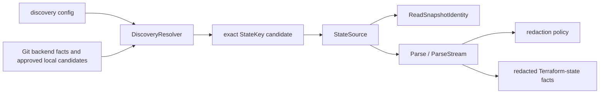

# internal/collector/terraformstate

`internal/collector/terraformstate` owns Terraform-state discovery primitives,
read-only state sources, streaming parsing, redaction, and fact-envelope output.
It keeps raw state bytes inside the source-reader and parser window.

This package does not schedule workflow claims, choose cloud credentials, commit
facts, write graph rows, or call cloud SDKs directly.

## Runtime Flow



`tfstateruntime` adapts these pieces to workflow claims. The command runtime
supplies the S3 SDK adapter and credential routing.

## Core Responsibilities

- Parse discovery config for explicit seeds, backend filters, repo scopes, and
  approved local candidates.
- Resolve only exact Terraform-state candidates.
- Open local or S3 state through read-only source interfaces.
- Stream top-level snapshot identity without retaining the whole state body.
- Parse Terraform state into redacted resource, output, module, provider,
  tag-observation, and warning facts.
- Preserve bounded parser stats so the runtime can record metrics without
  rescanning emitted envelopes.
- Keep locator, path, bucket, and secret values out of facts, logs, and metric
  labels unless they are intentionally hashed or redacted.

## Discovery Inputs

| Input | Behavior |
| --- | --- |
| Explicit seeds | Exact local or S3 state candidates supplied by config. |
| Git Terraform backend facts | Active Git generations with literal backend fields. |
| Terragrunt `remote_state` facts | Resolved to the underlying backend kind, such as `s3` or `local`. |
| Backend filters | Bounded active-generation search for exact backend declarations. |
| Approved repo-local candidates | Metadata-only `.tfstate` candidates from Git snapshots, opened only when policy approves the exact repo-relative path. |

Dynamic backend expressions, prefix-only S3 keys, non-S3 cloud backends, and
unapproved local paths are not discovery candidates.

## Source And Identity Contracts

`StateSource` opens one exact state stream. `LocalStateSource` requires an
operator-approved absolute path. `S3StateSource` requires an exact bucket/key
and uses an injected read-only object client.

Two hashes intentionally serve different identities:

| Function | Includes | Use |
| --- | --- | --- |
| `LocatorHash(StateKey)` | backend kind, locator, and version ID | Per-candidate and per-version identity. |
| `ScopeLocatorHash(BackendKind, Locator)` | backend kind and locator | Version-agnostic join key shared with `scope.NewTerraformStateSnapshotScope`. |

Keep these functions distinct. Drift correlation depends on the version-agnostic
scope hash, while workflow planning may need version-specific identity.

## Redaction And Composite Capture

Redaction key material is mandatory before parsing. Unknown provider-schema
scalars are redacted; unknown composites are dropped and recorded through
`CompositeCaptureRecorder`.

Schema-known composites use the same streaming JSON decoder as the rest of the
parser. Each scalar leaf still passes through `RedactionRules.Classify`.
Composite drops use bounded reason labels, while high-cardinality details stay
in structured logs.

`tags` and `tags_all` become `terraform_state_tag_observation` facts for
correlation indexing. Scalar tag keys and values still follow the same schema
and redaction rules as other attributes.

## Safety Rules

- Raw state bytes are only allowed in the source reader and parser window.
- Full S3 URLs and local paths are not emitted in facts; parser facts use a
  locator hash in payload and source references.
- Repo-local state discovered by Git is discover-only by default. The
  Terraform-state collector opens it only when `local_state_candidates.mode` is
  `approved_candidates` and the config names an exact repo-relative path. An
  approval may include `target_scope_id`, but a local read does not require one.
- Exact local seeds still require operator-approved absolute paths.
- S3 reads are exact object reads. Prefix-only keys are rejected.
- S3 `NoSuchKey` responses are treated as a missing exact object, not a
  transient source-read failure. Runtime adapters may turn that into a
  `terraform_state_warning` so stale graph-discovered backend declarations do
  not retry forever while still leaving operator-visible evidence.
- Repo-scoped graph discovery waits for Git generation readiness before reading
  Terraform backend facts. Backend-filter discovery reads only active
  generations and must include at least one explicit filter.
- Dynamic backend expressions, workspace-prefixed S3 backends, non-S3 backends,
  and unapproved local paths from Git facts are not discovery candidates.
- S3 write capability is rejected at source construction.
- Redaction key material is mandatory before parsing.
- Unknown provider-schema scalar attributes are redacted. Unknown composite
  attributes are dropped and observed via
  `eshu_dp_drift_schema_unknown_composite_total{reason="schema_unknown"}` so
  operators can detect provider-schema drift.
- Schema-known composite attributes are captured through a streaming nested
  walker (`readCompositeValue` in `composite_walker.go`). The walker reuses
  the existing `json.Decoder`, applies per-leaf classification via
  `RedactionRules.Classify`, and emits the nested-singleton-array shape the
  drift loader's flattener expects. The 48 MB peak-heap ceiling enforced by
  `TestParseStream_PeakMemoryGate_CompositeCapture` holds for a 20k-instance
  fixture where every instance carries a populated SSE composite.
- Schema-known composites whose top-level source path is classified as
  sensitive are skipped before the walker starts. Walker failures are observed
  with `reason="shape_mismatch"` so operators can distinguish bad state shape
  from missing provider-schema coverage.
- `tags` and `tags_all` are emitted as `terraform_state_tag_observation`
  facts for correlation indexing, but scalar tag keys and values still follow
  the unknown provider-schema rule and are redacted by default. Non-scalar tag
  values are dropped and represented by warning facts.
- DynamoDB lock metadata is read-only and observational. The reader records the
  digest and a lock ID hash, but consistency decisions still come from the
  opened state body and durable generation metadata.

## Verification

```bash
go test ./internal/collector/terraformstate -count=1
go test ./internal/collector/tfstateruntime -count=1
go test ./cmd/collector-terraform-state -count=1
go run ./cmd/eshu docs verify ../go/internal/collector/terraformstate \
  --limit 1000 --fail-on contradicted,missing_evidence
```

Run the command package gate when command wiring, S3 adapters, or credential
routing changes.

Observability Evidence: the remote proof used workflow work-item terminal
state, Terraform-state fact row counts, API and MCP health endpoints, collector
structured logs, and NornicDB error-log checks. Existing collector metrics,
workflow status fields, fact work-item counters, and parser warning facts still
identify whether discovery, source opening, parsing, fact commit, reducer
projection, or graph persistence is stuck or failing; this patch does not add a
new runtime stage or hide failures behind fallback behavior.

No-Regression Evidence: after classifying S3 `NoSuchKey` as a missing exact
state object, the focused reader and AWS adapter gate passed with
`go test ./internal/collector/terraformstate -run 'TestS3StateSourceReports(MissingState|NotModified)' -count=1`
and
`go test ./cmd/collector-terraform-state -run 'TestSafeS3GetObjectErrorMaps(NoSuchKey|NotModified)|TestSafeS3GetObjectErrorDoesNotLeakLocator' -count=1`.
The change does not alter discovery cardinality, parser memory behavior,
worker counts, graph writes, or retry timing for transient AWS failures.

Observability Evidence: missing S3 objects preserve the typed
`ErrStateMissing` cause without logging bucket names, object keys, or full
locators. The claim runtime records the source-open result and emits a bounded
`terraform_state_warning` with `warning_kind=state_missing`, so operators can
separate stale backend declarations from permission errors, parser failures,
and retryable transport failures.

## Related Docs

- [Terraform-State Runtime Adapter](../tfstateruntime/README.md)
- [Collector Package](../README.md)
- [Collector Authoring](../../../../docs/public/guides/collector-authoring.md)
- [Environment Variables](../../../../docs/public/reference/environment-variables.md)
- [Telemetry Reference](../../../../docs/public/reference/telemetry/index.md)
