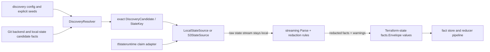

# Terraform State Collector

## Purpose

`internal/collector/terraformstate` owns the first Terraform-state collection
primitives. It resolves exact state candidates, opens exact state sources,
parses state with a streaming JSON decoder, redacts values before they cross the
parser boundary, and emits Terraform-state fact envelopes.

This package does not schedule collector runs, write graph rows, persist raw
state, or call cloud APIs directly. Coordinator claims, reducer projection, and
AWS SDK wiring belong to integration slices outside the reader stack.

## Collection flow

Raw Terraform state is only visible to the source reader and parser. Everything
leaving this package is a redacted fact, warning, identity, or bounded summary.

## Current Surface

- `StateSource` opens one exact Terraform state stream.
- `LocalStateSource` reads an operator-approved absolute file path only.
- `S3StateSource` wraps a caller-supplied read-only object client and sends an
  exact bucket/key request with optional `If-None-Match` and version metadata.
- `DiscoveryResolver` turns explicit seeds, Git-observed backend facts, and
  explicitly approved Git-local state candidates into exact `StateKey`
  candidates without opening raw state.
- Graph discovery can be bounded by configured repositories (`local_repos`) or
  by `backend_filters` that search all indexed active Git facts for exact
  backend declarations matching fields such as backend kind, bucket, key, and
  region.
- When `local_repos` and `backend_filters` are both configured, discovery
  treats them as a union: repo-scoped exact candidates remain eligible, filtered
  global candidates are added with de-duplication, and approved repo-local state
  candidates are not filtered by S3 backend fields.
- Git HCL parsing emits `terraform_backends` metadata for Terraform `backend`
  blocks. The Postgres adapter reads those facts from active Git generations
  and only returns exact S3 candidates with deterministic bucket, key, and
  region values. Deterministic values may be literal backend attributes or
  same-module `var.*` / `local.*` references whose parser facts contain one
  unambiguous literal value. Duplicate names, `module.*` references,
  `terraform.workspace`, functions, and unresolved interpolations stay
  non-candidates because `DiscoveryCandidate` is an exact state object.
- Git HCL parsing also emits `terragrunt_remote_states` metadata for
  Terragrunt `remote_state` blocks, including blocks resolved through nested
  `include` chains. `TerragruntRemoteStateCandidate` translates each row
  into a `DiscoveryCandidate` carrying the underlying backend kind (`s3` or
  `local`); discovery never observes `BackendTerragrunt`. Local-backend
  rows require the repository fact's `local_path` so the resolver can
  compute a repo-relative `RelativePath` and reject backend paths that
  resolve outside the repo checkout (`source_terragrunt.go:97`).
- The Git collector may emit `terraform_state_candidate` facts for repo-local
  `.tfstate` files. Those facts are metadata only: repo ID, repo-relative path,
  path hash, size, and warning flags. They do not include raw state bytes or
  absolute filesystem paths.
- The Postgres readiness adapter reports graph discovery as ready only when the
  upstream Git repository fact is tied to an active committed generation.
- `ParseDiscoveryConfig` maps collector-instance JSON into the typed discovery
  config used by the resolver.
- Discovery candidates carry `target_scope_id` when config or approval policy
  supplies one. The reader stack treats it as routing metadata; source opening
  code decides which cloud credentials to use.
- `NewDiscoveryMetrics` registers the candidate counter used during discovery.
- `Parse` turns one state stream into redacted Terraform-state facts.
- Parser results include bounded operational stats for resource facts,
  output facts, module facts, and a warnings-by-kind breakdown alongside
  redactions by reason. Runtime code records those as metrics; raw values
  and source locators stay out of labels.
- `LoadPackagedSchemaResolver` loads top-level attributes and block types from
  both `resource_schemas` and `data_source_schemas` in the packaged Terraform
  provider bundle. Terraform state serializes managed resources and data
  sources through the same `resources` array, so schema-backed data-source
  composites such as `aws_iam_policy_document.statement`,
  `aws_kms_key.multi_region_configuration`, `aws_kms_key.xks_key_configuration`,
  `aws_subnets.filter`, `aws_subnets.ids`,
  `aws_vpc.cidr_block_associations`, and `aws_vpc.filter` are captured as
  evidence. Provider shapes without a bundled schema, such as
  `cloudinit_config.part`, remain unsupported and fail closed.
- `ReadSnapshotIdentity` streams only the top-level serial and lineage fields so
  runtime code can build the claimed generation identity without retaining raw
  state bytes.
- `ParseOptions` carries scope, generation, source, fencing, and redaction
  context.
- The parser emits `incident_routing.applied_pagerduty_resource`,
  `incident_routing.applied_alert_route`, and
  `incident_routing.coverage_warning` facts for allowlisted PagerDuty and alert
  route resources observed in Terraform state. These are applied source
  evidence only; reducers own declared/applied/observed comparison, drift
  classification, graph projection, and read-model truth.
- `internal/collector/tfstateruntime` adapts these primitives to workflow
  claims: it resolves exact candidates, opens a matching source, parses facts
  with the claim fencing token, and leaves SDK-specific cloud wiring behind the
  existing read-only source interfaces.
- `cmd/collector-terraform-state` supplies the current AWS SDK adapter for
  read-only S3 access in the claim-driven runtime.
- `LocatorHash(StateKey)` returns the per-version durable hash that backs
  `CandidatePlanningID` and the persisted
  `terraform_state_snapshot.payload->>'locator_hash'` field. It digests
  `BackendKind`, `Locator`, and `VersionID` so the workflow coordinator can
  dispatch one work item per S3 object version.
- `ScopeLocatorHash(BackendKind, Locator)` returns the version-agnostic
  durable hash used as the join key for the canonical drift resolver. It
  MUST stay aligned with `scope.NewTerraformStateSnapshotScope`
  (`go/internal/scope/tfstate.go`); the contract is locked by the
  cross-package test in
  `locator_hash_scope_alignment_test.go:31`. The two hash functions are
  intentionally distinct — see issue #203 for the silent drift-rejection
  bug that motivated the split.
- `CompositeCaptureRecorder` is the observability seam the parser uses when it
  drops a composite before capture or the streaming nested walker stops
  mid-capture. The collector wires a recorder that increments
  `eshu_dp_drift_schema_unknown_composite_total{resource_type,reason}` and
  emits bounded `slog.Warn` lines with the high-cardinality `attribute_key`,
  source path, reason, and diagnostic error. Parser warning facts summarize
  unsupported composite shapes with `warning_kind=unsupported_composite_attribute`,
  `resource_type`, `attribute_key`, `reason`, `severity`, `actionability`, and
  `occurrence_count` so repeated resource instances do not create one warning
  fact each. Other composite safe drops use
  `warning_kind=composite_attribute_skipped` with the same bounded shape fields.
  A nil recorder is allowed for fixtures and early-bootstrap paths. ADR
  `2026-05-12-tfstate-parser-composite-capture-for-schema-known-paths`
  owns the contract.

## Safety Rules

- Raw state bytes are only allowed in the source reader and parser window.
- Full S3 URLs and local paths are not emitted in facts; parser facts use a
  locator hash in payload and source references.
- Repo-local state discovered by Git is discover-only by default. The
  Terraform-state collector opens it only when `local_state_candidates.mode` is
  `approved_candidates` and the config names an exact repo-relative path. An
  approval may include `target_scope_id`, but a local read does not require one.
- Exact local seeds still require operator-approved absolute paths.
- S3 reads are exact object reads. Prefix-only keys are rejected.
- S3 `NoSuchKey` responses are treated as a missing exact object, not a
  transient source-read failure. Runtime adapters may turn that into a
  `terraform_state_warning` so stale graph-discovered backend declarations do
  not retry forever while still leaving operator-visible evidence.
- Repo-scoped graph discovery waits for Git generation readiness before reading
  Terraform backend facts. Backend-filter discovery reads only active
  generations and must include at least one explicit filter.
- Dynamic backend expressions that cannot be reduced to same-module literal
  variable/local values, workspace-prefixed S3 backends, non-S3 backends, and
  unapproved local paths from Git facts are not discovery candidates. The Git
  collector emits `terraform_state_warning` facts with
  `warning_kind=unresolved_backend_expression` for unresolved Terraform backend
  attributes before Terraform-state source opening. Warning payloads carry the
  repo id, repo-relative source path, attribute name, line number, expression
  class, and an opaque expression hash; they do not carry raw backend values,
  full object locators, or absolute local paths.
- S3 write capability is rejected at source construction.
- Redaction key material is mandatory before parsing.
- Unknown provider-schema scalar attributes are redacted. Unknown composite
  attributes are dropped and observed via
  `eshu_dp_drift_schema_unknown_composite_total{reason="schema_unknown"}` so
  operators can detect provider-schema drift. The parser emits one
  `unsupported_composite_attribute` warning fact per
  `resource_type`/`attribute_key`/`reason` shape with an `occurrence_count`
  rather than repeating the warning for every resource instance.
- Known provider-schema attributes that are unsafe for incident-routing state
  evidence still fail closed in the generic `terraform_state_resource` fact.
  This covers PagerDuty integration keys and user emails, SNS endpoints, SSM
  parameter values, Lambda environment blocks, EventBridge target payload
  templates, webhook configs, and IAM policy documents even when a packaged
  schema would otherwise mark the attribute as known. These schema-backed
  sensitive composites emit `warning_kind=composite_attribute_skipped` with
  `reason=known_sensitive_key`, not `unsupported_composite_attribute`.
- The provider-schema resolver trusts only the top-level attributes and
  block types declared in packaged resource or data-source schemas. It does not
  promote remote E2E shapes from logs alone; adding support for a new provider
  or shape requires a committed schema bundle or another explicit schema proof.
  `cloudinit_config.part` remains an unsupported provider-schema gap until a
  Cloudinit schema bundle is committed, so it emits
  `unsupported_composite_attribute` with `reason=schema_unknown`.
- Schema-known composite attributes are captured through a streaming nested
  walker (`readCompositeValue` in `composite_walker.go`). The walker reuses
  the existing `json.Decoder`, applies per-leaf classification via
  `RedactionRules.Classify`, and emits the nested-singleton-array shape the
  drift loader's flattener expects. The 48 MB peak-heap ceiling enforced by
  `TestParseStream_PeakMemoryGate_CompositeCapture` holds for a 20k-instance
  fixture where every instance carries a populated SSE composite.
- Schema-known composites whose top-level source path is classified as
  sensitive are skipped before the walker starts. Walker failures are observed
  with `reason="shape_mismatch"` so operators can distinguish bad state shape
  from missing provider-schema coverage.
- `tags` and `tags_all` are emitted as `terraform_state_tag_observation`
  facts for correlation indexing, but scalar tag keys and values still follow
  the unknown provider-schema rule and are redacted by default. Non-scalar tag
  values are dropped and represented by warning facts. Tag maps that are not
  JSON objects emit `tag_map_dropped` with `reason=null_tag_map`,
  `reason=malformed_tag_map`, or `reason=unsupported_tag_map_shape` so
  operators can separate absent source data from bad source data and
  intentionally unsupported tag shapes.
- Every emitted `terraform_state_warning` with a recognized stable
  `warning_kind`/`reason` pair carries `severity` and `actionability`.
  Missing or too-large state sources are `blocking/blocking_evidence`,
  unresolved backend expressions are `blocking/blocking_evidence`,
  unsupported composites are `warning/provider_schema_support`, sensitive
  composite skips are `info/accepted_guardrail`, null tag maps are
  `info/accepted_normalization`, and malformed tag maps are
  `warning/source_normalization_review`.
- DynamoDB lock metadata is read-only and observational. The reader records the
  digest and a lock ID hash, but consistency decisions still come from the
  opened state body and durable generation metadata.

No-Regression Evidence: `go test ./internal/collector ./internal/collector/terraformstate ./internal/parser ./internal/status -run 'Test(BuildStreamingGeneration(EmitsUnresolvedTerraformBackendExpressionWarnings|KeysBackendExpressionWarningsByLine)|ClassifyWarningStablePairs|DefaultEngineParsePathHCLTerraformBackend(AttributeLineNumbers|Metadata|MarksDynamicMetadata)|BuildReportSummarizesUnresolvedBackendExpressionWarnings)' -count=1` plus `go test ./internal/storage/postgres -run 'TestTerraformStateBackendFactReader.*(VariableDefault|LocalTemplate|RejectsUnresolvedExpressions|FiltersResolvedVariableCandidate)|TestPostgresTerraformBackendQuery.*VariableDefault|TestListTerraformStateRecentWarningsIncludesGitBackendExpressionWarnings' -count=1` prove unresolved backend expressions emit warning evidence, exact candidate resolution still accepts only resolved literal/variable/local values, and status readback groups Git-scope warnings by safe source handle.

No-Observability-Change: this slice emits additional source facts through the
existing Git collector fact stream and surfaces them through the existing
Terraform-state admin status section. It adds no worker, queue domain, graph
write, metric name, metric label, runtime knob, or source-open path; operators
diagnose the path through persisted `terraform_state_warning` facts, generation
status, existing Postgres query spans, and `/admin/status` warning summary rows.

## Applied PagerDuty Incident Routing

Terraform-state PagerDuty evidence is emitted from the existing per-resource
streaming parser boundary. The collector does not evaluate Terraform, call
PagerDuty, inspect declared source files, or infer graph truth. It only turns
applied resource instances into bounded source facts when the resource type and
attribute names are on a hardcoded allowlist.

PagerDuty resources emit `incident_routing.applied_pagerduty_resource` with the
Terraform state address, resource type, module address, provider address,
state generation, serial, lineage, locator hash, provider object ID, and
fingerprinted names. Unsupported `pagerduty_*` resource types emit
`incident_routing.coverage_warning` with `reason=unsupported_pagerduty_resource`
instead of trying to persist unknown attributes.

AWS alert-route resources emit `incident_routing.applied_alert_route` only when
the Terraform address, module, resource name, ARN/name-like fields, endpoint, or
state value names PagerDuty. Secret-bearing endpoint values, SSM parameter
values, IAM policy documents, integration keys, private URLs, and user emails
are never persisted in these facts. Endpoint, value, and policy presence is
recorded with redaction flags plus optional fingerprints for correlation.

No-Regression Evidence: the applied incident-routing path reuses the existing
streaming resource loop, adds one small allowlist check per resource instance,
and does not change Terraform-state discovery, source opening, generic
resource/output/module/provider facts, worker counts, graph writes, queue
behavior, or provider-schema composite capture. Focused proof:
`go test ./internal/collector/terraformstate -run 'TestParserEmitsAppliedPagerDutyIncidentRoutingFacts|TestParserEmitsAppliedPagerDutyAlertRouteFacts' -count=1`
and `go test ./internal/collector/terraformstate -run TestParserRedactsAppliedRoutingSensitiveAttributesUnderKnownSchema -count=1`
plus `go test ./internal/facts -run TestIncidentRoutingFactKindsAndSchemaVersions -count=1`.

No-Observability-Change: this slice emits additional source facts and bounded
coverage-warning facts from an existing parser stage. Operators still diagnose
Terraform-state runs through the existing claim status, parser fact counts,
warning facts, redaction counts, source-open errors, collector logs, and
workflow terminal state; no new runtime stage, queue, metric label, span, or log
field is required.

## Composite Skip Summaries

No-Regression Evidence: the unsupported-composite summary path keeps supported
schema-known composites on the existing streaming capture path and leaves
unsupported composites absent from resource attributes. Focused proof:
`go test ./internal/collector/terraformstate -run 'TestParserSummarizesUnsupportedCompositeAttributeWarnings' -count=1`
passed after first failing against the old generic `attribute_dropped` warning
behavior. The full parser package gate
`go test ./internal/collector/terraformstate -count=1` passed with the streaming
large-state memory test updated to expect one summary warning fact for 20,000
repeated unsupported composites and an `occurrence_count` of 20,000.

Observability Evidence: every skipped composite still increments
`eshu_dp_drift_schema_unknown_composite_total{resource_type,reason}` through the
runtime recorder. Parser warning facts now emit
`warning_kind=unsupported_composite_attribute` once per
`resource_type`/`attribute_key`/`reason` shape with `occurrence_count`
(`composite_attribute_skipped` for non-schema-unknown safe drops), while the
runtime `slog.Warn` companion logs only the first occurrence of each same shape
and keeps `attribute_key`, source path, reason, and diagnostic error out of
metric labels.

## Filtered Discovery Evidence

No-Regression Evidence: baseline before this slice was direct Terraform-state
seeds plus repo-scoped Git backend discovery; backend-filter discovery and the
remote all-collector Compose entrypoint were not accepted release paths. After
measurement on 2026-05-21, an isolated remote Compose smoke run built from the
PR branch against the default NornicDB image resolved one configured S3 state
object by seed and by backend filter across a 45-repository smoke corpus. The
Terraform-state collector reached terminal workflow completion with
`terraform_state_snapshot=1`, `terraform_state_resource=148`,
`terraform_state_module=148`, `terraform_state_provider_binding=148`,
`terraform_state_output=33`, `terraform_state_tag_observation=713`, and
`terraform_state_warning=14`; API and MCP health checks returned healthy. This
change keeps graph discovery exact-object only, leaves worker counts and graph
write paths unchanged, and only reduces filtered discovery database round trips
from two queries per filter to one Terraform query plus one Terragrunt query
per resolve.

Observability Evidence: the remote proof used workflow work-item terminal
state, Terraform-state fact row counts, API and MCP health endpoints, collector
structured logs, and NornicDB error-log checks. Existing collector metrics,
workflow status fields, fact work-item counters, and parser warning facts still
identify whether discovery, source opening, parsing, fact commit, reducer
projection, or graph persistence is stuck or failing; this patch does not add a
new runtime stage or hide failures behind fallback behavior.

No-Regression Evidence: after classifying S3 `NoSuchKey` as a missing exact
state object, the focused reader and AWS adapter gate passed with
`go test ./internal/collector/terraformstate -run 'TestS3StateSourceReports(MissingState|NotModified)' -count=1`
and
`go test ./cmd/collector-terraform-state -run 'TestSafeS3GetObjectErrorMaps(NoSuchKey|NotModified)|TestSafeS3GetObjectErrorDoesNotLeakLocator' -count=1`.
The change does not alter discovery cardinality, parser memory behavior,
worker counts, graph writes, or retry timing for transient AWS failures.

Observability Evidence: missing S3 objects preserve the typed
`ErrStateMissing` cause without logging bucket names, object keys, or full
locators. The claim runtime records the source-open result and emits a bounded
`terraform_state_warning` with `warning_kind=state_missing`, so operators can
separate stale backend declarations from permission errors, parser failures,
and retryable transport failures.

No-Regression Evidence: the Terraform-state provider-schema composite gap fix
only changes startup resolver coverage. The parser still performs one immutable
map lookup at each attribute boundary, keeps the streaming nested walker for
captured composites, and keeps unknown composites on the existing
`schema_unknown` warning/metric path. Focused local proof covered the #566
AWS data-source shapes and the unsupported `cloudinit_config.part` path with
`go test ./internal/collector/terraformstate -run 'TestLoadPackagedSchemaResolverCoversRemoteE2EDataSourceComposites|TestLoadPackagedSchemaResolverLeavesUnsupportedRemoteE2EGapsUnknown|TestLoadPackagedSchemaResolverFallsBackToEmbeddedSchemas|TestParserCapturesPackagedDataSourceCompositeAttribute|TestParserKeepsUnsupportedPackagedCompositeFailClosed' -count=1`.
Issue #1587 adds a synthetic Terraform-state fixture for the same
`cloudinit_config.part` provider-schema gap and proves the parser emits one
`unsupported_composite_attribute` warning summary with `occurrence_count=2`
while keeping the composite absent from resource evidence:
`go test ./internal/collector/terraformstate -run TestParserClassifiesCloudinitPartFixtureAsUnsupportedComposite -count=1`.

Observability Evidence: supported AWS data-source composites now stop emitting
`schema_unknown` skip records because they land as redacted Terraform-state
evidence. Unsupported providers and shapes still emit
`eshu_dp_drift_schema_unknown_composite_total{reason="schema_unknown"}` plus
the structured skip record carrying `resource_type`, `attribute_key`, source
path, reason, and diagnostic error.
