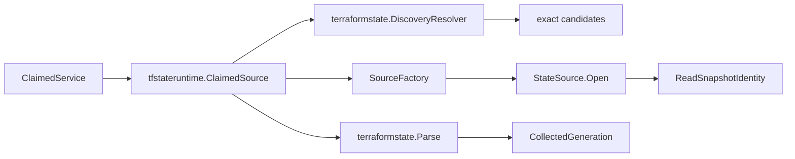

# Terraform State Runtime Adapter

## Purpose

`internal/collector/tfstateruntime` connects the Terraform-state reader stack to
workflow claims. It does not discover Git backends itself, call cloud SDKs
directly, or commit facts. Its job is narrower:

1. Resolve exact candidates through `terraformstate.DiscoveryResolver`.
2. Open one exact source through a `SourceFactory`.
3. Stream the state serial and lineage to build the expected snapshot
   generation.
4. Parse the matching state source with the workflow claim fencing token.
5. Return a `collector.CollectedGeneration` for `collector.ClaimedService`.

## Runtime Flow

## Exported Surface

- `ClaimedSource` implements `collector.ClaimedSource` for Terraform-state work
  items.
- `SourceFactory` opens one resolved candidate as a `terraformstate.StateSource`.
- `SourceFactoryFunc` adapts a function to `SourceFactory`.
- `DefaultSourceFactory` opens local files directly and S3 objects through a
  caller-supplied read-only `terraformstate.S3ObjectClient`.
- Approved Git-local state candidates are still exact local candidates by the
  time this package sees them. The resolver has already checked the
  repo-relative approval policy and the runtime emits a `state_in_vcs` warning
  when one is parsed.

## Telemetry

`ClaimedSource` records Terraform-state reader metrics when instruments are
provided:

- snapshot observations by backend and result
- source size after the final successful parse
- streaming parse duration
- resource fact count by backend
- output and module fact counts per `safe_locator_hash` and backend
- warning fact counts per `safe_locator_hash`, backend, and `warning_kind`
  (including the bypass `state_too_large` and `state_missing` paths)
- redactions and safe drops by policy reason
- S3 conditional-read not-modified outcomes
- `eshu_dp_drift_schema_unknown_composite_total{resource_type,reason}` whenever
  the parser drops a composite before capture or the streaming nested walker
  stops mid-capture. The companion `slog.Warn` line carries the
  high-cardinality `attribute_key`, source path, reason, and diagnostic error
  per the root observability contract.

The runtime also uses the Terraform-state span family from
`go/internal/telemetry`: source open, parser stream, and fact batch handoff. Do
not add raw source locators, bucket names, local paths, or work item IDs as
metric labels.

## Invariants

- Raw state bytes stay inside `terraformstate.StateSource` readers and parser
  streams.
- Graph-backed discovery must already be gated by Git generation readiness.
- A claimed work item only produces a generation when scope ID, generation ID,
  and source run ID all match the state snapshot identity.
- Claim fencing comes from `workflow.WorkItem.CurrentFencingToken` and is passed
  into every emitted Terraform-state fact.
- S3 access stays behind the existing consumer-side `S3ObjectClient` interface;
  SDK-specific adapters and target-scope credential selection belong outside
  this package.

## Missing Source Handling

When an exact S3 source returns `terraformstate.ErrStateMissing`, the runtime
emits a warning-only generation instead of returning a retryable collect error.
This preserves the workflow claim fence, completes the stale candidate with a
`terraform_state_warning` fact, lets the projector publish zero-row
Terraform-state canonical phase checkpoints, and keeps transient source-open
errors on the normal retry path.

No-Regression Evidence: the missing-source path is covered by
`go test ./internal/collector/tfstateruntime -run 'TestClaimedSourceEmitsWarningGenerationFor(MissingS3State|OversizedState)' -count=1`.
It adds no discovery fan-out, parser buffering, worker-count change, graph
write, or new queue type.

Observability Evidence: the existing Terraform-state source observation metric
records `result=state_missing`, warning counters record
`warning_kind=state_missing` with the bounded safe locator hash, and the emitted
warning fact carries the source type without exposing bucket names or object
keys.
The projector-owned `graph_projection_phase_state` rows and workflow
completeness rows then show whether the warning-only generation reached the
durable zero-row projection checkpoint.

## Related Docs

- `go/internal/collector/terraformstate/README.md`
- `go/internal/collector/README.md`
- `go/internal/workflow/README.md`
