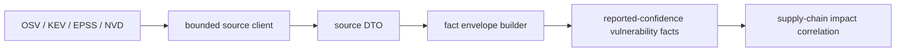

# internal/collector/vulnerabilityintelligence

`internal/collector/vulnerabilityintelligence` owns public vulnerability source
clients, source DTOs, and reported-confidence vulnerability fact construction.
It covers bounded OSV, CISA KEV, FIRST EPSS, and NVD CVE API 2.0 source data.

This package does not run a hosted collector, manage workflow claims, write
graph state, or decide package, image, workload, deployment, fixed-version, or
priority truth.

## Runtime Flow



## Core Responsibilities

- Query OSV package-version batches and vulnerability details with bounded
  request shapes.
- Read CISA KEV catalog snapshots.
- Query FIRST EPSS scores for explicit CVE IDs.
- Fetch one NVD CVE by ID or one bounded last-modified window page.
- Convert source records into CVE, affected package/product, reference,
  known-exploited, EPSS score, and source-snapshot facts.
- Strip credentials and sensitive token query parameters from URLs before
  payload or source-reference emission.

## Source Rules

| Source | Contract |
| --- | --- |
| OSV | Batch queries are capped at 100 rows. `purl` query shape must carry version in the PURL, not a separate version field. |
| CISA KEV | Known-exploited rows are risk signals only; they do not prove a workload is affected. |
| FIRST EPSS | Queries require explicit CVE IDs and must fit FIRST's `cve` parameter limit. |
| NVD | Modified-window queries are capped at 120 days and require explicit positive `resultsPerPage` up to 2000. |

NVD API keys are sent only as the `apiKey` HTTP header. They must never appear
in query strings, payloads, source refs, logs, or docs.

## Impact Boundary

Vulnerability facts are source evidence. Reducers own impact correlation after
package, SBOM, OCI image, Git, cloud, and deployment evidence exists.

NVD CPE rows are product evidence only. They do not prove a package is installed
or reachable. Reducers must rank package-native evidence, such as PURL or
ecosystem package name plus version, above CPE matches when both exist.

## Telemetry Boundary

This package emits no metrics, spans, or logs because it is a source client and
normalizer package. Callers receive errors and source-snapshot facts.

Collector Observability Evidence: the emitted `vulnerability.source_snapshot`
fact records `source`, `ecosystem`, query count, result count, response digest,
completion state, and warning fields for fixture-backed diagnosis. The hosted
runtime in `vulnruntime` adds request counters, fetch duration histograms,
rate-limit counters, fact-emission counters, observe/fetch spans, and the
shared admin/status surface.

Collector Deployment Evidence: this source-client package does not add Helm
workloads directly. The hosted `collector-vulnerability-intelligence` command
and remote E2E Compose service are wired by the runtime slice; EKS remains
gated until remote Compose proves live source collection, queue drain, API/MCP
read visibility, and restart behavior.

## Safety Rules

- Keep source queries bounded before making HTTP calls.
- Preserve NVD configuration and node negate flags; downstream consumers must
  read both before interpreting applicability.
- Keep EPSS decimal values as source strings scoped by score date.
- Keep KEV and EPSS as risk signals, not reachability proof.
- Namespace NVD and OSV CVE facts by source so independent observations can
  coexist.
- Normalize OSV package identity through package-registry identity helpers only
  when the public ecosystem registry is known.
- Treat missing affected versions as partial source truth.

## Verification

```bash
go test ./internal/collector/vulnerabilityintelligence -count=1
go run ./cmd/eshu docs verify ../go/internal/collector/vulnerabilityintelligence \
  --limit 1000 --fail-on contradicted,missing_evidence
```

Run supply-chain reducer tests when vulnerability facts are promoted into impact
or priority decisions.

## Related Docs

- [Collector Readiness](../../../../docs/public/reference/collector-reducer-readiness.md)
- [Collector Authoring](../../../../docs/public/guides/collector-authoring.md)
- [Fact Envelope Reference](../../../../docs/public/reference/fact-envelope-reference.md)
