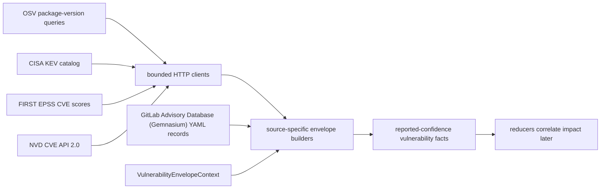

# Vulnerability Intelligence Collector

## Purpose

`internal/collector/vulnerabilityintelligence` owns source clients and
normalizers for the `vulnerability_intelligence` collector family. It turns
bounded OSV package-version queries, CISA KEV catalog rows, FIRST EPSS score
rows, NVD CVE API 2.0 records, and GitLab Advisory Database (Gemnasium)
package advisory records into reported-confidence `vulnerability.*` facts.
OSV Swift records are accepted through OSV's `SwiftURL` ecosystem when the
source package name is a Git URL. Eshu normalizes that Git URL to the shared
Swift Package Manager identity and can also use an OSV `PACKAGE` reference as a
fallback when a record only carries a short package name.

## Source-to-fact flow

The collector reports what vulnerability sources said. It does not decide
whether a package, image, workload, or deployment is affected.

## Ownership boundary

This package observes and normalizes vulnerability source truth. It does not
run a hosted collector, manage credentials, persist workflow claims, write graph
state, or decide package, image, workload, deployment, fixed-version, or
priority truth. Reducers own impact correlation after package, SBOM, OCI, Git,
cloud, and deployment evidence exists.

## Exported surface

- `CollectorKind` — durable collector family name: `vulnerability_intelligence`.
- `VulnerabilityEnvelopeContext` — scope, generation, collector instance,
  fencing token, observed time, and source URI copied into emitted envelopes.
- `VulnerabilitySourceSnapshot` — source observation summary used by OSV, KEV,
  and EPSS snapshot envelopes.
- `OSVClient` and `NewOSVClient` — bounded client for `/v1/querybatch` and
  `/v1/vulns/{id}`.
- `OSVQuery`, `OSVPackageQuery`, `OSVQueryBatchResult`, and
  `OSVVulnerability` — source-contract DTOs used by tests and future runtime
  wiring.
- `OSVEnvelopeContext` — compatibility alias for OSV callers using the shared
  vulnerability envelope context.
- `OSVSourceSnapshot` and `NewOSVSourceSnapshotEnvelope` — source observation
  boundary facts.
- `OSVRecordEnvelopes` — converts one full OSV vulnerability record into CVE,
  affected package, and reference facts.
- `KEVClient`, `NewKEVClient`, `KEVCatalog`, and `KEVVulnerability` — bounded
  CISA KEV feed client and source-contract DTOs.
- `KEVRecordEnvelope` — converts one CISA KEV row into a
  `vulnerability.known_exploited` fact.
- `NewKEVSourceSnapshotEnvelope` — records one KEV catalog observation
  boundary.
- `EPSSClient`, `NewEPSSClient`, `EPSSQuery`, `EPSSResult`, and `EPSSScore` —
  FIRST EPSS client and DTOs. Queries require explicit CVE IDs.
- `EPSSScoreEnvelope` — converts one FIRST EPSS score row into a
  `vulnerability.epss_score` fact.
- `NewEPSSSourceSnapshotEnvelope` — records one EPSS query observation
  boundary.
- `NVDClient`, `NewNVDClient`, and `NVDModifiedWindowQuery` — bounded NVD CVE
  API 2.0 client. `FetchCVEByID` fetches one CVE record using the current
  `cveIds` query parameter (NVD's documentation deprecates the singular
  `cveId`). `FetchModifiedWindow` fetches one paginated last-modified window
  page after validating the NVD 120-day window cap, an explicit positive
  `ResultsPerPage`, and the 2000 `resultsPerPage` cap. Optional API key is
  sent as the `apiKey` HTTP header only, never as a query parameter.
- `NVDCVEResult`, `NVDCVEItem`, `NVDCVE`, `NVDDescription`, `NVDMetrics`,
  `NVDCVSSMetric`, `NVDCVSSData`, `NVDWeakness`, `NVDReference`,
  `NVDConfiguration`, `NVDConfigNode`, and `NVDCPEMatch` — source-contract
  DTOs mirroring the NVD CVE API 2.0 JSON schema subset Eshu consumes.
- `NVDRecordEnvelopes` — converts one NVD CVE record into one
  `vulnerability.cve` envelope, one `vulnerability.affected_product` envelope
  per `configurations[].nodes[].cpeMatch[]` entry, and one
  `vulnerability.reference` envelope per non-blank source reference.
- `NewNVDSourceSnapshotEnvelope` — records one NVD observation boundary.
- `GitLabAdvisory` — source-contract DTO for one GitLab Advisory Database
  (Gemnasium) record. Field names mirror the upstream YAML schema so future
  YAML or JSON decoders can populate the struct without re-mapping fields.
- `GitLabAffectedRange`, `GitLabRangeBranch`, `GitLabRangeConstraint`, and
  `ParseGitLabAffectedRange` — structured form of the compact
  `<8.6.77||>=9.0.0 <9.9.1-alpha.1` affected_range syntax. The parser
  preserves source version strings verbatim (including `-rc.1` and
  `+build.42`) and does not pick a winning version.
- `GitLabAdvisoryEnvelopes` — converts one GLAD advisory into one
  `vulnerability.cve` envelope (CVE/GHSA identity, CVSS v2/v3/v4 vectors, CWE
  IDs, source advisory UUID), one `vulnerability.affected_package` envelope
  (package_slug, ecosystem, package_id, raw and parsed affected_range,
  human-readable affected/not-impacted/solution text, fixed versions), and
  one `vulnerability.reference` envelope per non-blank URL.
- `NewGitLabSourceSnapshotEnvelope` — records one GLAD observation boundary
  with source name `glad` and the GLAD ecosystem the snapshot covers.
- `GoModFile`, `GoModuleRequirement`, and `ParseGoMod` — parse one repository
  `go.mod` into source-truth Go module requirements (module path, required
  version, replacement, indirect flag, line anchor) using the official
  `golang.org/x/mod/modfile` parser.
- `GoSumEntry`, `ParseGoSum`, and `NewGoSumIndex` (with `ModuleHash` /
  `GoModHash` lookups) — parse a repository `go.sum` into source-truth hash
  rows so reducers can prove which module version was actually resolved.
- `GoModuleEvidenceContext` and `NewGoModuleEvidenceEnvelopes` — emit
  `vulnerability.go_module_evidence` facts that anchor a repository's
  Go-module requirements to advisory truth without inferring impact.
- `GovulncheckFinding`, `GovulncheckFrame`, `GovulncheckReachabilityLevel`,
  and `ParseGovulncheckJSON` — parse `govulncheck -json` output (NDJSON or
  JSON array) into source-truth findings, preserving the full govulncheck
  envelope as `RawJSON` so reducers can keep govulncheck-compatible evidence
  intact.
- `GovulncheckEvidenceContext` and `NewGovulncheckReachabilityEnvelopes` —
  emit `vulnerability.go_call_reachability` facts that preserve the parsed
  reachability level (`module`, `import`, `symbol`, `not_called`, or
  `unknown`) alongside the original govulncheck JSON payload.

See `doc.go` for the godoc contract.

## Dependencies

- `internal/facts` provides durable `facts.Envelope` contracts, schema
  versions, source confidence, and stable IDs.
- `internal/packageidentity` and `internal/collector/packageregistry` provide
  package identity normalization so OSV and GitLab Advisory Database
  affected-package facts use the same package IDs and PURLs as
  package-registry facts when the public ecosystem registry is known.
- Standard-library `net/http` is used for OSV, CISA KEV, FIRST EPSS, and NVD
  API calls; no hosted runtime, workflow, storage, query, or graph package is
  imported.

## Telemetry

This package emits no metrics, spans, or logs because it is a deterministic
source client plus normalizer. Hosted runtime telemetry belongs in a later slice
after the ADR's collector proof gate is satisfied.

Collector Performance Evidence: `go test ./internal/collector/vulnerabilityintelligence -count=1`
exercises bounded OSV batch requests, max-batch rejection at 101 queries, OSV
detail fetch path construction, CISA KEV catalog fetch decoding, FIRST EPSS
explicit-CVE query shaping, FIRST EPSS query-size rejection, NVD CVE API 2.0
single-CVE lookup via the current `cveIds` parameter, NVD 120-day
modified-window validation, NVD required explicit `resultsPerPage` and
2000-cap enforcement, NVD non-2xx status handling, NVD optional `apiKey`
header delivery, source snapshot envelope construction, affected package
normalization, fixed-version extraction, KEV/EPSS risk-signal envelopes, NVD
CVE envelope construction with full CVSS metric payload and CWE dedup, NVD
CPE applicability envelope construction with configuration- and node-level
operator and negate flags preserved, GitLab Advisory Database (Gemnasium)
advisory parsing with compact multi-branch range parsing, prerelease and
build-metadata fixed-version preservation, package_slug identity
normalization (npm/pypi/maven/go/nuget/composer/rubygems/cargo/swift/os), CVSS
v2/v3/v4 vector preservation,
CWE dedup, source advisory UUID preservation, source-namespaced stable fact
keys that coexist with OSV/NVD/GHSA observations of the same CVE,
provenance-preserving conflict tests for range/severity/fixed-version
disagreement against OSV and NVD, Go module evidence parsing across required,
replaced, and indirect dependency fixtures, govulncheck JSON parsing across
import-reachable, symbol-reachable, and not-called fixtures (with NDJSON and
JSON-array inputs both accepted), and credential-stripping without graph
writes, queue claims, or live network calls.

No-Regression Evidence: `go test ./internal/collector/vulnerabilityintelligence -run 'SwiftURL' -count=1` proves OSV `SwiftURL` affected packages normalize from source Git URLs, preserve the source PURL separately for provenance, and can still use a `PACKAGE` reference when a source record only publishes a short package name.

Collector Observability Evidence: the emitted `vulnerability.source_snapshot`
fact records `source`, `ecosystem`, query count, result count, response digest,
completion state, and warning fields for fixture-backed diagnosis. The hosted
runtime in `vulnruntime` adds request counters, fetch duration histograms,
rate-limit counters, fact-emission counters, observe/fetch spans, and the
shared admin/status surface.

Collector Deployment Evidence: this source-client package does not add Helm
workloads directly. The hosted `collector-vulnerability-intelligence` command
and remote E2E Compose service are wired by the runtime slice; EKS remains
gated until remote Compose proves live source collection, queue drain, API/MCP
read visibility, and restart behavior.

No-Observability-Change: this package is not mounted as a runtime and does not
change the telemetry contract. The current diagnosable surface is the returned
error and the source-snapshot fact produced by callers.

## Gotchas / invariants

- OSV `purl` queries must not also set a separate `version`; version belongs in
  the PURL for that request shape.
- Batch queries are capped at 100 rows to keep source calls bounded.
- EPSS queries require an explicit CVE list and reject CVE query strings over
  FIRST's 2,000-character `cve` parameter limit.
- KEV catalog rows are exploited-in-the-wild signals only. They do not prove
  that a workload is affected or reachable.
- EPSS values are kept as source decimal strings and scoped by score date.
- NVD modified-window queries cannot span more than 120 consecutive days; the
  client validates this before any HTTP call. Callers must set an explicit
  positive `ResultsPerPage` (zero is rejected) and the maximum value is 2000.
  Callers paginate by advancing `StartIndex` between calls.
- NVD's documentation deprecates the singular `cveId` parameter in favor of
  `cveIds` (comma-separated, max 100). `FetchCVEByID` sends a single-element
  `cveIds=<id>` query for one-CVE lookups.
- NVD optional API keys are sent only as the `apiKey` HTTP header. They are
  never appended to URL query strings and never appear in payloads or source
  refs.
- NVD CPE rows are product evidence only. They do not prove a package is
  installed or reachable. The reducer must rank package-native evidence
  (PURL, ecosystem package name plus version) above CPE matches.
- NVD CPE applicability rows preserve the configuration- and node-level
  logical context in `source_configuration_operator`,
  `source_configuration_negate`, `source_node_operator`, and
  `source_node_negate`. A negated configuration or node inverts the
  vulnerability claim; downstream consumers must read both negate flags.
- NVD CVE records have no per-record source schema version, so the
  `vulnerability.cve` NVD payload does not carry a `source_schema_version`
  key. The Eshu envelope's `SchemaVersion` field records the normalized
  fact schema version.
- NVD stable fact keys are namespaced by `source: "nvd"`, so an NVD CVE
  envelope and an OSV CVE envelope describing the same CVE ID coexist as
  independent observations rather than overwriting each other.
- OSV package identity is normalized through the package-registry identity
  helper using public default registries. Private registry matching is not
  inferred from OSV.
- Missing affected versions remain partial source truth. The reducer must not
  promote those rows to exact impact without stronger version evidence.
- URLs in payloads and source refs are stripped of credentials and sensitive
  token query parameters.
- GLAD advisories are package-scoped: one YAML record covers exactly one
  `package_slug`. The parser preserves `package_slug`, source ecosystem,
  package name, raw `affected_range`, structured `parsed_affected_range`,
  human-readable `affected_versions` and `not_impacted` text, multiple
  `fixed_versions` (including prerelease and `+build` branches), CVSS v2/v3/v4
  vectors, CWE IDs, URLs, and the source advisory UUID. The parser does not
  evaluate the range against a candidate version; reducers own admission.
- GLAD stable fact keys are namespaced by `source: "glad"`, so GLAD, OSV, NVD,
  and a future GHSA observation of the same CVE coexist as independent
  source-reported evidence rather than overwriting each other.
- GLAD `vulnerability.cve` envelopes are per-(advisory, package), not per-CVE.
  Because GLAD partitions one CVE across multiple package-scoped YAML
  records, the CVE stable fact key includes `package_id` alongside
  `advisory_id` and `source` so two records that share the same CVE for
  different packages cannot collide on the same FactID within one
  scope+generation. The advisory and CVE identifiers are still carried in
  the payload so reducers can join the records.
- GLAD `vulnerability.source_snapshot` envelopes require a non-blank
  ecosystem. The upstream gemnasium-db repository partitions by ecosystem,
  so collapsing snapshots from multiple ecosystems into one source-snapshot
  stable key would make freshness and result counts ambiguous.
- GLAD scoped npm PURLs use the percent-encoded `pkg:npm/%40scope/name`
  form so the PURL correlation anchor matches what OSV emits for the same
  package; without that, cross-source joins on PURL string equality silently
  miss scoped npm packages.
- OSV SwiftURL records use the package Git URL as the OSV package name. Eshu
  normalizes that URL into `swift://<host>/<namespace>/<package>`. If an OSV
  record only includes a short package name, Eshu requires a `PACKAGE` reference
  URL to prove the source namespace before it admits a Swift package identity.
- GLAD does not include an HTTP client in this slice. The cache and freshness
  lifecycle for advisory snapshots is owned by the shared source interface in
  #603; the GLAD adapter is a pure parser that a future client or
  source-runtime slice can wire in without re-shaping the fact payload.
- Go-module evidence (`vulnerability.go_module_evidence`) is repo-anchored.
  The stable fact key includes `repository_id`, `relative_path`, `module_path`,
  and `required_version` so multiple `go.mod` files in one repository (for
  example, a multi-module Go workspace) emit independent evidence rows rather
  than colliding on a single key.
- Replacement directives are joined into the matching require row when
  emitted. The payload keeps both the original `required_version` and the
  `replacement_path` / `replacement_version`, plus `replace_from_version` for
  version-scoped replacements, so reducers can rank advisory matches against
  the actually-resolved module without losing the source-declared intent.
- govulncheck evidence (`vulnerability.go_call_reachability`) preserves the
  full govulncheck JSON envelope under `govulncheck_raw_finding`. A future
  slice can expose this verbatim payload for operators who want
  govulncheck-native explanations; the parsed `reachability_level` exists so
  reducers can classify without re-decoding.

## Related docs

- `docs/public/reference/collector-reducer-readiness.md`
- `docs/public/guides/collector-authoring.md`
- `docs/public/reference/fact-envelope-reference.md`
- `docs/public/reference/collector-reducer-readiness.md`
