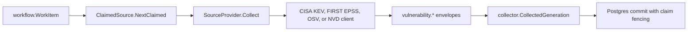

# Vulnerability Intelligence Runtime

## Purpose

`internal/collector/vulnerabilityintelligence/vulnruntime` owns the
claim-driven runtime for `vulnerability_intelligence` collector work. It maps
one workflow claim to one configured vulnerability source target, fetches that
bounded source scope, converts the response into `vulnerability.*` fact
envelopes, and returns them to `collector.ClaimedService`.

## Flow

## Exported Surface

- `SourceConfig` validates collector instance ID, bounded targets, provider,
  clock, and optional telemetry handles.
- `TargetConfig` stores one configured source target plus runtime-only endpoint
  and credential fields.
- `SourceProvider` fetches one configured target and returns normalized
  vulnerability fact envelopes.
- `HTTPProvider` is the production provider for CISA KEV, FIRST EPSS, OSV, and
  NVD.
- `ClaimedSource` implements `collector.ClaimedSource`.

## Telemetry

The runtime records:

- `vulnerability_intelligence.observe` spans
- `vulnerability_intelligence.fetch` spans
- `eshu_dp_vulnerability_intelligence_observations_total`
- `eshu_dp_vulnerability_intelligence_fetch_duration_seconds`
- `eshu_dp_vulnerability_intelligence_facts_emitted_total`
- `eshu_dp_vulnerability_intelligence_rate_limited_total`

Labels stay bounded to source, ecosystem, result/status class, and fact kind.
CVE descriptions, package names, PURLs, source URLs, and API keys must stay out
of metrics.

## Invariants

- A claimed source only collects a configured `scope_id`. Unknown scope IDs
  return retryable errors so workflow claim backoff applies instead of a tight
  claim/release loop.
- `collector_instance_id`, `generation_id`, and `fencing_token` come from the
  workflow claim and are copied into every emitted fact.
- Source targets are explicit and bounded: CVE ID sets, OSV package-version
  queries, CISA KEV catalog snapshot, or NVD modified windows with explicit page
  size.
- NVD API keys live only in runtime fields resolved from env vars. They must not
  be copied to desired collector config output, facts, logs, metric labels, or
  docs.
- This package emits source-truth facts only. Reducers own package, image,
  workload, deployment, reachability, and priority truth.

## Evidence

No-Regression Evidence: `go test ./internal/collector/vulnerabilityintelligence/vulnruntime -count=1` proves the claim boundary rejects wrong collector kinds, preserves fencing tokens, emits vulnerability facts for matching claims, and fetches EPSS source truth through the production HTTP provider.

Observability Evidence: `TestClaimedSourceRecordsObservationMetricsAndFetchSpan` proves each claimed source observation emits bounded observation metrics, fetch duration metrics, and both observe/fetch spans without CVE IDs, package names, PURLs, source URLs, or credential material in metric labels.

## Related Docs

- [Vulnerability intelligence ADR](../../../../../docs/public/reference/collector-reducer-readiness.md)
- [Service runtimes](../../../../../docs/public/deployment/service-runtimes.md)
